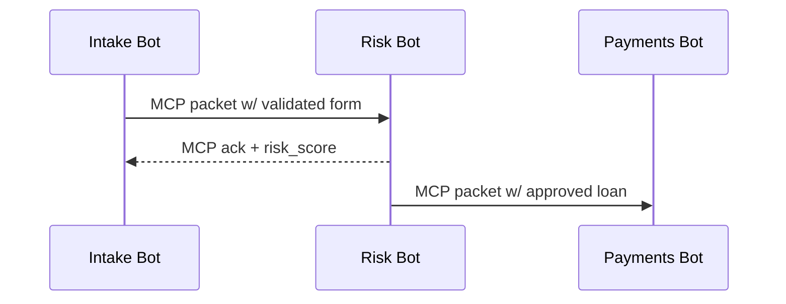
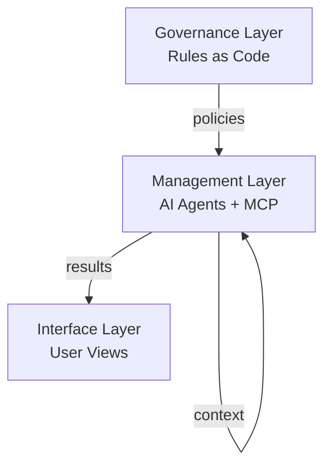

# Chapter 2: Model Context Protocol (HMS-MCP)

*(A gentle hop from [Chapter 1: Multi-Layered Governance Architecture](01_multi_layered_governance_architecture_.md))*  

> “Forget telepathy—just give the robots a meeting agenda.”  
> —A project manager after seeing MCP for the first time  

---

## 1. Why Do We Need Yet *Another* Protocol?

Picture a farmer named Laila applying online for a USDA micro-loan:

1. **Intake Bot** collects her form.  
2. **Risk Bot** (modeled after TSA threat scoring) checks for fraud red-flags.  
3. **Payments Bot** in the Treasury Fiscal Service schedules disbursement.  

If any of these AIs mishear the others—  
*Was that “$8 000” or “80 000”? Was she *verified* or merely *screened*?*—her loan stalls.

**Model Context Protocol (MCP)** is the shared grammar that keeps the conversation straight.  
Think of it as *Robert’s Rules of Order* for software agents:

* Who’s speaking?  
* What do they already know?  
* What tools can they use?  
* What do they promise to produce next?

---

## 2. What Exactly *Is* “Context”?

In MCP, *context* is broken into four bite-sized chunks—easy enough for a junior developer to skim, yet rich enough for auditors:

| Chunk | Plain-English Question | Example Value |
|-------|------------------------|---------------|
| `identity` | Who am I? | `"IntakeBot_USDA"` |
| `knowledge` | What do I already know? | `"Form: FSA-2310, ApplicantAge: 29"` |
| `capabilities` | What tools may I use? | `["FraudCheckAPI", "ACHService"]` |
| `plan` | What will I do next? | `"Validate ⇒ ScoreRisk ⇒ Handoff"` |

---

## 3. A Postcard-Sized MCP Document

Below is a **complete** MCP message (18 lines—mail-slot sized):

```yaml
# loan_intake.mcp.yaml
identity: IntakeBot_USDA
knowledge:
  form_id: FSA-2310
  applicant:
    name: Laila Rahman
    age: 29
capabilities:
  - validate_schema
  - request_missing_docs
plan:
  - step: validate_schema
  - step: handoff
    to: RiskBot_TSA
    required_fields: [ssn, address]
```

**Why it matters:**  
* A human (or log auditor) reads this faster than free-text chat.  
* Any HMS agent can parse the same 4 top-level keys—no surprises.

---

## 4. Speaking MCP in Code (≤ 20 Lines!)

### 4.1 Creating an MCP Message

```python
# create_mcp.py
import yaml

def build_mcp(applicant):
    mcp = {
        "identity": "IntakeBot_USDA",
        "knowledge": {"applicant": applicant},
        "capabilities": ["validate_schema"],
        "plan": [{"step": "validate_schema"}],
    }
    return yaml.dump(mcp)

msg = build_mcp({"name": "Laila", "age": 29})
print(msg)
```

Explanation  
1. We craft a plain Python `dict` with the 4 mandatory keys.  
2. `yaml.dump` serializes it—no fancy library required.  
3. The printout can be shipped to **Risk Bot** or saved for audit.

### 4.2 Reading & Acting on MCP

```python
# read_mcp.py
import yaml, json

def handle_mcp(raw):
    mcp = yaml.safe_load(raw)
    if "validate_schema" in mcp["capabilities"]:
        # pretend-validate
        return {"status": "ok", "next": mcp["plan"]}
    return {"status": "error", "msg": "No validator"}

response = handle_mcp(open("loan_intake.mcp.yaml").read())
print(json.dumps(response, indent=2))
```

After loading YAML, we simply check allowed actions and respond.

---

## 5. Step-By-Step Walkthrough

### 5.1 Sequence Diagram



Three bots, three tidy MCP envelopes—no free-text ambiguity.

### 5.2 What Happens Under the Hood?

1. **Serialize:** Each bot wraps its state in the 4-part MCP format.  
2. **Validate:** Receiver checks required keys (`identity`, `knowledge`, …).  
3. **Act:** Follow the `plan`, possibly updating the `knowledge`.  
4. **Handoff:** Send a fresh MCP file to the next agent.  

---

## 6. A Peek Inside the Parser

*(Still ≤ 20 lines—promise!)*

```python
# mcp_parser.py
import yaml, pydantic

class MCP(pydantic.BaseModel):
    identity: str
    knowledge: dict
    capabilities: list[str]
    plan: list

def parse_mcp(path):
    with open(path) as f:
        data = yaml.safe_load(f)
    return MCP(**data)          # raises if any key missing
```

Explanation  
* We let **Pydantic** enforce the schema—no manual `if key not in …`.  
* Any violation (e.g., missing `plan`) throws a clear error before the bot acts.

---

## 7. MCP & the Bigger HMS Picture

Where do the **layers** from Chapter 1 meet MCP?



* Governance defines *what* must be done.  
* Agents in Management swap MCP envelopes to decide *how*.  
* Interface picks up the latest MCP to show citizens transparent status.

---

## 8. Quick Checklist Before You Commit

☐ Message has **exactly** the 4 top-level keys.  
☐ `identity` is unique within your deployment.  
☐ `plan` contains at least one `step`.  
☐ Parser test passes without network access.  
☐ Log file stores the raw MCP for auditors (keep PII encrypted!).

Nail these, and your bot speaks perfect MCP.

---

## 9. What’s Next?

You now know how agents talk.  
But **where do the *rules* they follow live?**  
Enter the policy brain of HMS: [Policy Codification Engine (HMS-CDF)](03_policy_codification_engine__hms_cdf__.md).

*Onward!*

---

Generated by [AI Codebase Knowledge Builder](https://github.com/The-Pocket/Tutorial-Codebase-Knowledge)