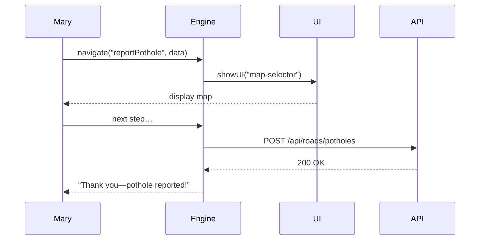

# Chapter 3: Intent-Driven Navigation Engine

Now that you’ve seen how citizens interact with services ([HMS-MFE](01_micro_frontend_user_interface__hms_mfe__.md)) and how administrators govern AI proposals ([HMS-GOV](02_admin_governance_portal__hms_gov__.md)), let’s make the user experience even smoother. Welcome to the **Intent-Driven Navigation Engine**: your GPS for guiding citizens through complex government processes.

---

## 1. Motivation & Central Use Case

Imagine Mary needs to **report a pothole** on her city street. Without intent-driven guidance, she might:
- Scroll through a long menu: “Public Works” → “Road Maintenance” → “Pothole Report”
- Fill in forms in the wrong order
- Get stuck and call support

With our navigation engine, Mary simply clicks “Report a pothole,” and the system:
1. Loads the right UI components (map, photo uploader, form)  
2. Calls the correct APIs in sequence  
3. Handles success or error messages  

This “one-click” journey cuts frustration, speeds up service, and reduces training needs.

---

## 2. Key Concepts

1. **Intent**  
   A short phrase or code representing a user goal (e.g., `"reportPothole"`, `"applyPermit"`).

2. **Flow**  
   A list of ordered **steps** (UI or API) that fulfill an intent.

3. **Step Types**  
   - `UI` step shows a form or page.  
   - `API` step sends data to a backend.

4. **Engine**  
   The core module that reads an intent, looks up its flow, and executes each step.

5. **Registry**  
   A simple mapping from intents to their flows.

---

## 3. Hands-On: Driving the “Report a Pothole” Flow

### 3.1 Define Your Intent Flow

File: `flows.js`
```js
export const intentFlows = {
  reportPothole: [
    { type: 'UI',   component: 'map-selector' },
    { type: 'UI',   component: 'photo-uploader' },
    { type: 'UI',   component: 'details-form' },
    { type: 'API',  endpoint: '/api/roads/potholes', method: 'POST' }
  ]
};
```
Explanation:  
- We list four steps: three UI components, then a POST API call.

### 3.2 Initialize the Navigation Engine

File: `nav-engine.js`
```js
import { intentFlows } from './flows.js';

export function navigate(intent, userData) {
  const flow = intentFlows[intent] || [];
  return flow.reduce(async (prev, step) => {
    await prev;
    if (step.type === 'UI') {
      return showUI(step.component, userData);
    } else {
      return callAPI(step.endpoint, step.method, userData);
    }
  }, Promise.resolve());
}
```
Explanation:  
- `navigate` looks up the flow, then runs each step in order.
- UI steps call `showUI()`, API steps call `callAPI()` (we’ll stub those next).

### 3.3 Stub Helpers for UI and API

File: `nav-helpers.js`
```js
export function showUI(name, data) {
  console.log(`Loading UI: ${name}`); 
  return Promise.resolve(); // In real code, render the component.
}

export function callAPI(url, method, data) {
  console.log(`Calling API ${method} ${url}`, data);
  return fetch(url, { method, body: JSON.stringify(data) });
}
```
Explanation:  
- `showUI` would mount the component in your shell.  
- `callAPI` sends data to the backend.

### 3.4 Triggering Navigation from the UI

File: `index.html`
```html
<button id="report">Report a pothole</button>
<script type="module">
  import { navigate } from './nav-engine.js';
  document.getElementById('report').addEventListener('click', () => {
    const userData = { userId: 123, location: { lat:…, lng:… } };
    navigate('reportPothole', userData);
  });
</script>
```
Explanation:  
- User clicks “Report a pothole.”  
- We pass `userData` into the navigation engine.

---

## 4. What Happens Under the Hood?

Here’s a simplified flow when Mary clicks the button:



---

## 5. Internal Implementation Walkthrough

### 5.1 Non-Code Overview

1. **User action** triggers `navigate(intent)`.  
2. **Engine** loads the flow from the **registry**.  
3. Each **step** runs in sequence:  
   a. UI step → renders a component in the shell  
   b. API step → sends data to the backend  
4. **Navigation** ends when all steps are done.

### 5.2 Engine Entry Point

File: `nav-engine.js` (expanded)
```js
import { intentFlows } from './flows.js';
import { showUI, callAPI } from './nav-helpers.js';

export async function navigate(intent, data) {
  const flow = intentFlows[intent];
  if (!flow) throw Error(`Unknown intent: ${intent}`);
  for (const step of flow) {
    if (step.type === 'UI') {
      await showUI(step.component, data);
    } else {
      await callAPI(step.endpoint, step.method, data);
    }
  }
}
```
Explanation:  
- We validate the intent, then loop through steps one by one.

### 5.3 Flow Registry

File: `flows.js`
```js
export const intentFlows = {
  applyPermit: [ /*…*/ ],
  reportPothole: [ /*…*/ ]
  // add new intents here
};
```
Explanation:  
- Adding a new service (e.g., “applyPermit”) is as easy as registering its flow.

---

## 6. Summary & Next Steps

You’ve learned how the **Intent-Driven Navigation Engine** lets users speak in plain goals (“Report a pothole,” “Apply for a permit”) and then guides them through the right sequence of screens and API calls—just like a GPS for government services.

Next up: dive into how we tune and optimize these processes with the [Process Optimization Module (HMS-MCP)](04_process_optimization_module__hms_mcp__.md).

---

Generated by [AI Codebase Knowledge Builder](https://github.com/The-Pocket/Tutorial-Codebase-Knowledge)