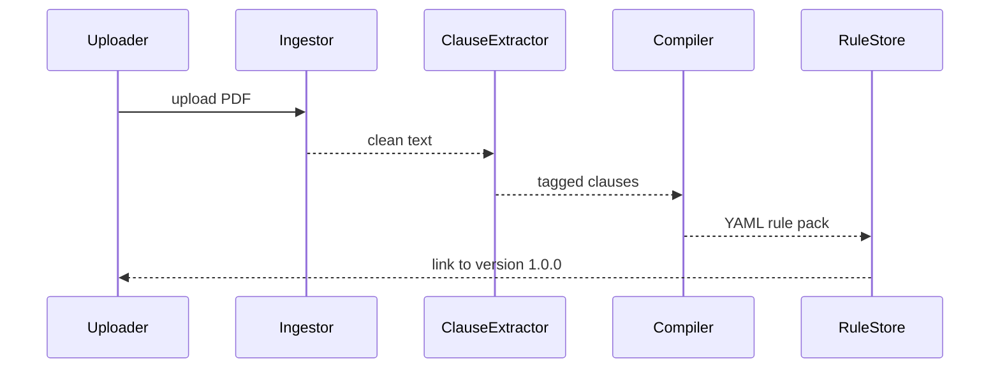

# Chapter 3: Policy Codification Engine (HMS-CDF)

*(Picking up right after [Model Context Protocol (HMS-MCP)](02_model_context_protocol__hms_mcp__.md))*  

> “I have **86 pages** of a security memo and 10 minutes before the checkpoint opens—  
> can the computer please just read it for me?”  
> —PFPA Shift Supervisor, 5 a.m.

---

## 1. The Everyday Problem

A new **Pentagon Force Protection Agency (PFPA)** directive arrives Friday night:

> “Section 4-B: All visitor badges must expire **within 8 hours** of issuance.”

By Monday morning every guard kiosk, badge printer, and visitor-kiosk AI must enforce that rule.  
Historically this meant:

1. Humans skim the PDF.  
2. Developers translate prose to code.  
3. Weeks later, kiosks finally reject a 9-hour badge.

**Policy Codification Engine (HMS-CDF)** removes steps 1–2.  
Upload the memo → get machine-readable rules → agents start enforcing **before the coffee gets cold**.

---

## 2. What “Codification” Really Means

Plain-English → **Canonical Rule Grammar (CRG)** → Executable JSON/YAML.

```text
Prose                     CRG                        Machines
┌─────────┐   parse   ┌───────────────┐   publish   ┌─────────┐
│PDF/Word │ ────────► │ expiry < 8h   │ ──────────► │AI agents│
└─────────┘           │ scope: badges │            └─────────┘
```

Think of CDF as a **legislative clerk on steroids**—it:

1. Extracts numbered clauses & definitions.  
2. Detects obligations (“must”, “shall”), prohibitions (“must not”), and permissions (“may”).  
3. Emits a **rule pack** any HMS component can consume.

---

## 3. A 5-Minute Walk-Through

### 3.1 Set-Up

```bash
# install once
pip install hms-cdf
```

### 3.2 Compile the Directive (≤ 8 hours badge rule)

```bash
cdf compile PFPA_2023-09-15.pdf \
           --output pfpa.rules.yaml
```

**What just happened?**

1. PDF -> text (`pdftotext` under the hood).  
2. NLP model tags clauses.  
3. Rule Grammar emitted to `pfpa.rules.yaml`.

### 3.3 Peek at the Result (14 Lines)

```yaml
# pfpa.rules.yaml
id: PFPA-SEC-2023-09-15
version: 1.0.0
source: PFPA_2023-09-15.pdf
rules:
  - id: VISITOR_BADGE_EXPIRY
    type: obligation          # obligation | prohibition | permission
    target: VisitorBadge
    field: expiry_hours
    operator: <=
    value: 8
    citation: "§4-B"
```

Beginner takeaway: **one YAML line per idea**—no legalese.

---

## 4. Using a Rule Pack in Your Code (18 Lines)

```python
# badge_validator.py
import yaml, datetime as dt

RULES = yaml.safe_load(open("pfpa.rules.yaml"))

def get_rule(rule_id):
    for r in RULES["rules"]:
        if r["id"] == rule_id:
            return r
    return None

def validate_badge(badge):
    rule = get_rule("VISITOR_BADGE_EXPIRY")
    expire_in = (badge.expires - badge.issued).seconds / 3600
    if expire_in > rule["value"]:
        raise ValueError("Badge too long – violates PFPA §4-B")
    return True
```

Guards and kiosks call `validate_badge(...)`; CDF did the legal heavy-lifting for them.

---

## 5. How CDF Fits the HMS Puzzle

```mermaid
graph LR
    doc[Policy Document\n(PDF/EO/Memo)]
    CDF[HMS-CDF\nCodify]
    GOV[Governance Layer\n(rule store)]
    AGT[Agents & Services\n(enforce)]
    doc --> CDF --> GOV --> AGT
    AGT --status--> GOV
```

* **HMS-CDF** sits at the boundary between *prose* and *logic*.  
* Stored rules live in the **Governance Layer** from [Chapter 1](01_multi_layered_governance_architecture_.md).  
* Agents exchange those rules via **MCP** envelopes from Chapter 2.

---

## 6. Inside the Engine (No PhD Required)



Five steps, five actors—easy to trace in logs.

---

## 7. A Tiny Taste of the Internals

### 7.1 Clause Extractor (17 Lines)

```python
# cdf/extractor.py
import re, uuid

OBLIGATIONS = re.compile(r"\b(must|shall)\b", re.I)

def extract(text):
    clauses = []
    for line in text.splitlines():
        if OBLIGATIONS.search(line):
            clauses.append({
                "id": str(uuid.uuid4())[:8],
                "text": line.strip()
            })
    return clauses
```

Reads each line, grabs anything containing *must/shall*.  
Real code uses NLP; we keep it snack-size here.

### 7.2 Compiler to CRG (18 Lines)

```python
# cdf/compiler.py
import yaml

KEYWORDS = {"expiry": "expiry_hours"}

def compile(clauses):
    rules = []
    for c in clauses:
        if "within 8 hours" in c["text"]:
            rules.append({
                "id": "VISITOR_BADGE_EXPIRY",
                "type": "obligation",
                "target": "VisitorBadge",
                "field": KEYWORDS["expiry"],
                "operator": "<=",
                "value": 8,
                "citation": "§4-B"
            })
    return yaml.dump({"rules": rules})
```

Maps English phrase → structured rule.  
Even a junior developer can tweak this dictionary.

---

## 8. Versioning & Rollback in Two Commands

```bash
# publish new version
cdf publish pfpa.rules.yaml --major

# oops, revert!
cdf rollback PFPA-SEC-2023-09-15 --to 0.9.2
```

Behind the scenes, CDF tags every rule pack with SemVer and stores a full diff.  
Auditors sleep better.

---

## 9. Quick “Did I Do It Right?” Checklist

☐ Uploaded document compiles with **zero errors**  
☐ Generated YAML passes `cdf validate`  
☐ Rule pack stored in Governance repository  
☐ Agents receive the new version via MCP broadcast  
☐ Change log includes citation & diff

If all boxes are ticked, policy is live at **AI-speed**!

---

## 10. What’s Next?

Now that policies exist as executable code, we must **prove** we’re following them—and handle conflicts when laws collide.  
Put on your legal-tech hat; we’re heading to [Compliance & Legal Reasoning (HMS-ESQ)](04_compliance___legal_reasoning__hms_esq__.md).

*See you in court… well, preferably not!*

---

Generated by [AI Codebase Knowledge Builder](https://github.com/The-Pocket/Tutorial-Codebase-Knowledge)