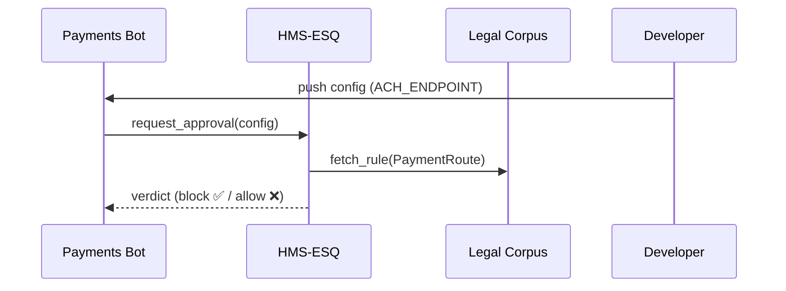
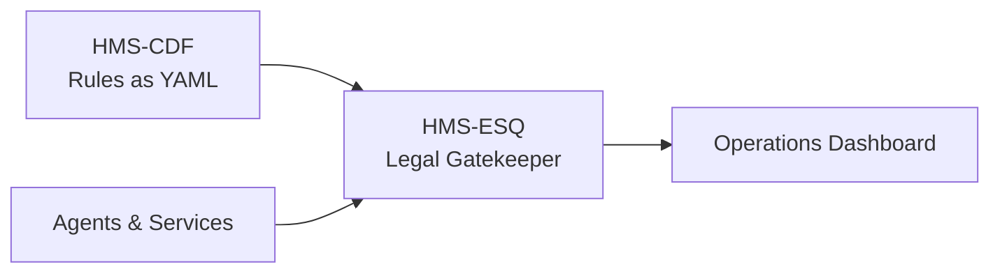

# Chapter 4: Compliance & Legal Reasoning (HMS-ESQ)

*(A smooth hand-off from [Policy Codification Engine (HMS-CDF)](03_policy_codification_engine__hms_cdf__.md))*  

> “Before you click ‘Deploy,’ remember: the U.S. Code is watching.”  
> —Anxious DevOps engineer, Friday 4 p.m.

---

## 1. Why Do We Need ESQ?

### 1.1 A Concrete Use-Case  

The **Employment and Training Administration (ETA)** wants to issue $1,500 stipends to job-seekers who finish an online course.

Workflow:  
1. **Course Bot** notifies Treasury to pay.  
2. **Payments Bot** schedules an ACH.  
3. **Logging Service** stores the receipt.

Legal catch: *31 U.S.C. § 3302* says **you may not hold federal money in private bank accounts**.  
If *Payments Bot* ever tries to route funds through an un-approved clearinghouse, the agency could violate federal law—auditors, fines, hearings…the works.

**HMS-ESQ** is the in-house counsel that:

* Reads the statute (“must deposit directly to Treasury”).  
* Maps it to system actions (“ACH endpoint must equal `treasury.gov/ach`”).  
* Blocks or rewrites non-compliant steps **before they run**.

Result: developers ship code with confidence, and lawyers sleep at night.

---

## 2. ESQ in One Sentence

“Turn statutes, regulations, and executive orders into real-time guardrails that every HMS agent obeys.”

---

## 3. Key Pieces (No Law Degree Required)

| Piece | Plain-English Role | 5-Word Memory Hook |
|-------|-------------------|--------------------|
| Legal Corpus | JSON copy of laws & rules | “Library of Congress in YAML” |
| Clause Mapper | Match rule ➔ system field | “This law touches **that** API” |
| Conflict Detector | Spot collisions in rules | “No red light + green light” |
| Verdict Engine | Allow, block, suggest fix | “Judge, jury, bailiff—automated” |

We’ll meet each piece through the ETA stipend example.

---

## 4. Loading the Law (Legal Corpus)

A PDF statute compiled by [HMS-CDF](03_policy_codification_engine__hms_cdf__.md) produces:

```yaml
# us_code_31_3302.rules.yaml  (excerpt ‑ 10 lines)
rules:
  - id: FEDERAL_FUNDS_DEPOSIT
    citation: "31 U.S.C. § 3302(b)"
    type: obligation
    target: PaymentRoute
    field: clearinghouse
    operator: "=="
    value: "treasury.gov/ach"
```

**Beginner takeaway:** one YAML line captures the legal obligation.

---

## 5. Mapping Law to Code (Clause Mapper)

```python
# mapper.py  (12 lines)
import yaml
LAW = yaml.safe_load(open("us_code_31_3302.rules.yaml"))

def map_to_system(rule_id):
    rule = next(r for r in LAW["rules"] if r["id"] == rule_id)
    return {
        "service": "PaymentsBot",
        "config_key": "ACH_ENDPOINT",
        "allowed": rule["value"]
    }

print(map_to_system("FEDERAL_FUNDS_DEPOSIT"))
```

Sample output:

```text
{'service': 'PaymentsBot',
 'config_key': 'ACH_ENDPOINT',
 'allowed': 'treasury.gov/ach'}
```

Explanation: ESQ just linked a statute to a runtime configuration flag.

---

## 6. Real-Time Check (Verdict Engine)

```python
# verdict.py  (18 lines)
import mapper

ALERTS = []

def check(action):
    spec = mapper.map_to_system("FEDERAL_FUNDS_DEPOSIT")
    if action["service"] == spec["service"] \
       and action["config_key"] == spec["config_key"]:
        if action["value"] != spec["allowed"]:
            ALERTS.append("⚠️ 31 U.S.C. § 3302 violation")
            return False
    return True

# Simulate Payments Bot about to use wrong endpoint
proposed = {"service":"PaymentsBot", "config_key":"ACH_ENDPOINT",
            "value":"thirdparty.com/ach"}

print(check(proposed))          # ➜ False
print(ALERTS)                   # ➜ ['⚠️ 31 U.S.C. § 3302 violation']
```

Payoff: The deployment is blocked **before** funds go astray.

---

## 7. What Happens Under the Hood?



Only four participants; logs stay readable for auditors.

---

## 8. Conflict Detection (Red vs Green Lights)

Sometimes two rules fight:

* 31 U.S.C. § 3302 ➔ “route through Treasury”  
* A temporary OMB memo ➔ “may pilot external fintech vendor”

ESQ performs a tiny **top-trumps** check:

```python
# conflict_detector.py  (15 lines)
HIERARCHY = ["statute", "regulation", "memo"]  # highest ➔ lowest

def higher(rule_a, rule_b):
    return HIERARCHY.index(rule_a["level"]) < HIERARCHY.index(rule_b["level"])

def resolve(rule_a, rule_b):
    return rule_a if higher(rule_a, rule_b) else rule_b

# Example
statute = {"id":"FEDERAL_FUNDS_DEPOSIT", "level":"statute"}
memo    = {"id":"PILOT_FINTECH", "level":"memo"}
print(resolve(statute, memo)["id"])   # ➜ FEDERAL_FUNDS_DEPOSIT wins
```

Explanation: ESQ always favors the **higher legal authority**—no midnight debates.

---

## 9. Integrating ESQ into Your Pipeline (3 Steps)

1. **Add a Pre-Deploy Hook**  
   ```bash
   esq check --service PaymentsBot --config config.yaml
   ```
2. **Wire Agents**  
   In each agent, call `verdict.check(action)` before executing sensitive steps.  
3. **Monitor Alerts**  
   Subscribe the compliance team to `esq_alerts` channel (Slack, email, or syslog).

That’s it—legal compliance is now continuous.

---

## 10. Quick “Did I Do It Right?” Checklist

☐ Statutes and regulations compiled via HMS-CDF  
☐ Each executable action tagged with `service`, `config_key`, `value`  
☐ Pre-deploy ESQ hook blocks conflicts  
☐ Conflict detector uses proper legal hierarchy  
☐ Alerts logged with citation (e.g., “31 U.S.C. § 3302”)

Tick all five, and your pipeline is officially **court-ready**.

---

## 11. Where ESQ Sits in the HMS Map



* CDF feeds rules in.  
* Agents ask ESQ for permission.  
* Ops sees pass/fail verdicts in real time.

---

## 12. Peeking at the File Structure

```
hms-esq/
 ├─ corpus/
 │   └─ us_code_31_3302.rules.yaml
 ├─ mapper.py
 ├─ verdict.py
 └─ conflict_detector.py
```

Everything fits in a single pizza-box repo—beginners welcome.

---

## 13. What’s Next?

We now have *policies* (CDF) **and** a *legal referee* (ESQ).  
The next step is to give agents a smart backbone to act on those decisions.  
Grab a coffee and continue to:  
[Core Agent Framework (HMS-AGT)](05_core_agent_framework__hms_agt__.md)

*“Objection, your honor—overruled!”*

---

Generated by [AI Codebase Knowledge Builder](https://github.com/The-Pocket/Tutorial-Codebase-Knowledge)