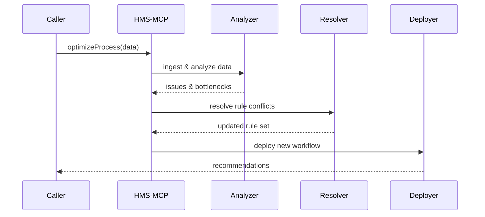

# Chapter 4: Process Optimization Module (HMS-MCP)

Welcome back! In the last chapter, we saw how our [Intent-Driven Navigation Engine](03_intent_driven_navigation_engine_.md) guides users step-by-step through a service. Now we’ll dive into the **Process Optimization Module (HMS-MCP)**, which analyzes inefficiencies—just like a city planner studies traffic jams—and then proposes streamlined workflows.

---

## 1. Motivation & Central Use Case

Imagine the Department of Public Works receives hundreds of pothole reports every week. Complaints pile up, repair crews get conflicted schedules, and some neighborhoods wait too long for fixes. HMS-MCP helps by:

1. Ingesting citizen complaints, system logs (e.g., when crews start and finish repairs), and performance metrics (average response time).
2. Analyzing where delays and conflicts happen (e.g., two crews scheduled in the same area).
3. Resolving outdated or conflicting rules (like “only one crew per street block” vs. “high-priority roads first”).
4. Generating a new schedule and deploying it automatically to the scheduling system.

With HMS-MCP, the city can turn data into clear process changes—no more manual spreadsheets or conflicting instructions.

---

## 2. Key Concepts

1. **Data Ingestion**  
   Collects user complaints, logs, and performance metrics.

2. **Analysis Engine**  
   Spots bottlenecks and frequent conflicts (like traffic jams).

3. **Rule Resolver**  
   Updates or removes outdated rules and resolves contradictions.

4. **Change Deployer**  
   Pushes optimized workflows back into the system with minimal human work.

---

## 3. Hands-On: Optimizing a Pothole Repair Process

Let’s walk through a simple example. We’ll feed HMS-MCP some mock data and get back a list of optimized assignments.

### 3.1 Sample Input Data

```json
{
  "complaints": [
    { "location": "Main St", "time": "08:00", "severity": 2 }
  ],
  "logs": [
    { "crew": "A", "start": "07:50", "end": "08:40", "street": "Main St" }
  ],
  "metrics": { "avgTimeMin": 60, "maxQueue": 15 }
}
```

Explanation:  
- One new complaint on Main St.  
- Crew A spent 50 minutes there yesterday.  
- Overall average repair time is 60 minutes, 15 complaints waiting.

### 3.2 Calling the Optimization API

```js
import { optimizeProcess } from './hms-mcp.js';

async function runOptimization(data) {
  const result = await optimizeProcess(data);
  console.log('Recommendations:', result);
}

runOptimization(sampleData);
```

Explanation:  
- We call `optimizeProcess()` with our data.  
- It returns recommendations to improve scheduling.

### 3.3 Expected Output

```json
{
  "newSchedule": [
    { "crew": "A", "street": "Main St", "start": "08:00" }
  ],
  "removedRules": ["one-crew-per-block"],
  "addedRules": ["high-severity-first"]
}
```

Explanation:  
- Crew A starts at 08:00 on Main St.  
- We removed an old rule and added a new priority rule.

---

## 4. What Happens Under the Hood?



---

## 5. Internal Implementation Walkthrough

### 5.1 Non-Code Steps

1. **Ingest:** load complaints, logs, metrics.  
2. **Analyze:** find slow steps or overlapping assignments.  
3. **Resolve:** remove conflicting rules, create updated priorities.  
4. **Deploy:** push changes into the scheduling API.

### 5.2 Core Module Structure

File: `hms-mcp.js`
```js
export async function optimizeProcess(data) {
  const analysis = analyzeData(data);
  const rules = resolveRules(analysis);
  const schedule = deployChanges(rules);
  return { newSchedule: schedule, ...rules };
}
```
Explanation:  
- `analyzeData()` spots issues.  
- `resolveRules()` updates policy.  
- `deployChanges()` sends new workflow.

#### analyzeData (in `analyzer.js`)
```js
export function analyzeData({ complaints, logs, metrics }) {
  // find streets with most delays
  return { hotspots: ['Main St'], conflicts: ['block-rule'] };
}
```

#### resolveRules (in `resolver.js`)
```js
export function resolveRules({ hotspots, conflicts }) {
  return {
    removedRules: conflicts,
    addedRules: ['high-severity-first']
  };
}
```

#### deployChanges (in `deployer.js`)
```js
export function deployChanges({ addedRules }) {
  // call external scheduling API (omitted)
  return [{ crew: 'A', street: 'Main St', start: '08:00' }];
}
```

---

## 6. Summary & Next Steps

In this chapter, you learned how HMS-MCP:

- Ingests diverse data (complaints, logs, metrics)  
- Analyzes inefficiencies like a city planner spotting traffic jams  
- Resolves outdated or conflicting rules  
- Deploys optimized workflows automatically  

Up next, we’ll see how individual AI agents coordinate these tasks in the [AI Agent Framework (HMS-A2A)](05_ai_agent_framework__hms_a2a__.md).

---

Generated by [AI Codebase Knowledge Builder](https://github.com/The-Pocket/Tutorial-Codebase-Knowledge)