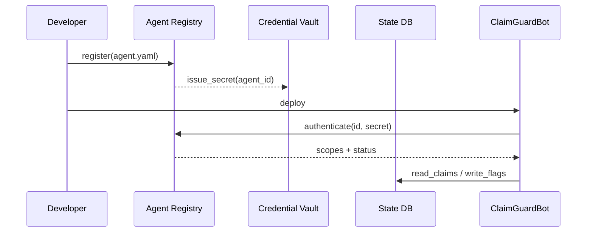
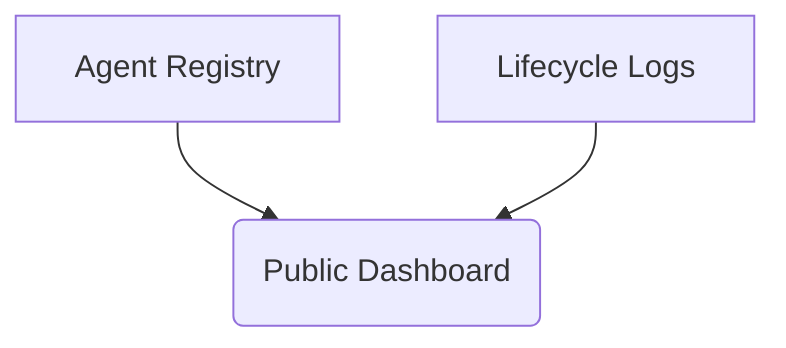
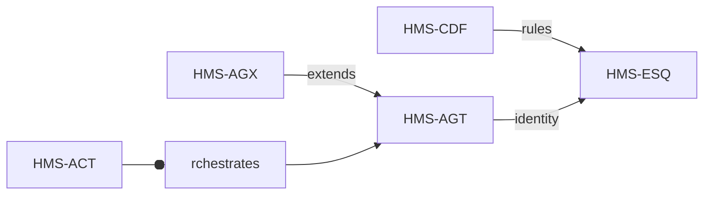

# Chapter 5: Core Agent Framework (HMS-AGT)

*(Picking up right after [Compliance & Legal Reasoning (HMS-ESQ)](04_compliance___legal_reasoning__hms_esq__.md))*  

> “If MCP is how agents **talk** and ESQ is how they **behave**,  
> AGT is simply **who they are**.”  
> —A DHS intern explaining HMS to a new hire

---

## 1. Why Do We Need HMS-AGT?

Imagine the Department of Labor wants a tiny AI helper—**ClaimGuardBot**—to flag suspicious unemployment claims.

Without a framework the team would have to hand-roll:

* a database table for bot identities  
* OAuth scopes for wage-data access  
* logs for when the bot was updated or retired  

Multiply that by 50 states and it’s chaos.

**Core Agent Framework (HMS-AGT)** is the government’s *civil-service commission* for AI: it **hires**, **trains**, and **retires** every bot so you don’t rebuild the HR office each time.

Result—devs code the fraud logic, not the paperwork.

---

## 2. The Four Building Blocks

| # | Block | Plain-English Job |
|---|-------|------------------|
| 1 | Agent Registry | “Who exists?” |
| 2 | Permission Scopes | “What can they touch?” |
| 3 | Credential Vault | “How do they prove it?” |
| 4 | Life-Cycle Hooks | “When do they enter/exit service?” |

We’ll meet each while onboarding **ClaimGuardBot**.

---

## 3. Onboarding a New Agent in 5 Minutes

### 3.1 Describe the Bot (`agent.yaml`)

```yaml
# claim_guard/agent.yaml
name: ClaimGuardBot
owner: Dept_of_Labor
skills: [fraud_detection, nlp]
scopes:
  - read_claims
  - write_flags
lifecycle: active      # active | paused | retired
```

*One YAML file = one personnel form.*

### 3.2 Register with AGT

```bash
agt register claim_guard/agent.yaml
```

Sample output:

```
✅ Agent registered
   id: agt-23f1a7
   secret stored in Vault
```

### 3.3 Use the Issued Credentials (≤ 15 lines)

```python
# claim_guard/main.py
import agt_sdk as agt

agent = agt.login("agt-23f1a7")   # secret fetched automatically

for claim in agent.fetch("read_claims"):
    if is_suspicious(claim):      # your logic
        agent.post("write_flags", claim.id, reason="anomaly")
```

Explanation: `agt.login()` checks the Registry and Vault; no manual tokens.

---

## 4. How The Magic Works (Step-By-Step)



Only **five** actors—easy to audit.

---

## 5. Deep Dive: The Building Blocks

### 5.1 Agent Registry (Who)

```python
# agt/registry.py (18 lines)
import uuid, yaml, json

REG_FILE = "registry.json"

def register(path):
    info = yaml.safe_load(open(path))
    info["id"] = "agt-" + uuid.uuid4().hex[:6]
    db = json.load(open(REG_FILE)) if os.path.exists(REG_FILE) else []
    db.append(info)
    json.dump(db, open(REG_FILE,"w"), indent=2)
    return info["id"]
```

Beginners’ takeaways:  
* Adds a UUID, stores one JSON doc—done.  
* No databases to set up on day one.

---

### 5.2 Permission Scopes (What)

```python
# agt/scopes.py (12 lines)
ALLOWED = {
    "read_claims":  ["GET:/claims"],
    "write_flags":  ["POST:/flags"]
}

def check(scope, method, route):
    return f"{method}:{route}" in ALLOWED.get(scope, [])
```

Each scope simply white-lists HTTP verbs + routes.

---

### 5.3 Credential Vault (How)

```python
# agt/vault.py (16 lines)
import secrets, json

VAULT = "vault.json"

def issue(agent_id):
    secret = secrets.token_hex(16)
    store = json.load(open(VAULT)) if os.path.exists(VAULT) else {}
    store[agent_id] = secret
    json.dump(store, open(VAULT,"w"))
    return secret

def validate(agent_id, secret):
    store = json.load(open(VAULT))
    return store.get(agent_id) == secret
```

No encryption at this tutorial stage—keep concepts clear.

---

### 5.4 Life-Cycle Hooks (When)

```python
# agt/lifecycle.py (13 lines)
import datetime as dt, json

def retire(agent_id, reason):
    db = json.load(open("registry.json"))
    for ag in db:
        if ag["id"] == agent_id:
            ag["lifecycle"] = "retired"
            ag["retired_at"] = dt.datetime.utcnow().isoformat()
            ag["reason"] = reason
    json.dump(db, open("registry.json","w"), indent=2)
```

One function toggles `lifecycle`—audit trails are automatic.

---

## 6. Monitoring: The Policy-Maker Dashboard



At any time a policy officer can see:

| Agent | Status | Scopes | Owner |
|-------|--------|--------|-------|
| ClaimGuardBot | active | read_claims, write_flags | Labor |

*Zero coding effort by the developer.*

---

## 7. How AGT Plays with Other HMS Parts



* CDF & ESQ **decide** what is legal.  
* AGT **knows** *which* agents exist.  
* [Specialized Agent Extensions (HMS-AGX)](06_specialized_agent_extensions__hms_agx__.md) will teach these agents new tricks.  
* [Activity & Workflow Orchestrator (HMS-ACT)](07_activity___workflow_orchestrator__hms_act__.md) will chain them into end-to-end services.

---

## 8. Quick “Did I Do It Right?” Checklist

☐ `agent.yaml` committed to version control  
☐ Registration returns a unique `agt-XXXXXX` ID  
☐ Secrets live only in Vault, never in code  
☐ Each request passes `scope` check  
☐ Retirement updates `lifecycle` and timestamp

If every box is ticked, your bot just earned its *digital* federal badge!

---

## 9. What’s Next?

ClaimGuardBot works, but sometimes you’ll need agents with **special powers**—vision, speech, or geospatial analytics.  
The next chapter shows how to bolt such skills onto any AGT-registered bot.

👉 Continue to: [Specialized Agent Extensions (HMS-AGX)](06_specialized_agent_extensions__hms_agx__.md)

Happy hiring!

---

Generated by [AI Codebase Knowledge Builder](https://github.com/The-Pocket/Tutorial-Codebase-Knowledge)