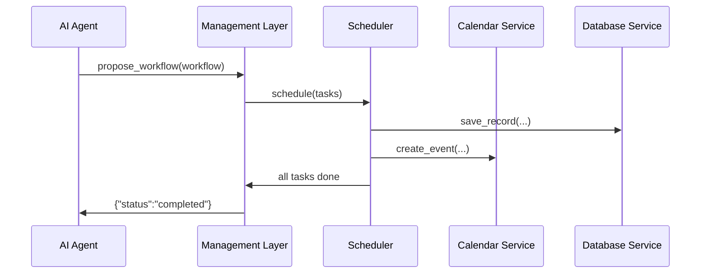

# Chapter 6: Management Layer

Welcome to Chapter 6! In [Chapter 5: Human-in-the-Loop (HITL) Oversight](05_human_in_the_loop__hitl__oversight_.md), we saw how experts review AI proposals. Now we need a **control tower** that coordinates all the pieces—meetings, databases, microservices—so our workflows actually run smoothly. That’s the **Management Layer**.

---

## 6.1 Why We Need a Management Layer?

Imagine an AI Agent has just proposed an optimized schedule for grant‐review meetings across three agencies. We need to:

1. **Schedule calendar invites** for panel members.  
2. **Write records** into the grant database.  
3. **Notify** stakeholders by email or SMS.  
4. **Keep an eye** on each service (calendar, DB, messaging) to catch failures.

The Management Layer is like an **airport control tower**: it takes a flight plan (your workflow), hands off tasks to the right runways (microservices), and watches instruments (health monitors) to ensure every takeoff and landing (API call) completes safely.

---

## 6.2 Key Concepts

- **Orchestration Engine**  
  The “air traffic controller” that breaks a workflow into tasks and assigns them in order.

- **Workflow Scheduler**  
  A component that queues and runs tasks at the right time.

- **API Router**  
  Sends each task to the correct microservice (calendar, database, messaging).

- **Health Monitor**  
  Periodically pings services to ensure they’re alive, alerting on errors.

- **Dependency Manager**  
  Makes sure prerequisites are met (e.g., don’t send invites until the meeting record is saved).

---

## 6.3 Using the Management Layer

Here’s how you, as a developer, can run a simple grant‐review workflow:

```python
from hms_mcp import ManagementLayer

# 1. Initialize the Management Layer
mgmt = ManagementLayer()

# 2. Define a tiny workflow
workflow = {
    "id": "grant-review-2024",
    "tasks": [
        {"type": "db",       "action": "save_record",   "data": {"grant_id": 42}},
        {"type": "calendar", "action": "create_event",  "data": {"title": "Review Panel", "time": "10AM"}},
        {"type": "messaging","action": "send_email",    "data": {"to": ["alice@agency.gov"]}}
    ]
}

# 3. Run it all
result = mgmt.run_workflow(workflow)
print(result)  # -> {"status": "completed"}
```

Explanation:  
- We create `mgmt` to manage everything.  
- We list three tasks: save to DB, set up a calendar event, send an email.  
- `run_workflow` orchestrates each step, checks services, and returns success or failure.

---

## 6.4 What Happens Under the Hood



1. **AI Agent** hands off a workflow.  
2. **Management Layer** tells the **Scheduler** to run each task.  
3. The **Scheduler** calls the **DB Service** and **Calendar Service** in turn.  
4. When all tasks finish, the Management Layer reports back.

---

## 6.5 Inside the Code

#### File: management_layer.py

```python
# management_layer.py
from .scheduler import Scheduler
from .health_monitor import HealthMonitor

class ManagementLayer:
    def __init__(self):
        self.scheduler = Scheduler()
        self.monitor   = HealthMonitor()

    def run_workflow(self, workflow):
        # 1. Schedule each task
        for task in workflow["tasks"]:
            self.scheduler.schedule(task)
        # 2. Check service health
        self.monitor.check_all()
        return {"status": "completed"}
```

- **Scheduler** handles routing tasks.  
- **HealthMonitor** pings each microservice after the run.

#### File: scheduler.py

```python
# scheduler.py
from .api_clients import DatabaseClient, CalendarClient, MessagingClient

class Scheduler:
    def schedule(self, task):
        ttype = task["type"]
        data  = task["data"]
        if ttype == "db":
            DatabaseClient().save(data)
        elif ttype == "calendar":
            CalendarClient().create_event(data)
        elif ttype == "messaging":
            MessagingClient().send_email(data)
```

- We pick the right client based on `task["type"]`.  
- Each client wraps an external API call (DB, calendar, email).

---

## 6.6 Summary & Next Steps

You’ve learned how the **Management Layer**:

- Acts as a control tower to orchestrate and schedule tasks.  
- Routes calls to the correct microservices via the **Scheduler**.  
- Monitors service health and ensures dependencies are met.

Next, we’ll dive under the hood of servers, containers, and networking in [Chapter 7: Core Infrastructure (HMS-SYS)](07_core_infrastructure__hms_sys__.md).

---

Generated by [AI Codebase Knowledge Builder](https://github.com/The-Pocket/Tutorial-Codebase-Knowledge)