# Chapter 6: Microservice Mesh & Service Discovery
*(“Who’s on the road and how do we drive safely together?”)*  

[← Back to Chapter 5: Management Layer (HMS-MGT / HMS-SVC)](05_management_layer__hms_mgt___hms_svc__.md)

---

## 1. Motivation — The “Passport Renewal Rush” Story  

Every spring, the **U.S. Department of State** handles a spike of passport renewals before summer travel.  
Behind the Submit button sit a dozen microservices:

* `photo-check` (AI image validation)  
* `fee-payment` (Treasury integration)  
* `delivery-tracker` (USPS updates)  
* …and many more  

During a rolling upgrade the `fee-payment` pods move from **10.12.4.23** to **10.27.6.89**.  
If the other services still call the *old* IP, passports grind to a halt.  
Add holiday-level traffic and you also need:

* automatic encryption (citizens’ PII)  
* retries (occasional network blips)  
* circuit-breaking (stop spamming a sick service)

Service Discovery tells every service **where** its friends live *right now*.  
A Service Mesh layers on reliability and security so the whole convoy keeps moving at rush-hour speed.

---

## 2. Key Concepts (Beginner Edition)

| Nickname | What It Really Is | Road-Trip Analogy |
|----------|------------------|-------------------|
| Service Registry | Database of *who* is alive + *where* | GPS that shows every car’s location |
| Sidecar Proxy | Tiny helper container next to your app | Co-driver handling steering & radio |
| Control Plane | Brain that updates rules in all sidecars | Traffic HQ broadcasting detours |
| Data Plane | Actual  ❮request→response❯ traffic | Cars on the highway |
| mTLS | Mutually authenticated encryption | Secret handshake before sharing directions |
| Retry | Try again after a short wait | “Missed the exit? Loop back.” |
| Circuit Breaker | Pause calls when failure spikes | “Road closed—reroute!” |

---

## 3. A 3-Step “Hello Mesh” Walk-Through  

We will:

1. Start two toy microservices (`photo-check`, `fee-payment`).  
2. Register them in a **tiny in-memory registry**.  
3. Call one through a **mini sidecar** that adds retries.

### 3.1 ‎`registry.py` – 18 lines

```python
# Very small service registry (NOT for prod!)
REGISTRY = {}          # {name: {"host": "..", "port": 1234}}

def register(name, host, port):
    REGISTRY[name] = {"host": host, "port": port}

def lookup(name):
    return REGISTRY.get(name)

if __name__ == "__main__":          # demo usage
    register("fee-payment", "10.1.2.3", 8080)
    print(lookup("fee-payment"))
```

Explanation  
• `register()` is called by each service at startup.  
• `lookup()` is used by callers to find the latest address.

### 3.2 ‎`sidecar.py` – 19 lines

```python
import requests, time
from registry import lookup

def call(service, path="/", retries=3):
    target = lookup(service)
    if not target:
        raise RuntimeError("No such service")
    url = f"http://{target['host']}:{target['port']}{path}"

    for i in range(retries):
        try:
            return requests.get(url, timeout=1).text
        except requests.RequestException:
            if i == retries - 1: raise
            time.sleep(0.2)          # quick back-off
```

What it does  
1. Looks up the **current** host/port.  
2. Tries up to 3 times before giving up (basic retry).  
3. *You* never hard-code an IP!

### 3.3 Demo Run

```python
from registry import register
from sidecar import call

# pretend two pods just came online
register("photo-check",  "10.0.0.7", 5000)
register("fee-payment",  "10.0.0.8", 6000)

print(call("fee-payment", "/health"))   # 👉 "OK"
```

Change the `fee-payment` IP, re-register, run again—no code change needed.

---

## 4. What Happens Under the Hood  

```mermaid
sequenceDiagram
participant Photo as photo-check
participant Fee as fee-payment
participant Reg as Service Registry
participant Side as Sidecar Proxy
participant App as Passport App

Photo->>Reg: register(photo-check, IP₁)
Fee->>Reg: register(fee-payment, IP₂)

App->>Side: GET fee-payment /pay
Side->>Reg: lookup(fee-payment)
Reg-->>Side: IP₂
Side->>Fee: HTTPS /pay  (mTLS, retries)
Fee-->>Side: 200 OK
Side-->>App: success
```



*If `Fee` starts failing, the sidecar could open a “circuit breaker” and return a friendly error instantly.*

---

## 5. A Glimpse at mTLS (Two Lines!)  

HMS-MCP’s mesh sidecar (we use Envoy under the hood) auto-generates certificates:

```bash
# inside the sidecar container
envoyctl certificates rotate --validity 24h
envoyctl enforce mtls --mode STRICT
```

Meaning: every service-to-service hop is encrypted & authenticated without touching your app code.

---

## 6. Where Does This Fit With Other Layers?

* **HMS-MGT** (Chapter 5) deploys new *versions* and sends their IPs to the registry.  
* **RBAC** (Chapter 4) tags traffic with *who* is calling; the mesh can block unauthorized calls.  
* **Governance** (Chapter 2) can mandate “all traffic must be mTLS.”  
* **Monitoring Dashboard** (Chapter 16) receives latency/error metrics emitted by sidecars.  

---

## 7. Internal Folder Map (Simplified)

```
hms-mesh/
 ├─ control/         # registry & policy updater
 ├─ sidecar/         # tiny Go or Rust binary shipped as container
 └─ certs/           # autogenerated mTLS certificates
```

*You normally never open these files—HMS-MCP plumbs them in automatically.*

---

## 8. Tips & Gotchas

1. **Always use service *names*, never IPs.**  
2. **Start small.** Even a 20-line registry beats spreadsheets.  
3. **Turn on automatic retries cautiously.** Some POSTs are *not* idempotent.  
4. **Watch circuit-breaker thresholds.** Too tight = false alarms; too loose = meltdowns.  
5. **mTLS cert rotation** should be < 24 h to satisfy many federal policies.

---

## 9. Recap  

You learned:

1. Service Discovery = live address book.  
2. Service Mesh = discovery **plus** encryption, retries, circuit-breaking.  
3. A 20-line registry + 20-line sidecar can solve 80 % of the headaches.  
4. How the mesh cooperates with governance, RBAC, and management layers.

Ready to expose these services safely to the outside world?  
Continue to [Backend API Gateway (HMS-API)](07_backend_api_gateway__hms_api__.md).

---

---

Generated by [AI Codebase Knowledge Builder](https://github.com/The-Pocket/Tutorial-Codebase-Knowledge)