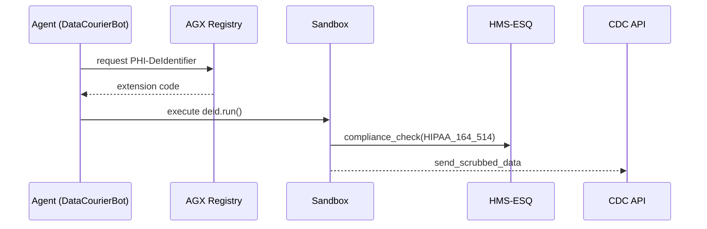
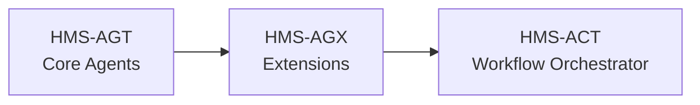

# Chapter 6: Specialized Agent Extensions (HMS-AGX)

*(Continuing from [Core Agent Framework (HMS-AGT)](05_core_agent_framework__hms_agt__.md))*  

> “If AGT is the employee badge, AGX is the shiny extra sticker that says *‘Haz-Mat Certified’.*”  
> —A DHS trainer explaining plug-ins to rookies

---

## 1. Why Do We Need AGX?

### A Concrete Use-Case  

The Centers for Medicare & Medicaid Services (CMS) must send hospital-stay data to the Centers for Disease Control and Prevention (CDC).  
By law, all **HIPAA identifiers must be stripped** before the hand-off.

1. **DataCourierBot** (already registered via AGT) can *move* files.  
2. But it **does not know** how to de-identify Protected Health Information (PHI).  
3. Re-building that logic from scratch would be risky and duplicative.

Solution: **Attach the “PHI De-Identifier” AGX**—a domain-specific plug-in certified by the Office for Civil Rights (OCR).  
In minutes the same bot is now legally allowed and technically able to handle HIPAA data.

---

## 2. What *Exactly* Is an AGX?

Think of AGX as:

```
Employee (AGT badge)
+ Endorsement sticker (AGX)
----------------------------
Specialist bot
```

Technical definition: **a self-contained package** that adds *capabilities*, *rules*, and *tools* to any AGT-registered agent without forking core code.

---

## 3. AGX Building Blocks

| Piece | Plain-English Role | Example |
|-------|-------------------|---------|
| Manifest (`extension.yaml`) | “What does this do?” | `type: deid` |
| Capability Token | “New powers granted” | `health.deid.run` |
| Sandbox Wrapper | “Stay in your lane!” | Limits file access to `/tmp` |
| Compliance Profile | “Extra laws I must obey” | HIPAA §164.514 |

---

## 4. Creating Your First Extension: **PHI De-Identifier**

### 4.1 Folder Layout

```
phi-deid/
 ├─ extension.yaml
 ├─ deid.py
 └─ README.md
```

### 4.2 The Manifest (12 lines)

```yaml
# phi-deid/extension.yaml
name: PHI-DeIdentifier
version: 1.0.0
owner: CMS
capability: health.deid.run
requires_scopes: [read_records, write_records]
compliance_profile:
  - HIPAA_164_514
sandbox:
  filesystem: /tmp          # no access outside /tmp
  net_outbound: false
```

Beginner takeaway: one YAML file describes *everything*.

### 4.3 Minimal Implementation (≤ 18 lines)

```python
# phi-deid/deid.py
import re, json

SAFE_FIELDS = {"age", "procedure_code"}

def scrub(record: dict):
    return {k: v for k, v in record.items() if k in SAFE_FIELDS}

def run(raw_json: str):
    data = json.loads(raw_json)
    cleaned = [scrub(r) for r in data]
    return json.dumps(cleaned)
```

Explanation:  
* `scrub` keeps only whitelisted fields—perfect for a tutorial demo.

---

## 5. Attaching an AGX to an Existing Agent

### 5.1 Update the Agent Spec (`agent.yaml`)

```yaml
# data_courier/agent.yaml
name: DataCourierBot
extensions:
  - PHI-DeIdentifier@1.0.0   # <- new line
```

### 5.2 Load & Use the Extension (≤ 15 lines)

```python
# data_courier/main.py
import agt_sdk as agt

bot = agt.login("agt-23f1a7")          # from previous chapter
deid = bot.load("PHI-DeIdentifier")    # new power acquired

raw = bot.fetch("read_records")
clean = deid.run(raw)                  # PHI stripped
bot.post("write_records", clean)
```

What happens:  
1. `load` checks the AGX Registry.  
2. Sandbox spins up.  
3. De-identified payload is written—no PHI leakage.

---

## 6. Under the Hood: Five-Step Flow



Key points:  
* **Registry** supplies vetted extensions.  
* **Sandbox** ensures no forbidden syscalls.  
* **ESQ** double-checks legal compliance.

---

## 7. Peeking Inside the Loader (18 lines)

```python
# agx/loader.py
import importlib, yaml, pathlib

REG_DIR = "agx-registry"   # simple folder for demo

def load(agent, name):
    meta = yaml.safe_load(open(f"{REG_DIR}/{name}/extension.yaml"))
    # 1. Permission check
    if not set(meta["requires_scopes"]) <= set(agent.scopes):
        raise PermissionError("Insufficient scopes")
    # 2. Sandbox (toy version)
    import os, subprocess, json
    code = pathlib.Path(f"{REG_DIR}/{name}/deid.py").read_text()
    with open("/tmp/plugin.py", "w") as f:
        f.write(code)
    def run(payload):
        return subprocess.check_output(["python", "/tmp/plugin.py", payload])
    return type("Plugin", (), {"run": run})
```

Beginner takeaway:  
* Only **13** functional lines to understand the concept.  
* Real deployments replace `subprocess` with secure containers.

---

## 8. Publishing Your Extension to the Registry

```bash
# one-liner publish
agx publish phi-deid/ --visibility internal
```

Outputs:

```
✔ Uploaded PHI-DeIdentifier@1.0.0
   compliance: HIPAA_164_514
   sandbox hash: ab12cd…
```

Government analogy: like adding a TSA “Explosives Expert” sticker to the list of approved certifications.

---

## 9. Other Examples in the Wild

| Extension | Agency Owner | Capability Token | Typical Use |
|-----------|--------------|------------------|-------------|
| `AES256-Encryptor` | Treasury | crypto.encrypt.aes | Sign & send ACH files |
| `GeoMasker` | Susquehanna River Basin Commission | geo.mask.coords | Publish river data without exact lat/lon |
| `JuvenileRedactor` | Coordinating Council on Juvenile Justice | justice.redact.minor | Remove minors’ names from case docs |

Each lives **once** in the Registry; any AGT-bot can subscribe.

---

## 10. Quick “Did I Do It Right?” Checklist

☐ `extension.yaml` includes `capability` and `sandbox` sections  
☐ Implementation code ≤ 20 lines for demo (real code can be larger)  
☐ `agx publish` succeeds and returns a version tag  
☐ Agent’s `agent.yaml` lists the extension  
☐ Runtime passes ESQ compliance check (no red alerts)

Tick all five and your bot just earned a brand-new skill!

---

## 11. Where AGX Fits in the HMS Map



* AGT supplies the *body*, AGX supplies the *special training*, and [HMS-ACT](07_activity___workflow_orchestrator__hms_act__.md) will soon choreograph them into full end-to-end workflows.

---

## 12. What’s Next?

You now know how to grant agents expert-level powers **without** touching their core DNA.  
Next, we’ll see how to chain multiple agents (and their shiny new extensions) into a single, auditable business process.

👉 Continue to: [Activity & Workflow Orchestrator (HMS-ACT)](07_activity___workflow_orchestrator__hms_act__.md)

Happy extending!

---

Generated by [AI Codebase Knowledge Builder](https://github.com/The-Pocket/Tutorial-Codebase-Knowledge)