# Chapter 7: Backend API Gateway (HMS-API)  
*(“One Guard Desk for 1,000 Doors”)*  

[← Back to Chapter 6: Microservice Mesh & Service Discovery](06_microservice_mesh___service_discovery_.md)

---

## 1. Motivation — The “Election Night Results” Story

It’s 8 p.m. on Election Night.  
Reporters, citizens, and analysts are *hammering* the **Federal Voting Assistance Program (FVAP)** website to retrieve live absentee-ballot counts:

1. **Public traffic**: browsers, mobile apps, TV tickers.  
2. **Internal traffic**: analytics dashboards used by the Secretary of State.  
3. **Backend services**: a fraud-detection AI that checks anomalies every second.

Without a single, well-lit checkpoint:

* citizens would face time-outs,  
* internal microservices could DDoS each other, and  
* attackers might slip in fake requests.

The solution is **HMS-API – the Backend API Gateway**.  
Think of it as the **passport control** at the border of HMS-MCP:  
every request—external *or* internal—shows its papers here first.

---

## 2. What Problems Does the Gateway Solve?

| Pain Without Gateway | How HMS-API Fixes It |
|----------------------|----------------------|
| Dozens of ports & URLs confuse clients | Presents **one** URL: `https://api.gov.example/v1/...` |
| Each service re-implements auth | Central **JWT / OAuth / mTLS** verification |
| Sudden traffic spikes kill small pods | **Rate-limits** and **caching** in front |
| Audit teams chase logs across 30 pods | **Unified access log** with request IDs |
| Legacy SOAP ↔ new REST headaches | **Protocol translation** modules |

---

## 3. Gateway Building Blocks (Beginner Edition)

| Nickname | Real Thing | Analogy |
|----------|-----------|---------|
| Route Map | `GET /ballots` → `ballot-count-svc` | Highway sign |
| Auth Plug | JWT / API-key checker | Passport scanner |
| Rate-Limiter | Token bucket counter | Turnstile letting 100 people/min |
| Transformer | JSON↔XML, REST↔gRPC, etc. | Language interpreter |
| Logger | Append-only log with request ID | CCTV camera |

---

## 4. Quick Start: Publish One API in 3 Steps  

We’ll expose the **`/absentee-count`** endpoint that lives inside the microservice `ballot-count-svc`.

### 4.1 Write a Route Spec (YAML, 14 lines)

`absentee_route.yml`

```yaml
route: /absentee-count
upstream: ballot-count-svc:7000      # mesh service name + port
methods: [ GET ]
auth:
  type: JWT
  audience: FVAP_PUBLIC
rate_limit:
  rps: 50                            # 50 requests per second
transform:
  request: passthrough
  response: json                    # convert XML→JSON if needed
```

Explanation  
• `route` – public path.  
• `upstream` – internal service discovered via the mesh (Chapter 6).  
• `auth.type` – use JWT.  
• `rate_limit.rps` – throttle to protect the backend.  
• `transform` – here we simply pass JSON unchanged.

### 4.2 Register the Route with HMS-API (Python, 10 lines)

```python
import requests, yaml, json

spec = yaml.safe_load(open("absentee_route.yml"))
resp = requests.post(
    "https://api-gw.gov/register",
    json=spec,
    headers={"Authorization": "Bearer <admin-jwt>"},
    timeout=5
)
print(resp.json())   # 👉 {"route_id": 312, "status": "ACTIVE"}
```

What happened?  
1. HMS-API stored the spec.  
2. It validated the JWT and checked you have the `api_publisher` role (see [RBAC](04_role_based_access_control__rbac____multi_tenant_security_.md)).  
3. The route is now immediately live!

### 4.3 Test It as a Public Client (Curl)

```
$ curl -H "Authorization: Bearer <citizen-jwt>" \
    https://api.gov.example/absentee-count
{
  "state": "TX",
  "absentee_ballots": 482_341
}
```

Behind the scenes:  
*HMS-API verified the citizen’s JWT, decremented their rate-limit token, forwarded the request to `ballot-count-svc`, logged the entire trip, and sent the JSON back.*

---

## 5. What Happens Under the Hood? (5-Step Tour)

```mermaid
sequenceDiagram
participant User as Browser
participant API as HMS-API Gateway
participant GOV as HMS-GOV
participant Mesh as Service Mesh
participant Ballot as ballot-count-svc

User->>API: GET /absentee-count  (JWT)
API->>GOV: Policy check (rate-limit, auth scheme)
GOV-->>API: ✅ OK
API->>Mesh: lookup ballot-count-svc
API->>Ballot: forward request (mTLS)
Ballot-->>API: 200 JSON
API-->>User: 200 JSON + headers
```



Key points:

1. Governance rules remain the ultimate judge.  
2. API Gateway sits *before* the mesh—clients never see internal IPs.

---

## 6. Tiny Internals — Code Peeks (All < 20 Lines)

### 6.1 Route Matcher (`gw/router.py`, 12 lines)

```python
ROUTES = {}  # path -> spec

def add(spec):
    ROUTES[spec["route"]] = spec

def match(path):
    return ROUTES.get(path)

# used by HTTP server
def handle(req):
    spec = match(req.path)
    if not spec:
        return 404, "Not Found"
    return forward(req, spec)
```

Beginner note: `ROUTES` is an in-memory dict; real gateways use radix trees for speed.

### 6.2 Auth Plug (`gw/auth.py`, 15 lines)

```python
import jwt, requests

def check(req, spec):
    token = req.headers.get("Authorization", "").split()[-1]
    if not token:
        raise ValueError("No JWT")

    # fetch JWKs from central IdP once per hour
    keys = requests.get("https://idp.gov/.well-known/jwks.json").json()
    claims = jwt.decode(token, keys, audience=spec["auth"]["audience"])
    req.context["claims"] = claims
    return True
```

• Verifies the JWT’s signature and audience.  
• Stashes claims for downstream logging.

### 6.3 Rate-Limiter (`gw/ratelimit.py`, 18 lines)

```python
import time, collections
BUCKET = collections.defaultdict(list)  # ip -> [timestamp]

def allow(ip, rps=50):
    now = time.time()
    window = now - 1               # 1-second window
    BUCKET[ip] = [t for t in BUCKET[ip] if t > window]
    if len(BUCKET[ip]) >= rps:
        return False
    BUCKET[ip].append(now)
    return True
```

Works like a turnstile: keep only timestamps in the last second, then check count.

### 6.4 Forwarder (`gw/forward.py`, 16 lines)

```python
import requests
from mesh import discover    # wrapper over Chapter 6 registry

def forward(req, spec):
    host, port = discover(spec["upstream"])
    url = f"http://{host}:{port}{req.path}"
    headers = dict(req.headers)
    # add tracing ID for logs
    headers["X-Trace-ID"] = req.context["trace_id"]
    return requests.request(
        req.method, url,
        headers=headers, data=req.body,
        timeout=2
    )
```

Leverages the service mesh’s discovery to never hard-code IPs.

---

## 7. Gateway File Map (Simplified)

```
hms-api/
 ├─ gw/
 │   ├─ __init__.py      # tiny HTTP server glue
 │   ├─ router.py        # route matcher
 │   ├─ auth.py          # JWT checker
 │   ├─ ratelimit.py     # token bucket
 │   └─ forward.py       # to mesh
 ├─ routes/              # YAML specs like absentee_route.yml
 └─ logs/                # unified access logs
```

*(Full production uses Envoy + Lua/Lens; this folder shows the core idea.)*

---

## 8. How HMS-API Interacts with Other Layers

• **Governance Layer** – Every route spec is validated against policies in [HMS-GOV](02_governance_layer__hms_gov__.md).  
• **RBAC & Multi-Tenant Security** – Only users with certain roles may *publish* or *call* routes ([Chapter 4](04_role_based_access_control__rbac____multi_tenant_security_.md)).  
• **Service Mesh** – HMS-API forwards to internal services by *name* (Chapter 6).  
• **Monitoring Dashboard** – Logs and metrics flow to [Chapter 16](16_monitoring___metrics_dashboard_.md).  
• **Data Privacy Engine** – If a request contains PII, transformation rules can redact it on the fly ([Chapter 3](03_data_privacy___compliance_engine_.md)).

---

## 9. Tips & Gotchas

1. **One Gateway, Many Tenants**  
   Use sub-paths (`/cms/`, `/fva/`) or sub-domains (`cms.api.gov`) to isolate traffic.  

2. **Don’t Over-Throttle Internals**  
   Internal microservices often need higher per-second limits than public clients.  

3. **Centralized Error Pages**  
   A friendly JSON error (`code: 429`, `detail: "Slow down"`) beats an HTML stack-trace.  

4. **Version Your Routes**  
   `/v1/absentee-count` vs. `/v2/…` allows smooth migrations.  

5. **Log the Trace ID Early**  
   Generate `X-Trace-ID` at the gateway so all downstream logs can be stitched together.  

---

## 10. Recap & What’s Next  

In this chapter you:

1. Saw why a single gateway keeps Election Night (and any high-traffic event) calm.  
2. Learned the core blocks: route map, auth, rate-limit, transform, logger.  
3. Published your first route with < 20 lines of YAML + Python.  
4. Peeked into lightweight code that proves the concept.  
5. Connected HMS-API to governance, RBAC, mesh, and monitoring layers.

Now that we have a guard desk for every request, how do *services themselves* talk to each other **asynchronously**—sharing updates without blocking?  
Let’s hop onto the [Synchronization Event Bus](08_synchronization_event_bus_.md)!

---

---

Generated by [AI Codebase Knowledge Builder](https://github.com/The-Pocket/Tutorial-Codebase-Knowledge)