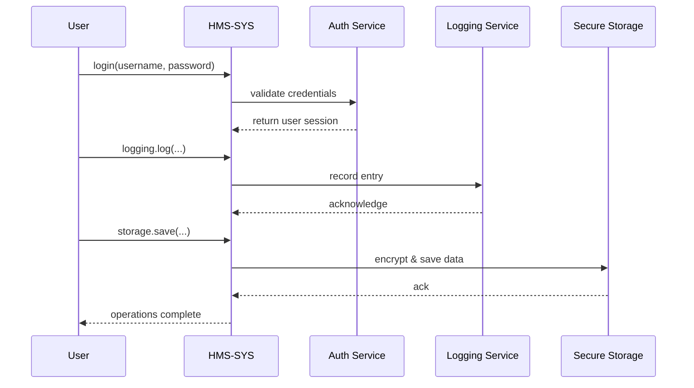

# Chapter 7: Core Infrastructure (HMS-SYS)

In the last chapter we saw how the [Management Layer](06_management_layer_.md) orchestrates tasks across services. Now it’s time to build the **foundation**—the plumbing, wiring, and security that every part of HMS-MCP depends on. Welcome to **Core Infrastructure (HMS-SYS)**!

## 7.1 Why Core Infrastructure?

Imagine the Agency for Toxic Substances and Disease Registry (ATSDR) rolling out an online portal for citizen exposure reports. Behind every click, we need to:

1. **Authenticate** the user so only authorized staff or citizens can log in.  
2. **Log** every action—viewing a report, submitting data—for audit and compliance.  
3. **Store** sensitive exposure measurements securely, encrypted at rest.

Without these services, higher-level modules (AI agents, workflows, management tasks) can’t run reliably or meet federal standards. Core Infrastructure is our secure foundation—like a building’s concrete, pipes, and wiring all working together so the rooms above stay safe and powered.

## 7.2 Key Concepts

1. **Authentication Service**  
   Verifies usernames and passwords, issues session tokens.

2. **Logging Service**  
   Records every operation with user ID, action name, timestamp, and details.

3. **Secure Storage Service**  
   Encrypts data before writing it to disk or a database, ensuring “data at rest” is always protected.

## 7.3 Getting Started with HMS-SYS

Below is a minimal example showing how to initialize and use the core services in a citizen-report scenario:

```python
from hms_mcp import CoreInfrastructure

# 1. Initialize Core Infrastructure
core = CoreInfrastructure()

# 2. User login (ATSDR staff)
user = core.auth.login(username="jdoe", password="secure123")

# 3. Log an action: viewing report #99
core.logging.log(user, "ViewExposureReport", {"report_id": 99})

# 4. Store sensitive data securely
core.storage.save("exposure_report_99", {"level": 5, "site": "Site A"})

print("All core operations completed!")
```

Explanation:
- `core.auth.login(...)` returns a simple user object if credentials match.
- `core.logging.log(...)` prints (or writes) a structured audit entry.
- `core.storage.save(...)` encrypts (simulated here) and writes data to a file or store.

## 7.4 What Happens Under the Hood

Here’s the end-to-end flow when a user logs in, logs an action, and saves data:



1. **User** calls `login()`.  
2. **Core** forwards to **Auth Service**, which checks credentials.  
3. On success, **Core** returns a session object.  
4. **Core** calls **Logging Service** to write an audit record.  
5. **Core** calls **Secure Storage** to encrypt and store data.

## 7.5 Internal Implementation

Let’s peek at how these services are structured in code:

#### File: hms_sys/core.py

```python
# core.py
from .services.auth import AuthService
from .services.logging import LoggingService
from .services.storage import StorageService

class CoreInfrastructure:
    def __init__(self):
        self.auth    = AuthService()
        self.logging = LoggingService()
        self.storage = StorageService()
```

#### File: hms_sys/services/auth.py

```python
# auth.py
class AuthService:
    def login(self, username, password):
        # Simplified check against a user store
        if username == "jdoe" and password == "secure123":
            return {"user_id": 1, "name": "John Doe"}
        raise ValueError("Invalid credentials")
```

#### File: hms_sys/services/logging.py

```python
# logging.py
import datetime

class LoggingService:
    def log(self, user, action, details):
        entry = {
            "user": user["name"],
            "action": action,
            "details": details,
            "time": datetime.datetime.utcnow().isoformat()
        }
        # In production, write to a centralized log store
        print("LOG ENTRY:", entry)
```

#### File: hms_sys/services/storage.py

```python
# storage.py
import json

class StorageService:
    def save(self, key, data):
        # Here we pretend to encrypt with AES-256 before saving
        encrypted = json.dumps(data)  # placeholder for real encryption
        with open(f"{key}.enc", "w") as f:
            f.write(encrypted)
        return True
```

Each service is kept simple and focused on one responsibility—making it easier to test, replace, or scale independently.

## 7.6 Summary & Next Steps

You’ve seen how **Core Infrastructure (HMS-SYS)** delivers the essential building blocks—authentication, logging, and secure storage—that keep our system reliable and compliant. With this solid foundation in place, we’re ready to delve deeper into user identity and permissions in the next chapter: [Authentication & Authorization](08_authentication___authorization_.md).

---

Generated by [AI Codebase Knowledge Builder](https://github.com/The-Pocket/Tutorial-Codebase-Knowledge)