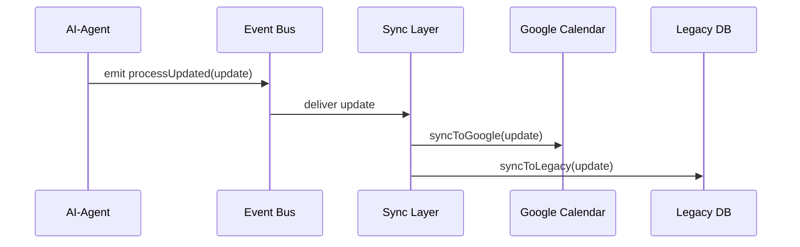

# Chapter 7: External System Synchronization

Welcome back! In [Chapter 6: Backend API Layer (HMS-API/HMS-MKT)](06_backend_api_layer__hms_api_hms_mkt__.md) we built secure endpoints for creating and fetching data. Now we’ll connect our core platform to **third-party tools**, document stores, and legacy databases—keeping them in real time sync.  

## 1. Motivation & Central Use Case

Imagine the Federal Health Agency schedules pop-up vaccination clinics. They use:
- A modern core scheduling platform  
- A legacy database for crew assignments  
- A Google Calendar for public viewing  
- A shared folder (e.g., Google Drive) for forms  

When an AI-agent in our system adjusts the clinic times or adds a new location, **every external system** must reflect that change immediately. Without synchronization, you risk:
- Double-booked crews in the legacy DB  
- Outdated calendar entries confusing citizens  
- Missing forms in the shared folder  

**External System Synchronization** is like the courier service linking a city hall kitchen to its branches. It picks up updates and delivers them instantly, preventing conflicts and outdated instructions.

## 2. Key Concepts

1. **Connector**  
   A small adapter that knows how to talk to one external system (e.g., Google Calendar API).

2. **Sync Layer**  
   The central service that listens for process updates and dispatches them to all connectors.

3. **Event Bus**  
   A lightweight queue or stream (e.g., Kafka, Redis) where update events are published.

4. **Conflict Resolver**  
   Logic to detect conflicting updates (e.g., same timeslot booked twice) and resolve them.

5. **Real-Time Sync**  
   Ensures updates travel from the core platform to external systems with minimal delay.

## 3. Hands-On: Syncing a Clinic Schedule Update

### 3.1 Define a Connector

File: `connectors/googleCalendar.js`
```js
export async function syncToGoogle(event) {
  // Map our event to Google Calendar format
  const entry = {
    summary: event.clinicName,
    start: { dateTime: event.start },
    end:   { dateTime: event.end }
  };
  // Call Google Calendar API (details omitted)
  await googleApi.createOrUpdate(entry);
}
```
> This adapter turns our internal `event` into a Google Calendar entry.

### 3.2 Build the Sync Layer

File: `hms-sync.js`
```js
import { syncToGoogle } from './connectors/googleCalendar.js';
import { syncToLegacy } from './connectors/legacyDb.js';

const connectors = [ syncToGoogle, syncToLegacy ];

export function startSync(eventBus) {
  eventBus.on('processUpdated', update => {
    connectors.forEach(fn => fn(update));
  });
}
```
> We subscribe to `processUpdated` events and call every connector.

### 3.3 Emit an Update Event

```js
// Somewhere in your AI agent or backend API
eventBus.emit('processUpdated', {
  processId: 'vac-camp-001',
  clinicName: 'Downtown Pop-Up',
  start: '2024-07-10T09:00:00Z',
  end:   '2024-07-10T17:00:00Z'
});
```
> When this fires, our sync layer pushes the new schedule to Google Calendar and the legacy DB.

## 4. What Happens Under the Hood?



1. The AI-agent emits a `processUpdated` event.  
2. The **Sync Layer** reads the event.  
3. It calls **Google Calendar** and **Legacy DB** connectors in parallel.

## 5. Internal Implementation Walkthrough

### 5.1 Non-Code Steps

1. **Core platform** emits a “process updated” event after an AI-agent or API call.  
2. **Event Bus** queues and delivers it to subscribers.  
3. **Sync Layer** fans out the update to all configured connectors.  
4. Each **Connector** maps the data and calls its external API.  
5. **Conflict Resolver** (optional) checks for overlaps or duplicates before calling.

### 5.2 Deeper Dive: Conflict Resolution

File: `hms-sync.js` (enhanced)
```js
import { resolveConflicts } from './conflict-resolver.js';

eventBus.on('processUpdated', update => {
  const safeUpdate = resolveConflicts(update);
  connectors.forEach(fn => fn(safeUpdate));
});
```
> `resolveConflicts()` might delay or adjust times to avoid double-booking.

## 6. Summary & Next Steps

In this chapter you learned how **External System Synchronization**:

- Uses **connectors** to adapt updates to each external API  
- Leverages an **event bus** for real-time delivery  
- Optionally applies a **conflict resolver** to prevent overlapping changes  

Next up, we’ll dive into secure payments and transaction processing in [Chapter 8: Financial & Transaction Engine (HMS-ACH)](08_financial___transaction_engine__hms_ach__.md).

---

Generated by [AI Codebase Knowledge Builder](https://github.com/The-Pocket/Tutorial-Codebase-Knowledge)