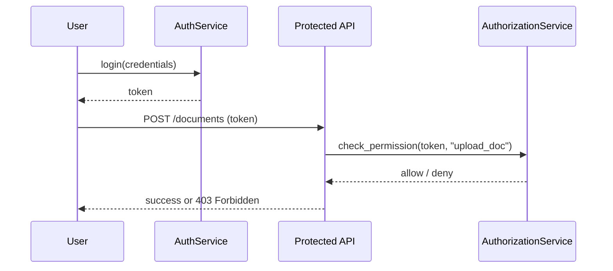

# Chapter 8: Authentication & Authorization

In [Chapter 7: Core Infrastructure (HMS-SYS)](07_core_infrastructure__hms_sys__.md) we built the foundation—authentication, logging, secure storage. Now we’ll focus on **who** can log in and **what** they’re allowed to do. Think of this as issuing ID badges and access cards in a secure government building.

---

## 8.1 Why Authentication & Authorization?

Imagine the Administrative Office of the U.S. Courts launches an e-filing portal:

- **Judges** need full access to sealed case files.  
- **Clerks** can upload and update documents.  
- **Citizens** can view public dockets but not sealed records.  

We need:

1. **Authentication (AuthN)** – Verify someone is really “JudgeSmith” or “ClerkJones.”  
2. **Authorization (AuthZ)** – Check that “JudgeSmith” can access sealed files, while “CitizenBob” cannot.

This prevents unauthorized access and keeps sensitive data safe.

---

## 8.2 Key Concepts

- **Authentication**  
  Proving identity, e.g. username/password or tokens.

- **Authorization**  
  Granting permissions based on roles (judge, clerk, citizen, AI agent).

- **Roles & Permissions**  
  A mapping:  
    • judge → view_sealed, submit_opinion  
    • clerk → upload_doc, update_status  
    • citizen → view_public

- **Tokens & Sessions**  
  Once logged in, we issue a token (like an access card) to avoid re-asking for credentials on every request.

---

## 8.3 Using AuthN & AuthZ

Below is a minimal example showing how to log in a user, issue a token, and check permissions before submitting a document.

```python
# 1. Initialize services
from hms_mcp.auth import AuthService
from hms_mcp.authorization import AuthorizationService

auth  = AuthService()
authz = AuthorizationService()

# 2. User logs in
token = auth.login(username="clerkjones", password="safePass123")
print("Got token:", token)

# 3. Clerk tries to upload a document
action = "upload_doc"
if authz.check_permission(token, action):
    print("Permission granted – proceed to upload.")
else:
    print("Access denied for action:", action)
```

Explanation:  
1. `AuthService.login` returns a token when credentials are valid.  
2. `AuthorizationService.check_permission` takes that token and an action string, then returns True/False.

---

## 8.4 What Happens Under the Hood

Here’s a simple sequence diagram for logging in and submitting a request:



1. **User** sends credentials to **AuthService**.  
2. **AuthService** validates and returns a token.  
3. **User** calls a protected API endpoint with the token.  
4. **Protected API** asks **AuthorizationService** if the token grants the needed role.  
5. The API either proceeds or rejects with “Access Denied.”

---

## 8.5 Internal Implementation

### File: hms_mcp/auth.py

```python
# hms_mcp/auth.py
import uuid

class AuthService:
    def __init__(self):
        # In-memory store: token → user info
        self.sessions = {}

    def login(self, username, password):
        # Simplified credential check
        if username == "clerkjones" and password == "safePass123":
            token = str(uuid.uuid4())
            self.sessions[token] = {"username": username, "roles": ["clerk"]}
            return token
        raise ValueError("Invalid credentials")

    def get_user(self, token):
        return self.sessions.get(token)
```

- `login` issues a random token and records the user’s roles.  
- `get_user` retrieves user info from a token.

### File: hms_mcp/authorization.py

```python
# hms_mcp/authorization.py
from hms_mcp.auth import AuthService

class AuthorizationService:
    # Define what each role can do
    ROLE_PERMISSIONS = {
        "judge":   {"view_sealed", "submit_opinion"},
        "clerk":   {"upload_doc", "update_status"},
        "citizen": {"view_public"}
    }

    def __init__(self):
        self.auth = AuthService()

    def check_permission(self, token, action):
        user = self.auth.get_user(token)
        if not user:
            return False
        # Combine all permissions from the user's roles
        perms = set()
        for role in user["roles"]:
            perms |= self.ROLE_PERMISSIONS.get(role, set())
        return action in perms
```

- `ROLE_PERMISSIONS` maps roles to allowed actions.  
- `check_permission` looks up the user by token, gathers their permissions, and checks the action.

---

## 8.6 Summary & Next Steps

In this chapter, you learned how **Authentication & Authorization**:

- Verifies user identity (AuthN) with tokens.  
- Controls access to actions based on roles (AuthZ).  
- Uses simple services (`AuthService`, `AuthorizationService`) and a token-based flow.  

Next up: dive into the [Policy & Process Module](09_policy___process_module_.md), where we encode business rules and workflows that sit on top of these permissions.

---

Generated by [AI Codebase Knowledge Builder](https://github.com/The-Pocket/Tutorial-Codebase-Knowledge)