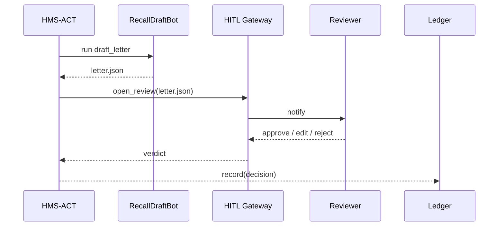
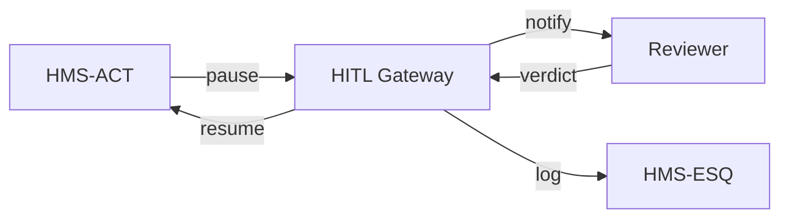

# Chapter 8: Human-in-the-Loop Oversight (HITL)

*(Picking up right after [Activity & Workflow Orchestrator (HMS-ACT)](07_activity___workflow_orchestrator__hms_act__.md))*  

> “Robots may be fast, but only people can say **‘Stop—this feels wrong.’**”  
> —A National Highway Traffic Safety Administration (NHTSA) recalls manager

---

## 1. Why Do We Need HITL?

### 1.1 A Concrete Use-Case – “Instant Vehicle Recall Notice”

NHTSA wants an AI to auto-draft recall letters when it spots safety defects in crash data.  
Problem: a **false alarm** could panic millions of drivers and tank a manufacturer’s stock.  
Requirement: **Every recall draft must pause for human review** before it reaches the public.

Without an “emergency brake,” the agency risks legal liability and public trust.  
**Human-in-the-Loop Oversight (HITL)** provides that brake:

1. AI flags a potential defect.  
2. Workflow pauses.  
3. A manager reviews, tweaks text, or hits *Reject*.  
4. Workflow resumes (or stops) with full audit history.

Result: AI speed **plus** human judgment.

---

## 2. HITL in One Sentence

“Insert a reversible *pause & review* checkpoint at any step where public trust or legal risk is high.”

---

## 3. Key Concepts (Nickname Cheat-Sheet)

| Concept | Beginner Nickname | 1-Line Definition |
|---------|------------------|-------------------|
| Pause Point | “Yellow Light” | Workflow spot that waits for humans |
| Oversight Role | “Reviewer” | Person or group allowed to approve |
| Review Dashboard | “Inbox” | Web view showing pending AI items |
| Guardrail Timer | “Fuse” | Auto-escalates if nobody responds |
| Audit Trail | “Black Box” | Immutable log of who did what, when |

---

## 4. Declaring a Pause in a Workflow (≤ 18 Lines)

Add a **HITL** step in the same YAML you used for ACT:

```yaml
# vehicle_recall.workflow.yaml (excerpt)
steps:
  - name: draft_letter
    uses: RecallDraftBot
  - name: legal_review
    uses: HITL:NHTSA_Legal_Team    # <-- Pause Point
  - name: publish_notice
    uses: FederalRegisterAPI
```

Explanation:  
* `HITL:<role>` tells ACT to **pause** until someone in `NHTSA_Legal_Team` clicks ✅ or ❌.

---

## 5. What Reviewers See

A tiny React front-end (already bundled with HMS-MFE) shows an “AI Inbox”:

```
┌──────────────────────────── AI Inbox ────────────────────────────┐
│ [ ] Recall #2024-017 ‑ Airbag Sensor       🕒 3 m ago           |
│ [ ] Recall #2024-018 ‑ Brake Hose          🕒 1 m ago           |
└──────────────────────────────────────────────────────────────────┘
Click an item → diff view → Approve / Reject / Edit → Save
```

Behind the scenes, each inbox item is just a JSON blob stored in the ledger.

---

## 6. Using HITL in Code (≤ 15 Lines)

Developers only add **one line**—the pause is automatic.

```python
# publish_recall.py
import act_sdk as act

act.emit("nhtsa.defect.detected", data={"case_id": "2024-017"})
# Because the workflow has HITL, act.status will show "waiting_human"
print(act.status("VEHICLE_RECALL", "2024-017"))
```

Output:

```
waiting_human: legal_review (NHTSA_Legal_Team)
```

Once a reviewer approves, status flips to `completed`.

---

## 7. Under the Hood – 5-Step Flow



*Only five actors—easy to reason about.*

---

## 8. Inside the HITL Gateway (≤ 20 Lines)

```python
# hitl/gateway.py
import queue, json, uuid

QUEUE = queue.Queue()
LEDGER = []

def open_review(payload, role):
    ticket = "rev-" + uuid.uuid4().hex[:6]
    QUEUE.put((ticket, role, payload))
    LEDGER.append((ticket, "opened"))
    return ticket

def decision(ticket, verdict, editor=None):
    LEDGER.append((ticket, verdict, editor))
    return verdict == "approved"

def next_item(role):
    t, r, p = QUEUE.get()
    return (t, p) if r == role else None
```

Highlights:  
1. `open_review` creates a **ticket** and logs it.  
2. `decision` writes the final verdict.  
3. Real systems swap `queue.Queue()` for a database; concept stays identical.

---

## 9. Adding the Guardrail Timer (Fuse)

```python
# hitl/fuse.py (12 lines)
import time, gateway

TIMEOUT = 3600  # 1 hour

def tick():
    now = time.time()
    for ticket, state, ts in list(gateway.LEDGER):
        if state == "opened" and now - ts > TIMEOUT:
            gateway.decision(ticket, "auto_reject", editor="system")
```

If nobody responds within 1 hour, the workflow auto-rejects—better safe than sorry.

---

## 10. Compliance Sneak-Peek

Before a human sees any content, **HMS-ESQ** can scrub PII:

```python
from esq_sdk import sanitize

payload = sanitize(letter_json, policy="NHTSA_PUBLIC_COMMS")
gateway.open_review(payload, "NHTSA_Legal_Team")
```

One line keeps sensitive crash-victim data out of screenshots.

---

## 11. Quick “Did I Do It Right?” Checklist

☐ Workflow YAML contains at least one `HITL:` step  
☐ Review dashboard shows your ticket after the AI runs  
☐ Approve / Reject buttons change `act.status()` accordingly  
☐ Audit log records `opened`, `approved/rejected`, timestamp, reviewer ID  
☐ Guardrail timer tested by simulating slow response  

Tick all five and you’ve installed an **emergency brake** on your AI!

---

## 12. Where HITL Fits in the HMS Map



---

## 13. Conclusion & What’s Next

You now have a **fail-safe** that lets humans override, tweak, or halt any AI decision—crucial when headlines and lawsuits are on the line.

But where are all these tickets and logs actually stored?  
In the next chapter we’ll dive into persistent storage and retention policies.

👉 Continue to: [Data Repository & Management (HMS-DTA)](09_data_repository___management__hms_dta__.md)

Happy safeguarding!

---

Generated by [AI Codebase Knowledge Builder](https://github.com/The-Pocket/Tutorial-Codebase-Knowledge)