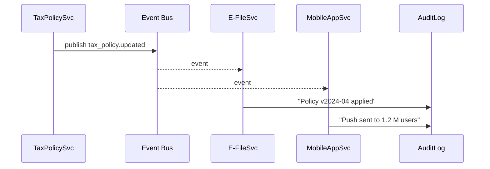

# Chapter 8: Synchronization Event Bus  
*(“The Town-Crier of HMS-MCP”)*  

[← Back to Chapter 7: Backend API Gateway (HMS-API)](07_backend_api_gateway__hms_api__.md)

---

## 1. Motivation — The “Instant Tax Bracket Update” Story  

April 10th, 7 a.m. — Congress passes a bill that **raises the standard deduction**.  
Inside HMS-MCP dozens of micro-services rely on that number:

| Service | Why It Cares |
|---------|--------------|
| `e-file` | Calculates refund for citizens. |
| `withholding-calculator` | Tells employers how much to deduct. |
| `mobile-tax-app` | Shows the new rate to users. |
| `analytics-dashboard` | Forecasts revenue impact. |

If each team manually edits configs:

* some services update at 7 a.m., others at 7 p.m.,  
* citizens see two different numbers,  
* auditors discover data mismatches.

Instead, one “town-crier” should shout *“The deduction is now \$15,000!”* and every service hears it **at the same second**.

That town-crier is the **Synchronization Event Bus**.

---

## 2. Big Idea in One Sentence  

Publish an **event** once → every subscribed service reacts instantly → no copy-paste, no drifts, no late nights.

---

## 3. Key Concepts (Beginner Friendly)

| Word | 1-Line Meaning | Analogy |
|------|---------------|---------|
| Event | A tiny JSON message saying something important happened (`policy.updated`) | The crier’s shout |
| Topic / Channel | Category of events (`tax-policy`) | Street the crier is on |
| Publisher | Code that sends the event | Person who whispers news to the crier |
| Subscriber | Code that listens and reacts | Crowd listening |
| Event Bus | The wiring that delivers messages (RabbitMQ, Redis, NATS, …) | The town square’s loud-speaker |
| Schema | Agreed shape of the JSON (`{id, new_value}`) | Script the crier reads from |

---

## 4. Using the Bus in 5 Minutes  

We will:

1. Publish a `tax_policy.updated` event.  
2. Let two toy subscribers react.  

### 4.1 Install a Tiny Bus (Redis Pub/Sub for demo)

```bash
docker run -d --name hms-bus -p 6379:6379 redis:7
```

### 4.2 Publisher — `publisher.py` (17 lines)

```python
import json, redis, uuid, time

bus = redis.Redis(host="localhost", port=6379)

event = {
    "id": str(uuid.uuid4()),
    "type": "tax_policy.updated",
    "timestamp": time.time(),
    "payload": {"standard_deduction": 15000}
}

bus.publish("tax-policy", json.dumps(event))
print("📣  Event sent!")
```

Explanation  
• Connects to Redis.  
• Builds a small JSON with a **type** and **payload**.  
• Publishes to channel `tax-policy`.

### 4.3 Subscriber A — `refund_service.py` (17 lines)

```python
import redis, json

def recalc(payload):
    print(f"New deduction = {payload['standard_deduction']}")
    # … update in-memory value, warm caches, etc.

bus = redis.Redis(host="localhost", port=6379).pubsub()
bus.subscribe("tax-policy")

for msg in bus.listen():
    if msg["type"] != "message": continue
    evt = json.loads(msg["data"])
    if evt["type"] == "tax_policy.updated":
        recalc(evt["payload"])
```

Subscriber B (`mobile_notifier.py`) would look almost identical but maybe push a phone alert.

Run **publisher → subscribers print instantly** — one source of truth, zero drifts. ✅

---

## 5. What Happens Under the Hood?



Only **one** publish, but many receivers react in real time.

---

## 6. Internal Implementation (Mini But Real)

### 6.1 Event Schema (`schemas/tax_policy.json`, 12 lines)

```json
{
  "type": "object",
  "required": ["standard_deduction"],
  "properties": {
    "standard_deduction": { "type": "number", "minimum": 0 }
  }
}
```

Services validate the payload before acting.

### 6.2 Mini Validator — `bus/validator.py` (18 lines)

```python
import jsonschema, json, pathlib

SCHEMAS = {
    "tax_policy.updated": json.load(
        pathlib.Path("schemas/tax_policy.json").open()
    )
}

def validate(event):
    schema = SCHEMAS.get(event["type"])
    if not schema:
        raise ValueError("Unknown event type")
    jsonschema.validate(event["payload"], schema)
```

Publisher calls `validate(event)` before `bus.publish(…)`. One guard, many saved headaches.

### 6.3 Folder Map (Simplified)

```
hms-bus/
 ├─ publisher.py
 ├─ refund_service.py
 ├─ mobile_notifier.py
 ├─ bus/
 │   └─ validator.py
 └─ schemas/
     └─ tax_policy.json
```

All files are tiny; the magic is in **agreeing on topics + schemas**.

---

## 7. How the Bus Plays with Other HMS Layers  

• **Governance Layer** – validates event schemas and keeps an immutable log ([Governance Layer (HMS-GOV)](02_governance_layer__hms_gov__.md)).  
• **RBAC** – only roles like `policy_publisher` may send on sensitive topics ([RBAC & Multi-Tenant Security](04_role_based_access_control__rbac____multi_tenant_security_.md)).  
• **Management Layer** – uses the bus to announce *deployment finished* events ([HMS-MGT](05_management_layer__hms_mgt___hms_svc__.md)).  
• **Service Mesh** – not needed here; events ride over the message broker rather than HTTP ([Microservice Mesh](06_microservice_mesh___service_discovery_.md)).  
• **Monitoring Dashboard** – side-stream of bus metrics feed charts ([Monitoring & Metrics Dashboard](16_monitoring___metrics_dashboard_.md)).

---

## 8. Tips & Gotchas  

1. **Name Topics Carefully** — `agency.domain.event` (e.g., `irs.tax_policy.updated`).  
2. **Keep Payload Small** — send IDs, not 10 MB PDFs; subscribers can fetch details via API.  
3. **Idempotent Subscribers** — retries may deliver the same event twice.  
4. **Dead-Letter Queue** — route validation failures to `*.dlq` for later inspection.  
5. **Schema-as-Code** — version control your JSON schemas alongside application code.

---

## 9. Recap & What’s Next  

You just:

1. Learned why a “town-crier” event bus prevents data drifts.  
2. Published and received real events with < 20 lines of code.  
3. Saw the simple but powerful internal flow and validation.  
4. Connected the bus to governance, security, and monitoring layers.

But what if the important news originates **outside** HMS-MCP (e.g., a Social-Security mainframe or a commercial shipping API)?  
Time to build a *translator* that syncs external worlds into our event bus.  
Jump to [Chapter 9: External System Sync Adapter](09_external_system_sync_adapter_.md)!

---

---

Generated by [AI Codebase Knowledge Builder](https://github.com/The-Pocket/Tutorial-Codebase-Knowledge)