# Chapter 9: Data Repository & Management (HMS-DTA)

*(A gentle hop from [Human-in-the-Loop Oversight (HITL)](08_human_in_the_loop_oversight__hitl__.md))*  

> “If an API call happens in the forest and nobody logs it,  
> did it really happen?” 
> —A sleepy auditor at the Office of Inspector General

---

## 1. Why Do We Need HMS-DTA?

### 1.1 60-Second Story — “The 6-Hour Tornado Report”

1. **National Weather Service (NWS)** sensors detect a tornado path.  
2. **FEMA** requests high-resolution shelter-entry logs to decide where to send aid.  
3. **Congressional staffers** ask for a public dashboard within six hours.  
4. **The press** files a FOIA request the same afternoon.

All those stakeholders need the *same* trustworthy information, fast.  
HMS-DTA is the **national archives** for your platform:

* Every sensor ping, form submission, and AI decision lands in one **secure vault**.  
* Anyone with permission can **query** or **purge** data according to policy.  
* Audit trails prove nothing was altered on the way to the nightly news.

Without DTA, FEMA would copy CSVs by hand, HIPAA timers would be missed, and auditors would growl.  
With DTA, a junior analyst can type one query and move on to real work.

---

## 2. Five Key Concepts (Beginner Cheat-Sheet)

| # | Name | Plain-English Role | Emoji Hook |
|---|------|-------------------|------------|
| 1 | Vault | The locked room that stores raw files | 🔒 |
| 2 | Index | The card catalog for finding stuff fast | 📇 |
| 3 | Retention Engine | The clock that deletes data on schedule | ⏰ |
| 4 | Query API | The librarian’s service window | 🔍 |
| 5 | Purger | The paper-shredder, with a receipt slip | 🗑️ |

Keep these five in mind. Everything else is just wiring.

---

## 3. Quick Tour—Where Does Data Go?

```mermaid
graph LR
    EV[Event Bus] -->|logs/forms| VAULT[🔒 Vault]
    VAULT --> INDEX[📇 Index]
    INDEX --> API[🔍 Query API]
    VAULT --> PURGE[🗑️ Purger]
    POLICY[ESQ rules & HIPAA timers] -.-> RETAIN[⏰ Retention Engine]
    RETAIN --> PURGE
```



1. **Event Bus** (from earlier chapters) fires raw data into the **Vault**.  
2. The **Index** stores only pointers & tags—fast to search, safe for PII.  
3. **Query API** and dashboards read the Index, not raw files, unless allowed.  
4. **Retention Engine** checks legal timers (HIPAA = 6 yrs, FOIA = forever, etc.).  
5. When a timer expires, **Purger** shreds data and logs a receipt.

---

## 4. Hands-On: Save, Find, Delete in 15 Lines Each

### 4.1 Storing a Tornado Sensor Reading

```python
# store.py
import dta_sdk as dta

reading = {
    "sensor_id": "NWS-TX-017",
    "timestamp": "2024-06-01T09:32:10Z",
    "wind_speed_mph": 142
}
dta.save("nws.tornado", reading)
print("✅ stored")
```

What happens behind the scenes?  
*Binary blob → Vault (🔒) → pointer + tags → Index (📇).*

---

### 4.2 Querying for a Dashboard

```python
# query.py
import dta_sdk as dta

rows = dta.find(
    topic="nws.tornado",
    after="2024-06-01T00:00:00Z",
    fields=["sensor_id", "wind_speed_mph"]
)
print(rows[:3])   # shows first 3 readings
```

Beginners’ takeaway: one function returns lightweight JSON—no need to touch S3 buckets or SQL.

---

### 4.3 Manually Purging a Record (FOIA Exemption)

```python
# purge.py
import dta_sdk as dta

receipt = dta.purge(record_id="abc123")   # from previous query result
print(receipt)    # → {"status":"deleted","shred_log":"log-7e2d…"}
```

*The Purger deletes from the Vault **and** writes a shred receipt to the Index for auditors.*

---

## 5. What’s Under the Hood?

### 5.1 Sequence in 5 Actors


Only **five** players—easy to trace!

---

### 5.2 Super-Tiny Internal Modules

Below are *toy* implementations to show the vibe.  
(Real code swaps JSON files for cloud storage.)

#### a) Vault (`vault.py`) – 17 lines

```python
import json, os, uuid, pathlib
ROOT = pathlib.Path("vault")

def save(topic, obj):
    path = ROOT / f"{uuid.uuid4()}.json"
    path.write_text(json.dumps(obj))
    return str(path)

def delete(path):
    os.remove(path)
```

*One file per record—simplicity beats fancy.*

#### b) Index (`index.py`) – 18 lines

```python
import json, time, pathlib, uuid
IDX = pathlib.Path("index.json")

def add(topic, path, ts):
    row = {"id": uuid.uuid4().hex[:6],
           "topic": topic,
           "path": path,
           "timestamp": ts}
    data = json.loads(IDX.read_text() or "[]") if IDX.exists() else []
    data.append(row)
    IDX.write_text(json.dumps(data, indent=2))
    return row["id"]

def search(topic, after):
    data = json.loads(IDX.read_text() or "[]")
    return [r for r in data if r["topic"]==topic and r["timestamp"]>=after]
```

*Index keeps only metadata—safe & small.*

#### c) Retention Engine (`retention.py`) – 15 lines

```python
import time, index, vault, purge

POLICY = {"nws.tornado": 60*60*24*90}  # keep 90 days

def sweep():
    now = time.time()
    for r in index.search(topic=None, after="1970"):
        keep_sec = POLICY.get(r["topic"], 0)
        age = now - r["timestamp"]
        if age > keep_sec:
            purge.remove(r["id"])
```

*Clock runs nightly; calls Purger as needed.*

---

## 6. Where the Laws Come In (HIPAA, FOIA, etc.)

HMS-DTA **does not invent** retention rules.  
It reads them from the legal corpus maintained in [Compliance & Legal Reasoning (HMS-ESQ)](04_compliance___legal_reasoning__hms_esq__.md).

```python
from esq_sdk import retention_days
POLICY[topic] = retention_days(topic)   # e.g., 2190 for HIPAA (6 yrs)
```

One line keeps lawyers smiling.

---

## 7. Connecting to Other HMS Pieces

```mermaid
graph LR
    AGT[Agents (HMS-AGT)] --> DTA
    ACT[Workflows (HMS-ACT)] --> DTA
    HITL[HITL Tickets] --> DTA
    ESQ[Legal Rules] -. timers .-> DTA
    A2A[Next Stop: A2A Gateway] -.feeds .-> DTA
```

*Every chapter you’ve met so far either **stores** or **reads** data here.*

---

## 8. Quick “Did I Do It Right?” Checklist

☐ `dta.save()` returns a path (proof data landed)  
☐ Record appears in `dta.find()` within seconds  
☐ Retention timers match ESQ rules (spot-check one)  
☐ `dta.purge()` writes a shred receipt to the Index  
☐ Dashboards read only from the Query API, never the raw Vault

Tick all five and your project now has a **tamper-proof memory**!

---

## 9. What’s Next?

You’ve archived, indexed, and legally tamed your data.  
But sometimes data must **leave your walls**—think Census ↔ IRS or FEMA ↔ NOAA transfers.  
Next up we’ll open the secure airlock:  
[Inter-Agency Data Exchange (HMS-A2A)](10_inter_agency_data_exchange__hms_a2a__.md)

Happy archiving!

---

Generated by [AI Codebase Knowledge Builder](https://github.com/The-Pocket/Tutorial-Codebase-Knowledge)