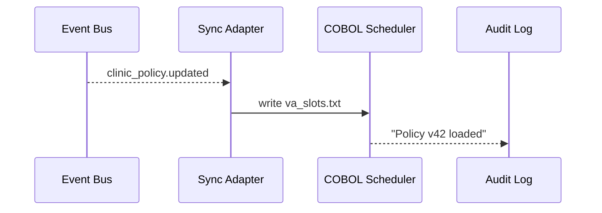

# Chapter 9: External System Sync Adapter  
*(“A Real-Time Translator for Legacy Platforms”)*  

[← Back to Chapter 8: Synchronization Event Bus](08_synchronization_event_bus_.md)

---

## 1. Motivation — The “VA Appointment Shuffle” Story  

The **Department of Veterans Affairs (VA)** still runs a 1990-era **COBOL scheduler** that books clinic visits.  
Last night an AI policy engine (inside HMS-MCP) decided to:

* double mental-health appointment lengths,  
* reserve two extra slots per day for walk-ins.

The change was published on the [Synchronization Event Bus](08_synchronization_event_bus_.md) at **00:02 AM**—but the COBOL mainframe:

* speaks only fixed-width text files,  
* refreshes its rules every 15 minutes,  
* crashes if the file format is wrong.

If the mainframe is not updated in *lock-step*, veterans see wrong times, clerks overbook rooms, and auditors open investigations.

**External System Sync Adapter** acts as a *real-time interpreter*:  
“Hey legacy scheduler, the new slot size is 60 minutes—here’s the change in *your* language, right now.”

---

## 2. Key Concepts (Beginner Edition)

| Term | 1-Line Meaning | Analogy |
|------|----------------|---------|
| Legacy System | Old but important software (COBOL, Oracle 9i, etc.) | Fax machine everyone still uses |
| Sync Adapter | Small program that translates modern events → legacy format (and back) | Bilingual clerk |
| Mapping Table | YAML file saying “new JSON field → old column #34” | Rosetta Stone |
| Push vs. Poll | Decide whether adapter *sends* updates or legacy system *pulls* | Mail delivery vs. post-office pickup |
| Idempotent Update | Applying the same change twice has no harm | Re-sending a memo marked “DUPLICATE—OK” |

---

## 3. Quick Start: Update the VA Scheduler in 3 Steps  

We will:

1. Define a mapping from JSON event → fixed-width text.  
2. Start a 20-line adapter.  
3. Publish a demo event and watch the “file” appear.

### 3.1 Mapping File (`va_scheduler.map.yml` — 12 lines)

```yaml
legacy_file: va_slots.txt
field_widths:        # fixed-width (chars)
  slot_length: 3     # minutes
  walkins:     2     # extra slots
defaults:
  walkins:     "00"  # if field missing
```

Explanation  
• `field_widths` tells how many characters each legacy column needs.  
• `defaults` fill blanks so the mainframe never crashes.

---

### 3.2 Minimal Adapter (`adapter.py` — 20 lines)

```python
import yaml, redis, json, pathlib

MAP = yaml.safe_load(open("va_scheduler.map.yml"))
bus = redis.Redis().pubsub()
bus.subscribe("clinic-policy")                # topic on event bus

def translate(payload):
    sl = str(payload.get("slot_length", "")).rjust(MAP["field_widths"]["slot_length"])
    wi = str(payload.get("walkins", MAP["defaults"]["walkins"])).rjust(MAP["field_widths"]["walkins"])
    return f"{sl}{wi}\n"                      # fixed-width line

for msg in bus.listen():                      # endless loop
    if msg["type"] != "message": continue
    evt = json.loads(msg["data"])
    if evt["type"] != "clinic_policy.updated": continue
    line = translate(evt["payload"])
    pathlib.Path(MAP["legacy_file"]).write_text(line)
    print("✅  Mainframe file rewritten:", line.strip())
```

What it does  
1. Subscribes to `clinic-policy` events.  
2. Converts JSON → fixed-width string.  
3. Writes/overwrites `va_slots.txt` (simulating the mainframe’s watch-file).

---

### 3.3 Fire the Event (`publisher.py` — 9 lines)

```python
import redis, json, uuid, time
bus = redis.Redis()
event = {
  "id": str(uuid.uuid4()),
  "type": "clinic_policy.updated",
  "timestamp": time.time(),
  "payload": { "slot_length": 60, "walkins": 02 }
}
bus.publish("clinic-policy", json.dumps(event))
print("📣  Event sent!")
```

Run order:

```bash
python adapter.py          # terminal 1
python publisher.py        # terminal 2
cat va_slots.txt           # see “ 60 2”
```

Both terminals show success within a second—COBOL scheduler will pick up the new file on its next 15-minute tick.

---

## 4. What Happens Under the Hood? (Step-By-Step)



Only **one** moving part (Adapter) bridges two worlds.

---

## 5. Inside the Adapter — Folder Peek

```
hms-sync-adapter/
 ├─ adapter.py            # 20-line translator
 ├─ va_scheduler.map.yml  # mapping table
 └─ logs/                 # auto-created, append-only
```

Production adapters add:

* retry loops,  
* checksum validation,  
* metrics export.

But the skeleton above is enough to grasp the idea.

---

## 6. How It Connects to Other HMS Layers

| Layer | Interaction |
|-------|-------------|
| Governance | Mapping files are approved just like any policy in [HMS-GOV](02_governance_layer__hms_gov__.md). |
| RBAC | Only users with `role: adapter_admin` can deploy or edit adapters ([RBAC](04_role_based_access_control__rbac____multi_tenant_security_.md)). |
| Event Bus | Primary input; adapter subscribes to topics set in [Chapter 8](08_synchronization_event_bus_.md). |
| Monitoring | Adapter exports “last_success” timestamp to [Metrics Dashboard](16_monitoring___metrics_dashboard_.md). |
| HITL Override | Humans can pause the adapter during audits via [Human-in-the-Loop Override](15_human_in_the_loop__hitl__override_.md). |

---

## 7. Tips & Gotchas

1. **Keep Mapping Tables in Git** — reviewers can diff textual changes.  
2. **Use Idempotent Fields** — include version numbers so duplicate events don’t double-apply.  
3. **Plan for Bidirectional Needs** — sometimes the adapter must also *read* mainframe files and publish events back.  
4. **Minimize Transformation Logic** — complex math belongs in modern services, not the adapter.  
5. **Fail Loud, Not Silent** — if translation fails, log and alert immediately; legacy systems often swallow errors.

---

## 8. Recap & What’s Next  

In this chapter you:

1. Saw why legacy systems need a real-time translator.  
2. Built a 20-line adapter that listens to the event bus and rewrites a mainframe file.  
3. Learned about mapping tables, idempotency, and layer interactions.

Now that the *back-end plumbing* reaches even the oldest systems, let’s see how real humans interact with HMS-MCP on the front end in [Chapter 10: Interface Layer (HMS-MFE, HMS-GOV Portals)](10_interface_layer__hms_mfe__hms_gov_portals__.md).

---

Generated by [AI Codebase Knowledge Builder](https://github.com/The-Pocket/Tutorial-Codebase-Knowledge)