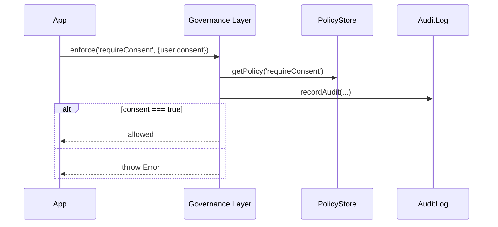

# Chapter 9: Governance Layer

In the previous chapter, you learned how to collect fees and record payments with the [Financial & Transaction Engine (HMS-ACH)](08_financial___transaction_engine__hms_ach__.md). Now we’ll build the **Governance Layer**, which sets and enforces the rules—like a city council writing bylaws—to keep the entire system transparent, ethical, private, and safe.

---

## 1. Motivation & Central Use Case

Imagine the National Institute of Justice (NIJ) deploys an AI tool to analyze crime patterns. Before any automated suggestion is applied:

1. We must ensure the AI respects privacy (no personal data leaks).  
2. We must enforce ethics (no biased recommendations).  
3. Every decision must be logged for audits.

The **Governance Layer** codifies these values into system-wide policies. It lets you author rules, enforces them on every action, and maintains a complete audit trail—so every automated decision or AI suggestion aligns with legal and ethical mandates.

---

## 2. Key Concepts

1. **Policy**  
   A rule that defines allowed or forbidden actions (e.g., “No data access without consent”).

2. **Policy Repository**  
   A store (in memory or database) where all policies live.

3. **Enforcement Engine**  
   The component that checks an action against policies before allowing it.

4. **Policy Authoring**  
   A simple interface or format to write new rules.

5. **Audit Trail**  
   A log of every policy check—who asked, what rule ran, and the outcome.

---

## 3. Hands-On: Enforcing a “Require Consent” Policy

Let’s codify a policy: **no user data request may proceed without explicit consent**.

### 3.1 Define the Policy

File: `policyStore.js`
```js
const policies = {
  requireConsent: {
    description: 'User must have given consent',
    condition: ctx => ctx.consent === true
  }
};
export function getPolicy(name) {
  return policies[name];
}
```
> We store one policy named `requireConsent` with a simple condition function.

### 3.2 Record Audit Events

File: `audit.js`
```js
export function recordAudit(policy, user, outcome) {
  console.log(`[Audit] ${new Date().toISOString()} | ${user} | ${policy} | ${outcome}`);
}
```
> Every time we check a policy, we’ll log who ran it, which policy, and whether it passed.

### 3.3 Enforcement Engine

File: `enforcer.js`
```js
import { getPolicy } from './policyStore.js';
import { recordAudit } from './audit.js';

export function enforce(policyName, ctx) {
  const p = getPolicy(policyName);
  const ok = p.condition(ctx);
  recordAudit(policyName, ctx.user, ok);
  if (!ok) throw new Error(`Policy "${policyName}" violated`);
  return true;
}
```
> We fetch the policy, run its condition on the context (`ctx`), audit the result, and throw if it fails.

### 3.4 Applying Enforcement in Your App

```js
import { enforce } from './enforcer.js';

function handleDataRequest(req) {
  // This will throw if user.consent !== true
  enforce('requireConsent', { user: req.userId, consent: req.consent });
  // ...proceed to fetch and return user data
}
```
> Before accessing any sensitive data, we call `enforce()` to guard the action.

---

## 4. What Happens Under the Hood?



1. Your app calls `enforce()`.  
2. The Governance Layer retrieves the rule from the Policy Store.  
3. It evaluates the condition, records an audit entry, and returns success or throws a violation.

---

## 5. Internal Implementation Walkthrough

### 5.1 Non-Code Overview

1. **Authoring:** Developers add or update policies in `policyStore.js` (or a more advanced UI).  
2. **Runtime Enforcement:** Whenever a sensitive action occurs, the app calls `enforce()`.  
3. **Audit Logging:** Each check writes a timestamped entry for full transparency.  
4. **Error Handling:** Violations raise exceptions or block the action.

### 5.2 Core File Structure

```
/governance
  ├── policyStore.js    # where policies live
  ├── enforcer.js       # enforcement logic
  └── audit.js          # audit trail recorder
```

Each file is small and focused:

- **policyStore.js:** Holds your rules in plain objects.  
- **enforcer.js:** The engine that runs rules and blocks violations.  
- **audit.js:** A simple logger (replace with a real audit service in production).

---

## 6. Summary & Next Steps

In this chapter, you learned how the **Governance Layer**:

- Codifies values like transparency, ethics, privacy, and safety into **policies**  
- Provides a **Policy Store** for writing and updating rules  
- Uses an **Enforcement Engine** to check every action  
- Keeps a complete **Audit Trail** for compliance  

Next up, we’ll look at the [Management Layer](10_management_layer_.md), which organizes and supervises all these components at scale. 

See you there!

---

Generated by [AI Codebase Knowledge Builder](https://github.com/The-Pocket/Tutorial-Codebase-Knowledge)