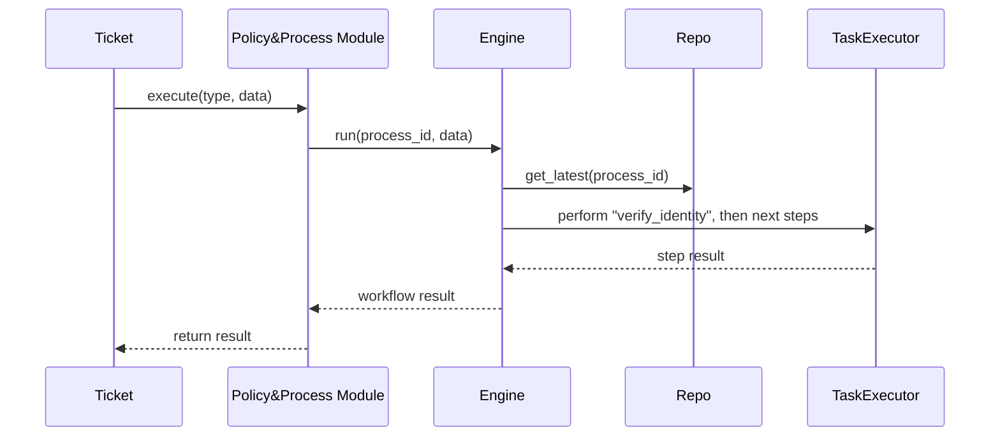

# Chapter 9: Policy & Process Module

In [Chapter 8: Authentication & Authorization](08_authentication___authorization_.md) we learned **who** can do **what** in HMS-MCP. Now let’s explore **how** tasks actually get done in a consistent, governed way. That’s the role of the **Policy & Process Module**.

---

## 9.1 Why a Policy & Process Module?

Imagine the **Passport Services Office** wants to automate citizen passport applications. Every application must follow these steps:

1. Verify the applicant’s identity  
2. Run a background check  
3. Print and mail the passport  

Instead of hard-coding these steps everywhere, we store them once in a **library of standard procedures**. When a new application (a “ticket”) arrives, we simply invoke the right process. If an AI agent suggests a better workflow—say, parallelizing background checks—we version that suggestion so we can review or roll back later.

---

## 9.2 Key Concepts

1. **Policies**  
   Business rules like “identity must be government-issued photo ID.”  
2. **Processes**  
   Ordered steps (e.g., `["verify_identity", "background_check", "issue_passport"]`).  
3. **Versioning**  
   Every time you create or update a process, you get a new version number.  
4. **Invocation**  
   When a ticket arrives (e.g., a passport application), the module picks the latest process and runs each step in order.

---

## 9.3 Using the Policy & Process Module

Here’s a minimal example of registering a process and executing it for an incoming application:

```python
from hms_mcp import PolicyProcessModule

# 1. Initialize the module
ppm = PolicyProcessModule()

# 2. Register a new process definition (AI-proposed or human-written)
process_def = {
    "id": "passport_app",
    "steps": ["verify_identity", "background_check", "issue_passport"]
}
versioned = ppm.register_process(process_def)
print("Registered version:", versioned["version"])
# → Registered version: 1

# 3. An application ticket arrives
ticket = {
    "type": "passport_app",
    "data": {"applicant_id": "C12345678"}
}

# 4. Execute the workflow
result = ppm.execute(ticket)
print(result)
# → {'status': 'completed',
#    'performed': [
#      'ran verify_identity on {...}',
#      'ran background_check on {...}',
#      'ran issue_passport on {...}'
#    ],
#    'process_version': 1}
```

Explanation:  
- We create `ppm` to manage processes.  
- `register_process` saves (and versions) the process.  
- `execute` looks up the latest version by `type` and runs each step.

---

## 9.4 What Happens Under the Hood



1. **Ticket** calls `execute(...)` on the module.  
2. The **Engine** asks the **Repository** for the latest process version.  
3. For each step, the **TaskExecutor** runs the work (could be another service or function).  
4. Results bubble back and are returned to the caller.

---

## 9.5 Internal Implementation

Let’s peek at the simplified files that power this module.

#### File: policy_process_module.py

```python
# policy_process_module.py
from .engine import ProcessEngine
from .repository import ProcessRepository

class PolicyProcessModule:
    def __init__(self):
        self.repo = ProcessRepository()
        self.engine = ProcessEngine(self.repo)

    def register_process(self, process_def):
        # Assigns a new version and saves
        return self.repo.save(process_def)

    def execute(self, ticket):
        # Finds and runs the process by type
        return self.engine.run(ticket["type"], ticket["data"])
```

#### File: repository.py

```python
# repository.py
class ProcessRepository:
    def __init__(self):
        self.store = {}  # id → list of versions

    def save(self, process_def):
        pid = process_def["id"]
        versions = self.store.setdefault(pid, [])
        version = len(versions) + 1
        process_def["version"] = version
        versions.append(process_def.copy())
        return process_def

    def get_latest(self, pid):
        return self.store[pid][-1]
```

#### File: engine.py

```python
# engine.py
class ProcessEngine:
    def __init__(self, repo):
        self.repo = repo

    def run(self, process_id, data):
        proc = self.repo.get_latest(process_id)
        performed = []
        for step in proc["steps"]:
            # In real life, call out to a service or function
            performed.append(f"ran {step} on {data}")
        return {
            "status": "completed",
            "performed": performed,
            "process_version": proc["version"]
        }
```

---

## 9.6 Summary & Next Steps

You’ve learned how the **Policy & Process Module**:

- Stores **versioned** process definitions (AI-generated or manual).  
- Picks the right workflow when a **ticket** arrives.  
- Executes each **step** in order and returns a clear result.

Up next: see how changes propagate instantly between services in  
[Chapter 10: Real-Time Synchronization](10_real_time_synchronization_.md).

---

Generated by [AI Codebase Knowledge Builder](https://github.com/The-Pocket/Tutorial-Codebase-Knowledge)