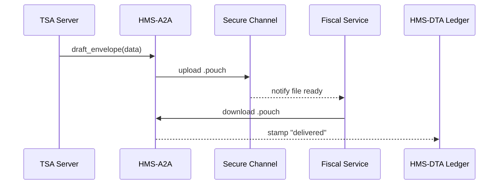
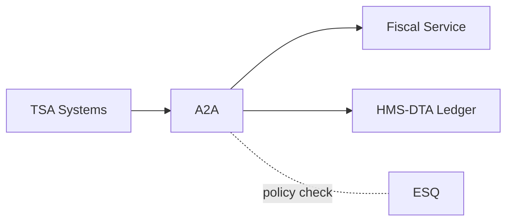

# Chapter 10: Inter-Agency Data Exchange (HMS-A2A)

*(Picking up right after [Data Repository & Management (HMS-DTA)](09_data_repository___management__hms_dta__.md))*  

> “Think of A2A as the State Department’s diplomatic pouch—  
> sealed, tracked, and delivered **exactly** to the other embassy door.”  
> —G-14 Systems Engineer explaining a JSON payload to a new hire  

---

## 1. Why Do We Need A2A?

### 1.1 A Concrete Use-Case – “TSA Lists → Treasury Payments”

1. **Transportation Security Administration (TSA)** holds the master traveler lists.  
2. **Bureau of the Fiscal Service (BFS)** must confirm each traveler has paid the $5.60 aviation fee before clearing ACH disbursements to airports.  
3. Data is **Privacy Act–protected** and **time-sensitive**.  
4. If a single record leaks or is tampered with, TSA faces a congressional hearing.

**Inter-Agency Data Exchange (HMS-A2A)** is the *air-gapped conveyor belt* that:

* packages TSA data in a tamper-evident “pouch,”  
* delivers it over a mutually authenticated channel,  
* writes an audit receipt to both agencies’ ledgers,  
* deletes or archives according to policy in [HMS-DTA](09_data_repository___management__hms_dta__.md).

Result: BFS gets the traveler list **fast**, TSA keeps its lawyers calm.

---

## 2. Five Key Ideas (Beginner Cheat-Sheet)

| # | Concept | Plain-English Metaphor |
|---|---------|-----------------------|
| 1 | Envelope | A zip file + checksum = sealed pouch |
| 2 | Handshake | Secret password both sides know (“Open, Sesame!”) |
| 3 | Audit Stamp | Ink stamp each time the pouch changes hands |
| 4 | Channel | The courier route (SFTP, HTTPS, dead-drop bucket) |
| 5 | Receipt | Little paper slip proving delivery |

Memorize **E-H-A-C-R** — Envelope, Handshake, Audit, Channel, Receipt.

---

## 3. Declaring an A2A Link (15-Line YAML)

Create `tsa_to_bfs.a2a.yaml`:

```yaml
id: TSA→BFS_fee_check
source_agency: TSA
dest_agency: BureauFiscalService
channel: sftp://sftp.fiscal.treasury.gov:22
encryption: AES256
handshake:
  shared_secret: ENV:A2A_SECRET        # read from env var
auditing:
  store: HMS-DTA                       # write receipts to Chapter 9 vault
  retention_days: 365
schedule: "every 4h"
```

Beginners’ takeaway: one YAML file is the **MOU** for tech systems.

---

## 4. Sending Data in <20 Lines

```python
# send.py
import a2a_sdk as a2a, json, os

PAYLOAD = {"flight":"UA123","passengers":[{"name":"Lee","fee":5.60}]}

link = a2a.load("tsa_to_bfs.a2a.yaml")
env = a2a.draft_envelope(PAYLOAD, link)   # ① zip + sign
a2a.send(env, link)                       # ② upload via SFTP
print("✅ sent")
```

What it does:  
1. `draft_envelope` zips + AES-encrypts + adds checksum.  
2. `send` uses the channel, then logs a “sent” receipt to **HMS-DTA**.

---

## 5. Receiving & Verifying (≤18 Lines)

```python
# receive.py
import a2a_sdk as a2a

link = a2a.load("tsa_to_bfs.a2a.yaml")
env = a2a.receive(link)               # ① download newest pouch
data = a2a.open_envelope(env, link)   # ② verify checksum & decrypt
print(data)                           # ➜ {'flight':'UA123',...}
```

If checksum or secret is wrong, `open_envelope` raises `TamperError` and ESQ is alerted.

---

## 6. Step-By-Step Walkthrough



Five actors—easy for auditors and beginners alike.

---

## 7. What’s Under the Hood? (Tiny Code Peaks)

### 7.1 Envelope Maker (17 Lines)

```python
# a2a/envelope.py
import json, hashlib, base64, zipfile, io, os
from Crypto.Cipher import AES

def draft(data: dict, secret: bytes):
    blob = json.dumps(data).encode()
    iv = os.urandom(16)
    cipher = AES.new(secret, AES.MODE_CFB, iv=iv)
    enc = cipher.encrypt(blob)
    sha = hashlib.sha256(enc).hexdigest()

    zbuf = io.BytesIO()
    with zipfile.ZipFile(zbuf, 'w') as z:
        z.writestr('body.enc', enc)
        z.writestr('meta.txt', sha)
    return zbuf.getvalue()
```

Highlights:  
* **≤17 lines** encrypt + hash + zip.  
* `meta.txt` carries the checksum.

### 7.2 Receipt Logger (14 Lines)

```python
# a2a/receipt.py
import dta_sdk as dta, time, uuid

def stamp(link_id, phase):  # phase = sent | received | tamper
    record = {
        "link": link_id,
        "phase": phase,
        "ts": time.time(),
        "id": uuid.uuid4().hex[:6]
    }
    dta.save("a2a.receipt", record)
```

Every stamp is now queryable in **HMS-DTA**.

---

## 8. Security & Compliance Hooks

Before shipping, A2A asks [HMS-ESQ](04_compliance___legal_reasoning__hms_esq__.md):

```python
from esq_sdk import allow_transfer

if not allow_transfer(data, dest="BureauFiscalService"):
    raise PermissionError("ESQ blocked transfer")
```

One line keeps FOIA, Privacy Act, and HIPAA guardians happy.

---

## 9. FAQ for New Developers

| Question | Tiny Answer |
|----------|-------------|
| Can I use HTTPS instead of SFTP? | Yes—change `channel:` URI. |
| How big can the envelope be? | Default 100 MB (configurable). |
| Where are secrets stored? | In **HMS-AGT** Vault, never in code. |
| How do I retry failed transfers? | `a2a.retry(link, envelope_id)` handles back-off. |
| Do I need to clean up old pouches? | Retention Engine in **DTA** purges after `retention_days`. |

---

## 10. Quick “Did I Do It Right?” Checklist

☐ `.a2a.yaml` file lists **source**, **dest**, **channel**, **handshake**  
☐ `draft_envelope` and `open_envelope` run without exceptions in dev  
☐ A “sent” and “delivered” receipt appear in `dta.find(topic="a2a.receipt")`  
☐ ESQ test passes by purposely using the wrong destination and seeing a block  
☐ Retention timer deletes envelopes after the set days (check logs)

Nail these five and you’ve mastered **federal-grade data diplomacy**!

---

## 11. Where A2A Sits in the HMS Map



*Data glides from one agency to another—signed, sealed, & logged.*

---

## 12. What’s Next?

Now that two agencies can swap files safely, imagine **50 states’ Medicaid portals** needing to exchange health data the *same day* a patient moves.  
Our next stop brings A2A techniques into the healthcare realm.

👉 Continue to: [Universal Health Care Integration (HMS-UHC)](11_universal_health_care_integration__hms_uhc__.md)

Happy exchanging!

---

Generated by [AI Codebase Knowledge Builder](https://github.com/The-Pocket/Tutorial-Codebase-Knowledge)