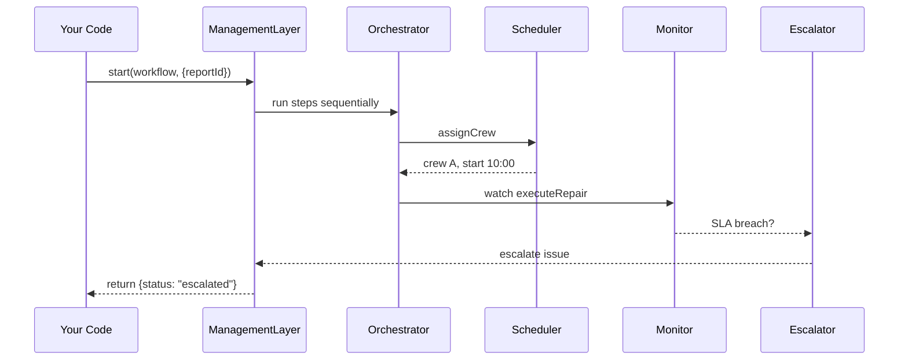

# Chapter 10: Management Layer

Welcome back! In the previous chapter we learned how the [Governance Layer](09_governance_layer_.md) enforces rules and logs every action. Now we’ll climb up to the “operations department” of our HMS system, the **Management Layer**, which schedules work, watches performance, and escalates problems when needed—just like city hall dispatching maintenance crews and tracking their progress.

---

## 1. Motivation & Central Use Case

Imagine the City Roads Agency needs to coordinate pothole repairs across hundreds of locations:

1. A citizen reports a pothole via our Intent Navigator.
2. An AI agent prioritizes it by severity.
3. A human supervisor approves the fix.
4. Crews must be scheduled, resources allocated, and progress monitored to meet a 48-hour SLA.

The **Management Layer** ties all these steps together, ensuring each task:
- Runs in the right order (orchestration).
- Has crews and materials assigned (resource allocation).
- Is tracked against performance targets (monitoring).
- Raises an alert if a repair runs over budget or past its deadline (escalation).

This chapter shows you how to use—and how it works under the hood.

---

## 2. Key Concepts

1. **Orchestrator**  
   The engine that reads a workflow definition and launches each step (microservice, AI agent, human approval) in sequence.

2. **Scheduler**  
   Assigns tasks to available teams or services based on capacity and skills.

3. **Monitor**  
   Watches running tasks, collecting metrics like start/end times and SLA compliance.

4. **Escalator**  
   Triggers alerts or fallback procedures when a task breaches thresholds (e.g., past its due time).

5. **Workflow Definition**  
   A JSON or code structure describing the ordered steps, required resources, and SLAs.

---

## 3. Hands-On: Orchestrating a Pothole Repair

### 3.1 Define a Simple Workflow

File: `repairWorkflow.json`
```json
{
  "steps": [
    { "task": "assessSeverity", "agent": "SeverityAgent" },
    { "task": "humanApproval", "role": "Supervisor" },
    { "task": "assignCrew", "service": "CrewScheduler" },
    { "task": "executeRepair", "service": "RepairService" }
  ],
  "slaHours": 48
}
```
> This JSON lists four steps and an overall 48-hour SLA.

### 3.2 Kick Off the Workflow

File: `main.js`
```js
import { ManagementLayer } from './management-layer.js';
async function startRepair(reportId) {
  const workflow = await fetch('repairWorkflow.json').then(r=>r.json());
  const result = await ManagementLayer.start(workflow, { reportId });
  console.log('Workflow Result:', result);
}
startRepair('pothole-123');
```
> We load the workflow, pass in the `reportId`, and await the final outcome.

### 3.3 What You’ll See

```txt
[Orchestrator] Step 1 passed: assessSeverity
[Orchestrator] Waiting humanApproval...
[Monitor] Task assignCrew started at 10:15
[Escalator] ALERT: executeRepair breached SLA at 2024-07-12T14:00Z
Workflow Result: { status: "escalated", details: {...} }
```
> Logs show each step, monitoring info, and an escalation when the SLA is missed.

---

## 4. What Happens Under the Hood?



1. Your code calls `ManagementLayer.start()`.  
2. The **Orchestrator** fires each step in order.  
3. The **Scheduler** picks a crew and kickoff time.  
4. The **Monitor** tracks progress against the 48-hour SLA.  
5. If breached, the **Escalator** raises an alert and updates the final status.

---

## 5. Internal Implementation Walkthrough

### 5.1 Core Files

```
/management-layer
  ├── index.js         # entry point
  ├── orchestrator.js  # runs each step
  ├── scheduler.js     # finds and allocates resources
  ├── monitor.js       # tracks task metrics
  └── escalator.js     # checks SLAs and triggers alerts
```

### 5.2 orchestrator.js (simplified)
```js
export async function run(steps, ctx) {
  for (const s of steps) {
    // launch microservice or agent
    await executeStep(s, ctx);
  }
  return ctx;
}
async function executeStep(step, ctx) {
  console.log(`Running ${step.task}`);
  // ... call AI agent, prompt human, or call service ...
}
```
> Loops through each step, running them one by one.

### 5.3 monitor.js & escalator.js
```js
let startTime = Date.now();
export function checkSLA(slaHours) {
  if ((Date.now() - startTime) > slaHours*3600000) {
    console.error('SLA breached');
    // ... trigger notifications ...
  }
}
```
> Simplified SLA check against the workflow start time.

---

## 6. Summary & Next Steps

In this chapter you discovered how the **Management Layer**:

- Orchestrates multi-step workflows across agents, services, and humans  
- Schedules resources to meet service demands  
- Monitors progress against SLAs  
- Escalates issues automatically when thresholds are missed  

Up next, we’ll learn about the [Interface Layer](11_interface_layer_.md), where these operations surface to users and external systems. See you there!

---

Generated by [AI Codebase Knowledge Builder](https://github.com/The-Pocket/Tutorial-Codebase-Knowledge)