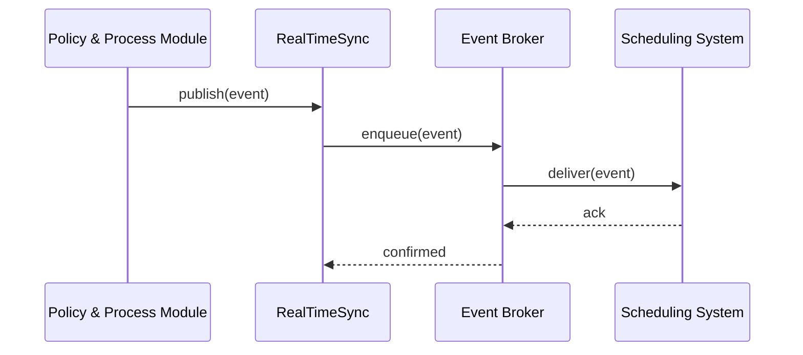

# Chapter 10: Real-Time Synchronization

In [Chapter 9: Policy & Process Module](09_policy___process_module_.md) we learned how HMS-MCP stores and executes versioned workflows. Now, let’s make sure **every** change you approve shows up everywhere **instantly**—that’s **Real-Time Synchronization**.

---

## 10.1 Why Real-Time Synchronization?

Imagine the Federal Railroad Administration (FRA) updates its **safety inspection schedule policy** in HMS. Trains run on tight timetables; you don’t want dispatchers or maintenance crews working off old instructions. With real-time sync, the moment policy is approved:

- Your **scheduling system** automatically updates crew assignments.  
- Your **case management platform** shows the new inspection rules to field engineers.  

No waiting, no manual imports—just **live updates** across all connected systems.

---

## 10.2 Key Concepts

1. **Change Events**  
   When a policy or process changes in HMS, we emit a tiny “event” describing what changed.

2. **Event Broker**  
   A simple in-memory queue or message bus that holds events until external systems pick them up.

3. **Subscribers**  
   External systems (scheduling apps, case managers) register callback functions to receive events.

4. **Delivery Guarantee**  
   We keep retrying until each subscriber confirms receipt—so updates are never lost.

---

## 10.3 Using Real-Time Synchronization

Below is a minimal example showing how a policy update flows through HMS and ends up in an external scheduler.

1) Approve a policy change in the Policy & Process Module:  
```python
from hms_mcp import PolicyProcessModule, RealTimeSync

ppm  = PolicyProcessModule()
sync = RealTimeSync()

# Register an external subscriber: the scheduling system
def scheduling_update(event):
    print("Scheduling system received:", event)
sync.subscribe("policy_update", scheduling_update)

# 1. Register and approve a process change
process_def = {
    "id": "train_inspection",
    "steps": ["pretrip_check", "safety_inspect", "report"]
}
ppm.register_process(process_def)

# 2. Emit a real-time event after approval
event = {"type": "policy_update", "process_id": "train_inspection", "version": 1}
sync.publish(event)
```
Explanation:  
- We subscribe our `scheduling_update` function to `"policy_update"` events.  
- After registering a new process, we create an event and call `sync.publish(...)`.  
- Our subscriber prints the event immediately.

---

## 10.4 What Happens Under the Hood



1. **Policy & Process Module** calls `sync.publish(...)`.  
2. **RealTimeSync** hands the event to the **Event Broker**.  
3. The **Broker** delivers to each **Subscriber** (e.g., scheduling system).  
4. Once a subscriber acknowledges, the broker marks the event done.

---

## 10.5 Internal Implementation

### File: real_time_sync.py

```python
# real_time_sync.py
class RealTimeSync:
    def __init__(self):
        # event_type → list of subscribers
        self.subscribers = {}

    def subscribe(self, event_type, callback):
        self.subscribers.setdefault(event_type, []).append(callback)

    def publish(self, event):
        # enqueue immediately for this simple broker
        for cb in self.subscribers.get(event["type"], []):
            self._deliver(cb, event)

    def _deliver(self, callback, event):
        # In real life, add retries & error handling
        callback(event)
```

Explanation:  
- `subscribe(...)` registers external callback functions by event type.  
- `publish(...)` looks up subscribers and calls them right away.  
- `_deliver(...)` is where you’d add retry logic in production.

---

## 10.6 Summary & Next Steps

You’ve seen how **Real-Time Synchronization** instantly propagates changes from the [Policy & Process Module](09_policy___process_module_.md) to any external system:

- Emitting **change events**  
- Using a simple **event broker**  
- Letting external **subscribers** register and receive updates  

Next, we’ll dive deeper into connecting with real-world external platforms—APIs, message queues, and case management systems—in  
[Chapter 11: External System Integration](11_external_system_integration_.md).

---

Generated by [AI Codebase Knowledge Builder](https://github.com/The-Pocket/Tutorial-Codebase-Knowledge)