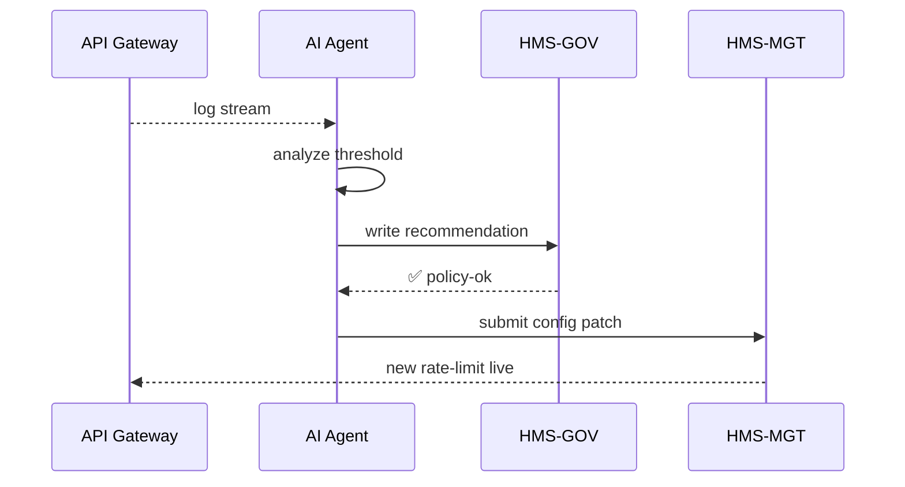

# Chapter 12: AI Representative Agent (HMS-A2A)

[← Back to Chapter&nbsp;11: Intent-Driven Navigation & Guided Journeys](11_intent_driven_navigation___guided_journeys_.md)

---

## 1. Motivation — The “Student-Loan Fix Before Breakfast” Story  

Every night the **Office of Federal Student Aid (FSA)** receives:

* 18 000 web complaints (“My balance looks wrong!”)  
* 400 000 log lines from payment micro-services  
* 65 new regulation pages from the Federal Register  

By 8 a.m. the help-desk must:

1. Detect patterns (e.g., interest mis-calculated for 2023 graduates).  
2. Draft a patch to the calculation service.  
3. Hand the proposal to a supervisor or, if trivial, auto-deploy it.  

A human could never read that much before coffee.  
Enter the **AI Representative Agent (HMS-A2A)**—a tireless policy analyst that lives inside the platform, watches usage patterns 24 / 7, and either **proposes** or **pushes** optimizations while keeping a clear audit trail.

---

## 2. What *Is* an AI Representative Agent?

Think of A2A as a **digital union rep** for citizens and agencies:

| Real-World Analogy | HMS-A2A Role |
|--------------------|-------------|
| Ombudsman reading complaints | Log & ticket Watcher |
| Policy analyst spotting trends | Pattern Analyzer |
| Draft lawyer writing new rule | Suggestion Engine |
| Clerk who files change request | Action Router |
| Supervisor signing off | Human-in-the-Loop (HITL) Gate |

At any moment A2A is either **observing**, **analyzing**, **suggesting**, or **acting**.

---

## 3. Key Concepts (Beginner Edition)

| Term | 1-Line Meaning | Analogy |
|------|---------------|---------|
| Watch Feed | Source A2A listens to (logs, complaints, metrics) | Newspaper pile |
| Signal | Interesting pattern found (`failure_rate↑`) | Red flag |
| Recommendation | YAML patch describing a fix | Memo on supervisor’s desk |
| Auto-Apply | Flag that lets A2A push the change via [HMS-MGT](05_management_layer__hms_mgt___hms_svc__.md) |
| HITL Level | Threshold deciding if a human must approve | “Needs signature” stamp |
| Audit Trail | Immutable record stored in [HMS-GOV](02_governance_layer__hms_gov__.md) | File cabinet |

---

## 4. A 3-Step “Hello A2A” Walk-Through  

We’ll train a tiny A2A to watch API error logs and raise the rate-limit if too many 429 errors appear.

### 4.1 Declare the Agent (YAML ≤ 15 lines)

```yaml
# file: agents/raise_rate_limit.yml
id: raise_rate_limit
watch_feed: api_gateway.logs
signal:
  type: count_status
  status: 429
  threshold: 100   # per minute
recommendation:
  service: PERMIT_API
  patch:
    rate_limit_rps: +50
hitl_level: LOW     # auto-apply allowed
```

Explanation  
• Watches gateway logs.  
• If > 100 “Too Many Requests” per minute, suggest bumping limit by 50 RPS.  
• Because impact is small, `hitl_level: LOW` means auto-deploy is ok.

---

### 4.2 Start the Agent (Python ≤ 15 lines)

```python
import a2a                                                   # tiny SDK
agent = a2a.load("agents/raise_rate_limit.yml")
agent.run()                                                  # blocking loop
```

The agent now:

1. Streams logs from the Watch Feed.  
2. Counts 429 errors.  
3. When threshold met → builds recommendation YAML → sends to Action Router.

---

### 4.3 Observe the Result (Console)

```
[A2A] Detected 132×429 in 60 s
[A2A] 🚀 Auto-patch queued   patch_id=901
[HMS-MGT] Applied patch 901  PERMIT_API rate_limit_rps:+50
```

No pager duty, no manual math—citizens feel the fix within minutes.

---

## 5. What Happens Under the Hood?



Only 5 actors, all existing pieces you’ve met in earlier chapters.

---

## 6. Inside the A2A SDK (Mini Code Peeks)

### 6.1 Loading & Scheduling (`a2a/core.py`, 15 lines)

```python
import yaml, time
def load(path):
    cfg = yaml.safe_load(open(path))
    return Agent(cfg)

class Agent:
    def __init__(self, cfg): self.cfg, self.count = cfg, 0
    def run(self):
        for log in stream(self.cfg["watch_feed"]):         # generator
            if is_signal(log, self.cfg["signal"]):
                self.count += 1
            if one_min_passed() and self.count > self.cfg["signal"]["threshold"]:
                self.recommend(); self.count = 0
```

Plain loop, no magic.

### 6.2 Making a Recommendation (`a2a/recommend.py`, 18 lines)

```python
import requests, uuid, time, yaml
from validator import guard_policy         # reuse Chapter 2 code

def propose(cfg):
    patch = {
      "service": cfg["recommendation"]["service"],
      **cfg["recommendation"]["patch"]
    }
    guard_policy(patch)                    # safety check
    rec = {
      "id": str(uuid.uuid4()),
      "patch": patch,
      "hitl": cfg["hitl_level"],
      "timestamp": time.time()
    }
    # store in GOV audit then forward
    requests.post("https://gov/api/rec", json=rec)
    return rec
```

Less than 20 lines to go from detection to audited proposal.

---

## 7. Where Does A2A Sit in HMS-MCP?

```
Logs, Complaints, Metrics
          ⇣
     ┌──────────┐
     │  A2A     │
     └──────────┘
          ⇣
   Governance Layer  ← HITL overrides (Ch. 15)
          ⇣
   Management Layer  (auto or manual patch)
          ⇣
   Services adapt   (plus feedback to Monitoring Dashboard)
```

A2A is **not** a free-floating rogue AI—it is caged inside existing guardrails.

---

## 8. Tips & Gotchas

1. **Start With LOW-Impact Fixes**  
   Auto-apply only what can’t break laws or finances (rate-limits, copy edits).

2. **Tune the HITL Ladder**  
   `LOW` = auto, `MEDIUM` = supervisor, `HIGH` = CISO sign-off.

3. **Use Clear Metrics**  
   False positives annoy staff; impossible thresholds mean no improvements.

4. **Log Everything**  
   A2A writes to HMS-GOV before acting—no silent changes.

5. **Recycle Signals**  
   Same Watch Feed can power multiple agents; keep them modular.

---

## 9. How A2A Connects to Other Chapters

| Layer / Chapter | Interaction |
|-----------------|-------------|
| [Synchronization Event Bus](08_synchronization_event_bus_.md) | Agents can publish `policy.recommendation` events for broadcast. |
| [Human-in-the-Loop Override](15_human_in_the_loop__hitl__override_.md) | Supervisors approve or block `MEDIUM/HIGH` recommendations. |
| [Monitoring & Metrics Dashboard](16_monitoring___metrics_dashboard_.md) | A2A health & impact stats render in dashboards. |
| [Process Optimization Workflow](14_process_optimization_workflow_.md) | A2A often triggers these workflows automatically. |

---

## 10. Recap & Next Steps

In this chapter you built a tiny but real **AI Representative Agent** that:

1. Watches live data feeds,  
2. Detects actionable patterns,  
3. Drafts or auto-applies fixes,  
4. Records every move for auditors.

You now have a smart co-worker that never sleeps and always plays by the rules.  
But how do we **version, test, retire, or swap** multiple A2A agents across agencies?  
That’s the focus of [Chapter 13: AI Agent Lifecycle Management](13_ai_agent_lifecycle_management_.md).

---

Generated by [AI Codebase Knowledge Builder](https://github.com/The-Pocket/Tutorial-Codebase-Knowledge)