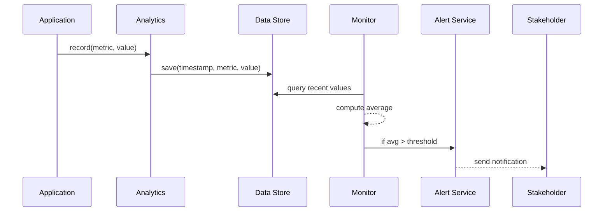

# Chapter 12: Analytics & Monitoring

In Chapter 11 we wired HMS-MCP into outside systems so updates flow automatically. Now let’s build the **dashboard and alerting** layer that watches everything—system health, user satisfaction, process efficiency—and keeps stakeholders informed in real time.

---

## 12.1 Why Analytics & Monitoring?

Imagine the **U.S. Parole Commission** wants to track how long it takes from a parole application submission to the hearing date. They also want to know if citizen requests to their public portal are failing, and if judges are responding to notifications on time.

**Analytics & Monitoring** gives you:
- A **dashboard** showing KPIs (e.g., average resolution time, error rates).  
- **Alerts** if metrics go out of bounds (e.g., resolution time > 30 days).  
- Data for continuous improvement—your AI Agents can verify if a process change actually sped things up.

Think of it like the operations center in a federal agency, with big screens tracking every key number.

---

## 12.2 Key Concepts

1. **Metrics**  
   Quantitative measures (e.g., complaint resolution time, API error rate).

2. **KPIs (Key Performance Indicators)**  
   Metrics you care about most (e.g., “90% of cases resolved in 14 days”).

3. **Dashboard**  
   A visual interface where stakeholders can see charts and tables.

4. **Alerts**  
   Notifications (email, SMS) triggered when a metric violates a threshold.

5. **Data Store**  
   A time-series database or logs where all measurements are recorded.

---

## 12.3 Using Analytics & Monitoring

Below is a super-simple example: track “complaint_resolution_time” and send an alert if it exceeds 30 days.

```python
# 1. Initialize services
from hms_mcp.analytics import AnalyticsService
from hms_mcp.monitoring import MonitoringService

analytics = AnalyticsService()
monitoring = MonitoringService()

# 2. Record a metric: 45 days to resolve a parole complaint
analytics.record("complaint_resolution_time", 45)

# 3. Define an alert: warn if average > 30 days
monitoring.set_alert(
  metric="complaint_resolution_time",
  threshold=30,
  callback=lambda val: print("ALERT! avg resolution =", val)
)

# 4. Evaluate alerts right now
monitoring.evaluate()
```

Explanation:
1. We create `analytics` and `monitoring` objects.  
2. We record one data point (45 days).  
3. We tell the system: “If the average resolution time goes above 30, call this function.”  
4. `evaluate()` checks the stored metrics, computes the average, and fires the alert.

---

## 12.4 What Happens Under the Hood



1. Your application calls `analytics.record()`.  
2. **AnalyticsService** writes the metric to a **Data Store**.  
3. **MonitoringService** periodically queries those values.  
4. It computes KPIs (like averages).  
5. If any KPI breaches a threshold, it calls the **Alert Service** to notify stakeholders.

---

## 12.5 Internal Implementation

Here’s a peek at how the core files work:

#### File: analytics.py

```python
# analytics.py
from .data_store import DataStore

class AnalyticsService:
    def __init__(self):
        self.store = DataStore()

    def record(self, metric, value):
        # Saves timestamp, metric name, and value
        self.store.insert(metric, value)
```

#### File: monitoring.py

```python
# monitoring.py
from .data_store import DataStore

class MonitoringService:
    def __init__(self):
        self.store = DataStore()
        self.alerts = []  # list of (metric, threshold, callback)

    def set_alert(self, metric, threshold, callback):
        self.alerts.append((metric, threshold, callback))

    def evaluate(self):
        # For each alert, compute avg over last N points
        for metric, threshold, cb in self.alerts:
            values = self.store.query(metric, limit=10)
            avg = sum(values) / len(values) if values else 0
            if avg > threshold:
                cb(avg)
```

#### File: data_store.py

```python
# data_store.py
import time

class DataStore:
    def __init__(self):
        self.db = {}  # metric → list of (ts, value)

    def insert(self, metric, value):
        self.db.setdefault(metric, []).append((time.time(), value))

    def query(self, metric, limit=100):
        # Return only the last `limit` values
        return [v for _, v in self.db.get(metric, [])][-limit:]
```

- **AnalyticsService** calls the **DataStore** to append metrics.  
- **MonitoringService** defines alerts and in `evaluate()` fetches the latest values, computes an average, and triggers callbacks.  
- **DataStore** is a simple in-memory log of (timestamp, value) lists. In production you’d swap it for a real time-series database.

---

## 12.6 Summary

You’ve learned how **Analytics & Monitoring** in HMS-MCP:

- Records system and business metrics with `AnalyticsService`.  
- Defines KPIs and threshold-based alerts with `MonitoringService`.  
- Stores data in a simple **DataStore** (swap in InfluxDB or Prometheus in real life).  
- Presents a dashboard or sends notifications when things go off track.

With this monitoring in place, your AI Agents and workflows can **verify improvements**, and stakeholders never miss a critical alert. 

This concludes our HMS-MCP tutorial. Happy monitoring!

---

Generated by [AI Codebase Knowledge Builder](https://github.com/The-Pocket/Tutorial-Codebase-Knowledge)