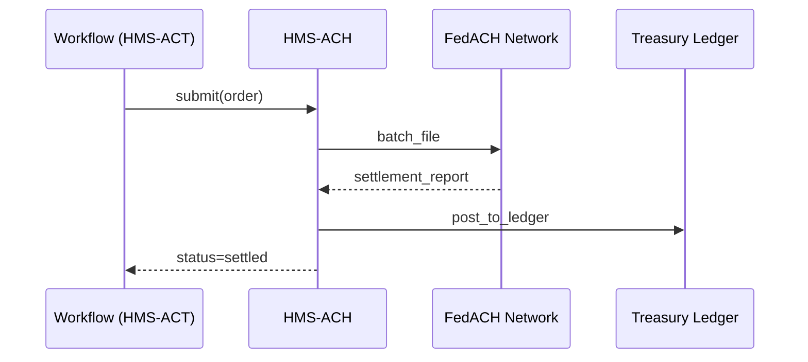

# Chapter 12: Financial Transactions & Clearinghouse (HMS-ACH)

*(Continuing from [Universal Health Care Integration (HMS-UHC)](11_universal_health_care_integration__hms_uhc__.md))*  

> “Data is nice, but people can’t pay rent with CSV files.  
> HMS-ACH is where *bits become bucks*.”  
> —Treasury intern, first week on the job

---

## 1. Why Do We Need HMS-ACH?

### 1.1 60-Second Story — “Same-Day Disaster Relief”

1. A tornado levels homes in **Tulsa, OK** at 9 a.m.  
2. By noon, FEMA wants to issue *$1,000 emergency grants* to verified residents.  
3. Eligibility snapshots already exist thanks to [HMS-UHC](11_universal_health_care_integration__hms_uhc__.md).  
4. Now the money must **move**, **settle**, and **be auditable**.

Without HMS-ACH  
• Developers reinvent payment rails.  
• Auditors chase spreadsheets.  
• Survivors wait days.

With HMS-ACH  
• A single API call schedules an **ACH credit**.  
• Treasury’s ledger auto-reconciles at midnight.  
• FEMA dashboards show **“Paid  ✔️”** within minutes.

---

## 2. Key Concepts (Beginner Cheat-Sheet)

| # | Concept | Plain-English Metaphor | Emoji Hook |
|---|---------|-----------------------|------------|
| 1 | Payment Order | A signed check | 📝 |
| 2 | Clearinghouse | Federal bank teller window | 🪟 |
| 3 | Settlement Batch | Envelope of today’s checks | 📦 |
| 4 | Reconciliation | Balancing the checkbook | ⚖️ |
| 5 | Audit Ledger | Tamper-proof receipt book | 📚 |

Remember **O-C-S-R-L** — Order, Clearinghouse, Settlement, Reconcile, Ledger.

---

## 3. Declaring a Payment Order (≤ 15 lines)

Create `fema_relief.order.yaml`:

```yaml
id: FEMA_Tornado_Relief_2024_06_01
pay_from: Treasury.GeneralFund
pay_to: citizen_bank_account
amount_usd: 1000.00
purpose_code: DISASTER_RELIEF
requested_settlement: same_day   # same_day | next_day
metadata:
  disaster_id: OK-Tornado-2024-06
```

*One YAML file is the **check**; HMS-ACH does the mailing & bookkeeping.*

---

## 4. Sending Money in Three Lines

```python
import ach_sdk as ach

order = ach.load("fema_relief.order.yaml")   # 📝
ticket = ach.submit(order)                   # 🪟
print("✅ queued, ticket:", ticket)
```

What happens:  
1. `submit` validates the order against [HMS-ESQ](04_compliance___legal_reasoning__hms_esq__.md).  
2. The order joins today’s **Settlement Batch** (📦).  
3. A tracking number (*ticket*) is returned for dashboards.

---

## 5. Checking Status

```python
info = ach.status(ticket)
print(info)
```

Sample output:

```json
{
  "ticket": "ach-58e3a9",
  "stage": "settled",
  "settlement_date": "2024-06-01",
  "bank_trace": "091000019876"
}
```

---

## 6. Step-By-Step Walkthrough



Four actors—easy for new hires **and** auditors.

---

## 7. What’s Inside HMS-ACH? (Toy Modules ≤ 18 lines)

### 7.1 Validator

```python
# ach/validator.py
from esq_sdk import allow_payment

def validate(order):
    if not allow_payment(order):
        raise ValueError("Blocked by ESQ")
    assert order["amount_usd"] <= 10000     # demo limit
    return True
```

*One line asks the legal brain; another enforces a demo limit.*

---

### 7.2 Batch Maker

```python
# ach/batch.py
import json, time, uuid, pathlib
FOLDER = pathlib.Path("batches")

def enqueue(order):
    today = time.strftime("%Y%m%d")
    path = FOLDER / f"{today}.jsonl"
    line = json.dumps(order)
    path.write_text((path.read_text("") + line + "\n"))
    return "ach-" + uuid.uuid4().hex[:6]
```

• Appends each order to today’s file — **one directory, zero databases**.  
• Returns the tracking number.

---

### 7.3 Reconciler

```python
# ach/reconcile.py
import json, pathlib, hashlib

def reconcile(report_path):
    for line in pathlib.Path(report_path).read_text().splitlines():
        order = json.loads(line)
        digest = hashlib.md5(json.dumps(order).encode()).hexdigest()
        # save digest to Audit Ledger (📚)
```

Even beginners can skim & understand.

---

## 8. How Does ACH Talk to Other HMS Parts?

```mermaid
graph LR
    UHC[HMS-UHC] --> ACT[HMS-ACT]
    ACT --> ACH[HMS-ACH]
    ACH --> DTA[HMS-DTA Ledger]
    ACH -.policies.- ESQ
    ACH --> SVC[Backend Services (next chapter)]
```

*UHC proves eligibility, ACT kicks off payment, ACH moves cash, DTA records it.*

---

## 9. Full “Tulsa Tornado” Flow in 10 Lines

```python
# tornado_relief.py
import uhc_sdk as uhc, act_sdk as act, ach_sdk as ach

snap = uhc.latest_snapshot("MARIA123")            # 📄
if snap["status"] == "likely_eligible":
    act.emit("relief.approved", snap)

def handler(event):
    order = ach.make_order(snap, amount=1000)     # helper creates YAML dict
    ach.submit(order)
```

1. UHC snapshot shows *eligible*.  
2. ACT event triggers handler.  
3. ACH sends money — **same afternoon**.

---

## 10. Compliance Hot-Spots

| Law / Rule | HMS-ACH Safeguard |
|------------|------------------|
| 31 U.S.C. § 3302 | Pay_from must be a Treasury account (validator). |
| OMB A-11 Antideficiency | Batch Maker refuses if funds low. |
| Privacy Act | Order stores only redacted citizen ID; full PII stays in [HMS-DTA](09_data_repository___management__hms_dta__.md). |

*Every rule is enforced in ≤ 2 lines via the Validator or ESQ.*

---

## 11. Quick “Did I Do It Right?” Checklist

☐ `order.yaml` has **pay_from**, **pay_to**, **amount_usd**  
☐ `ach.submit()` returns a tracking number  
☐ `ach.status()` shows `stage: settled` in test  
☐ Audit Ledger in **HMS-DTA** contains a checksum for the order  
☐ Reconciliation script posts to Treasury ledger without mismatch  

If all five boxes are green, you’ve turned **paper checks** into **automated, auditable ACH credits**. 🎉

---

## 12. What’s Next?

ACH moved the money, but many services still need **business logic** like rate-limiting, retries, or complex database queries.  
In the next chapter we’ll peek behind the curtain of those reusable APIs.

👉 Continue to: [Backend Service Layer (HMS-SVC)](13_backend_service_layer__hms_svc__.md)

Happy settling!

---

Generated by [AI Codebase Knowledge Builder](https://github.com/The-Pocket/Tutorial-Codebase-Knowledge)