# Chapter 13: Backend Service Layer (HMS-SVC)

*(Picking up right after [Financial Transactions & Clearinghouse (HMS-ACH)](12_financial_transactions___clearinghouse__hms_ach__.md))*  

> “Screens and chat-bots are the shiny storefront,  
> **SVC is the water-main in the alley that keeps them alive.**”  
> —City of Austin Digital Services Lead

---

## 1. Why Do We Need SVC?

### A 60-Second Story — “One-Click Business License Renewal”

1. **Aisha** owns a food truck in three Texas counties.  
2. She clicks “Renew License” in a single web portal.  
3. Behind the scenes the request must:  
   • check fee balances at the **Treasury ACH service** (Chapter 12)  
   • validate health-inspection dates stored in **HMS-DTA** (Chapter 9)  
   • trigger a new license PDF through **HMS-ACT** (Chapter 7)  
4. Every step must succeed **even if two counties’ servers are down**.

Who coordinates all that logic, retries, and load balancing?  
**Backend Service Layer (HMS-SVC)**—the invisible utility pipes pumping business brain-power to every screen and agent.

Without SVC: each county builds its own brittle API.  
With SVC: one stable endpoint `/license/renew` works anywhere in Texas (or the nation).

---

## 2. Five Key Concepts (Beginner Cheat-Sheet)

| # | Concept | Plain-English Role | Emoji |
|---|---------|-------------------|-------|
| 1 | Service Endpoint | Front door to logic (`/license/renew`) | 🚪 |
| 2 | Contract | JSON shape both sides sign | ✍️ |
| 3 | Adapter | Translator to other HMS pieces | 🔌 |
| 4 | Cache | Tiny memory that avoids duplicate work | 🧊 |
| 5 | Balancer | Traffic cop spreading load | 👮 |

Remember **E-C-A-C-B** — Endpoint, Contract, Adapter, Cache, Balancer.

---

## 3. Declaring an SVC Endpoint (≤ 18 Lines)

Create `svc_license.yaml`:

```yaml
id: LicenseRenewalSvc
route: /license/renew
methods: [POST]
contract:
  request:
    - citizen_id: string
    - county_ids: list<int>
  response:
    - status: string        # "ok" | "error"
    - pdf_url: string
adapters:
  - HMS-ACH    # collect payment
  - HMS-ACT    # orchestrate PDF creation
cache_ttl_seconds: 600        # 10 minutes
```

*One YAML file is the legal-tech “building permit” for your API.*

---

## 4. Using the Service — 12-Line Client Example

```python
# citizen_portal.py
import requests, json

payload = {"citizen_id": "TX-98765", "county_ids": [13, 227, 451]}
r = requests.post("https://api.gov/license/renew", json=payload, timeout=5)

print(r.json())
```

Sample output:

```json
{"status":"ok","pdf_url":"https://files.gov/permits/2024/98765.pdf"}
```

The front-end writes exactly **zero** custom logic for three counties—SVC hides the complexity.

---

## 5. What Happens Under the Hood?

```mermaid
sequenceDiagram
    participant UI as Portal
    participant GW as SVC Gateway
    participant SVC as LicenseRenewalSvc
    participant ACH as HMS-ACH
    participant ACT as HMS-ACT

    UI->>GW: POST /license/renew
    GW->>SVC: forward(request)
    SVC->>ACH: collect_fee()
    SVC->>ACT: start_workflow()
    SVC-->>GW: {status:ok,pdf_url:…}
    GW-->>UI: 200 OK + JSON
```



Five players; every hop is written to the audit ledger in **HMS-DTA**.

---

## 6. Minimal Implementation (All Files ≤ 20 Lines)

### 6.1 Gateway (FastAPI stub)

```python
# svc_gateway.py
from fastapi import FastAPI, Request
import yaml, importlib

app = FastAPI()
CONF = yaml.safe_load(open("svc_license.yaml"))

mod = importlib.import_module("svc_impl")        # business code

@app.post(CONF["route"])
async def handle(req: Request):
    body = await req.json()
    resp = await mod.run(body)                  # delegate
    return resp
```

**Plain English:** the gateway only checks the route and hands off to the service module—no business logic here.

---

### 6.2 Service Module (`svc_impl.py`)

```python
import ach_sdk as ach, act_sdk as act, functools, time, json

CACHE = {}          # naive in-memory cache

def _cache_key(body): return json.dumps(body, sort_keys=True)

async def run(body):
    key = _cache_key(body)
    if key in CACHE and time.time() - CACHE[key][1] < 600:   # 🧊
        return CACHE[key][0]

    ach.collect_fee(body["citizen_id"])       # 🔌 adapter #1
    ticket = act.start("LICENSE_PDF", body)   # 🔌 adapter #2
    pdf = act.wait_pdf(ticket)

    result = {"status": "ok", "pdf_url": pdf}
    CACHE[key] = (result, time.time())
    return result
```

*All real complexity lives in adapters to other HMS layers—less than 20 lines here.*

---

### 6.3 Balancer (toy round-robin)

```python
# balancer.py
SERVERS = ["svc-a.internal", "svc-b.internal"]
_cur = 0

def pick():
    global _cur
    host = SERVERS[_cur]
    _cur = (_cur + 1) % len(SERVERS)
    return host
```

Gateways simply call `pick()` to forward traffic—👮‍♂️ traffic cop in 7 lines.

---

## 7. Connecting SVC to Other HMS Layers


SVC **does not** reinvent rules (see [HMS-ESQ](04_compliance___legal_reasoning__hms_esq__.md)).  
It simply **consults** them on each request and reports outcomes to **DTA**.

---

## 8. Operational Hooks (1-Line Examples)

* **Rate-limit:** `@svc.rate_limit(per_minute=120)`  
* **Retry on adapter failure:** `svc.retry(ach.collect_fee, tries=3, backoff=1.5)`  
* **Emit event for analytics:** `act.emit("svc.request", meta)`

All helpers are < 5 lines each inside `svc_sdk`; beginners can read the files in an afternoon.

---

## 9. Quick “Did I Do It Right?” Checklist

☐ `.yaml` file defines `route`, `contract`, and `adapters`  
☐ Gateway code stays **under 20 lines** and contains **no business rules**  
☐ Service module delegates to at least one HMS adapter  
☐ Cache returns the same result on a second identical request (test!)  
☐ Load balancer alternates hosts when you call `pick()` twice

Pass every box and you’ve laid down a **federal-grade water-main** for business logic. 🚰

---

## 10. What’s Next?

SVC keeps internal apps humming, but sometimes you must push **the _same_ data** to outside vendors—think credit bureaus or postal address verifiers.  
That door is the **External System Synchronization Interface**, coming up next.

👉 Continue to: [External System Synchronization Interface](14_external_system_synchronization_interface_.md)

Happy piping!

---

Generated by [AI Codebase Knowledge Builder](https://github.com/The-Pocket/Tutorial-Codebase-Knowledge)