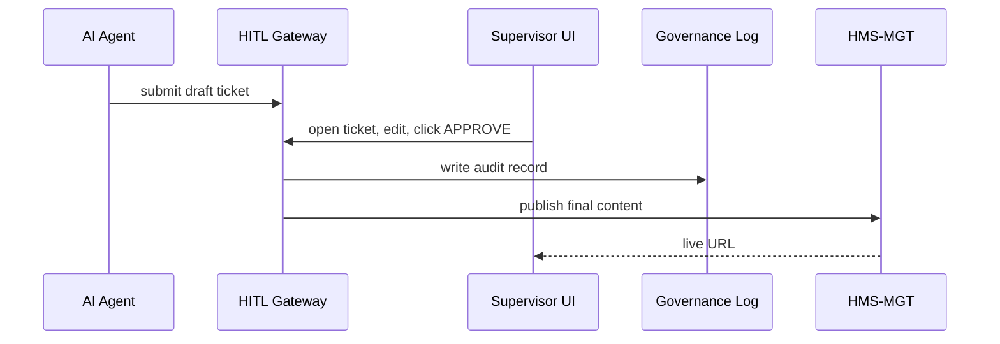

# Chapter 15: Human-in-the-Loop (HITL) Override  
*(“Even Smart AI Needs an Editor”)*  

[← Back to Chapter 14: Process Optimization Workflow](14_process_optimization_workflow_.md)

---

## 1. Motivation — The “Overtime Rule Press-Release” Story  

The U.S. Department of Labor (DOL) wants to announce a new overtime-pay rule.  
An **AI Representative Agent** (see [Chapter 12](12_ai_representative_agent__hms_a2a__.md)) drafts the press-release, but:

* A single typo could rattle Wall Street.  
* Legal language must match *29 CFR § 541*.  
* Congress will ask for the exact revision history.

So before anything hits *dol.gov*, a human policy officer must:

1. **Preview** the AI draft.  
2. **Tweak** numbers or wording.  
3. **Approve** (or veto) the final text.  
4. Leave an **audit trail** for inspectors.

That safety net is called **Human-in-the-Loop (HITL) Override**.

---

## 2. Key Concepts (Beginner-Friendly)

| Term | One-Line Definition | Analogy |
|------|--------------------|---------|
| Draft Ticket | JSON/YAML generated by AI that proposes a change | Intern’s first draft |
| Review Portal | Web screen where a supervisor edits & signs | Editor’s desk |
| Redline | Difference between AI draft and supervisor’s edits | Track-changes in Word |
| Decision | **APPROVE**, **EDIT & APPROVE**, or **REJECT** | Green, yellow, or red stamp |
| Audit Log | Immutable record of every keystroke & click | Newspaper’s editorial logbook |

---

## 3. How to Use HITL — 3 Micro Steps  

We’ll walk through the press-release example.

### 3.1 AI Creates a Draft Ticket (Python · 13 lines)

```python
# ai_draft.py
import uuid, yaml, json, requests, time
draft = {
  "ticket_id": str(uuid.uuid4()),
  "type": "press_release",
  "agency": "DOL",
  "content": "Overtime pay threshold will rise to $55,000 …",
  "created": time.time()
}
# send to HITL Gateway
requests.post("https://hitl.gov/api/draft", json=draft)
print("🤖 Draft submitted!")
```

What happens:  
The AI sends a **ticket** to the HITL service instead of publishing directly.

---

### 3.2 Supervisor Reviews in the Portal (YAML diff · 10 lines)

```yaml
# original draft
Overtime pay threshold will rise to $55,000 …

# supervisor edit (redline)
Overtime pay threshold will rise to **$57,500** …
```

The portal shows side-by-side text; the officer clicks **“Approve & Publish”**.

---

### 3.3 Final Publish & Log (Python · 15 lines)

```python
# hitl_gateway.py (snippet)
def decide(ticket_id, action, edits=None, user="jane.doe@dol.gov"):
    record = {
      "ticket_id": ticket_id,
      "action": action,          # APPROVE / REJECT
      "edits": edits,            # None if no change
      "user": user,
      "timestamp": time.time()
    }
    audit_log.append(record)     # tamper-proof file
    if action.startswith("APPROVE"):
        publish(edits or fetch(ticket_id)["content"])
```

If **approved**, the final text is pushed through [HMS-MGT](05_management_layer__hms_mgt___hms_svc__.md) to the live website; every step is written to the audit log.

---

## 4. What Happens Under the Hood?



Only five actors keep the flow understandable and fully traceable.

---

## 5. Inside the HITL Gateway (Tiny Code Peeks)

### 5.1 REST Endpoints (`hitl/api.py` · 18 lines)

```python
from fastapi import FastAPI
import uuid, time, yaml, pathlib

app = FastAPI()
STORE = pathlib.Path("drafts.yml")      # simple YAML “DB”

def _load(): return yaml.safe_load(STORE.read_text() or "[]")
def _save(data): STORE.write_text(yaml.safe_dump(data))

@app.post("/draft")
def recv_draft(draft: dict):
    data = _load(); data.append(draft); _save(data)
    return {"status": "QUEUED"}

@app.post("/decision/{ticket_id}")
def recv_decision(ticket_id: str, body: dict):
    data = _load()
    for d in data:
        if d["ticket_id"] == ticket_id:
            d["decision"] = body; _save(data); break
    return {"status": "RECORDED"}
```

A YAML file keeps things ultra-simple for demos; real deployments point to Postgres.

---

### 5.2 Audit Logger (`hitl/audit.py` · 12 lines)

```python
import json, pathlib, hashlib, time
LOG = pathlib.Path("audit.log")

def append(entry):
    line = json.dumps(entry)
    h = hashlib.sha256((line + str(time.time())).encode()).hexdigest()
    LOG.write_text(LOG.read_text() + f"{h} {line}\n")
```

Each log line is hashed with a timestamp → tamper evident.

---

### 5.3 Folder Map (Simplified)

```
hms-hitl/
 ├─ api.py         # endpoints
 ├─ audit.py       # append-only log
 ├─ drafts.yml     # demo store
 └─ ui/            # small React app (not shown)
```

All files are small enough for a beginner to skim.

---

## 6. How HITL Integrates with Other Layers

| Layer / Chapter | Interaction |
|-----------------|-------------|
| [AI Representative Agent](12_ai_representative_agent__hms_a2a__.md) | Sends **draft tickets** instead of live changes. |
| [Process Optimization Workflow](14_process_optimization_workflow_.md) | POW pauses at Step 4 for HITL approval. |
| [Governance Layer](02_governance_layer__hms_gov__.md) | Stores immutable audit trail; enforces who may approve. |
| [RBAC & Multi-Tenant Security](04_role_based_access_control__rbac____multi_tenant_security_.md) | Only roles `supervisor` or higher may approve drafts. |
| [Monitoring & Metrics Dashboard](16_monitoring___metrics_dashboard_.md) | Counts pending tickets, average approval time. |

---

## 7. Tips & Gotchas

1. **Keep Tickets Small** – Attach links to large docs rather than inlining 10 MB of text.  
2. **Clear Deadlines** – Auto-escalate tickets older than *N* hours to avoid bottlenecks.  
3. **Redline, Don’t Overwrite** – Store diffs; auditors want to see each word changed.  
4. **Role Separation** – The AI that drafts must never be the user that approves.  
5. **Batch Approvals Sparingly** – Bulk “approve all” defeats the purpose of oversight.

---

## 8. Recap  

In this chapter you learned:

1. Why even top-tier AI needs a human editor before public release.  
2. The core HITL flow: **Draft → Review → Decision → Audit → Publish**.  
3. How a 20-line API & audit file deliver robust oversight.  
4. Where HITL plugs into agents, workflows, governance, and dashboards.

With the oversight loop complete, you now have trustworthy logs ready for live dashboards and alerts.  
Let’s explore those next in  
[Chapter 16: Monitoring & Metrics Dashboard](16_monitoring___metrics_dashboard_.md).

---

---

Generated by [AI Codebase Knowledge Builder](https://github.com/The-Pocket/Tutorial-Codebase-Knowledge)