# Chapter 15: Operations & Monitoring (HMS-OPS)

*(Following directly from [External System Synchronization Interface](14_external_system_synchronization_interface_.md))*  

> “When a TSA screening line slows at Reagan National, HMS-OPS is the **911 dispatcher** that sees the jam, pages extra compute, and tells the press office *before* Twitter does.” 
> —Airport CIO, holiday-weekend war room

---

## 1. Why Do We Need OPS?

### 1.1 60-Second Story — “Keep the Lines Moving”

1. **Reagan National Airport** runs an AI‐powered luggage scanner (an [HMS-AGT](05_core_agent_framework__hms_agt__.md) bot).  
2. Holiday traffic spikes → the scanner queue time creeps from 12 s to 38 s.  
3. If no one reacts, lines back up, travelers miss flights, TSA phone lines melt.  

OPS fixes it automatically:  

* **Detects** queue latency crossing 30 s (error rate & SLO breach).  
* **Spins up** 2 extra GPU containers via the airport’s Kubernetes cluster.  
* **Alerts** TSA ops and the public‐affairs desk.  
* **Logs** the whole incident for the Office of Inspector General.

Zero finger-pointing, citizens keep moving.

---

## 2. Five Key Concepts (Beginner Cheat-Sheet)

| # | Concept | Plain-English Role | Emoji |
|---|---------|-------------------|-------|
| 1 | Metric | A live number (queue_time = 38 s) | 📊 |
| 2 | Sensor | Little snippet that reports a metric | 📡 |
| 3 | SLO (Service-Level Objective) | “Stay <30 s 95 % of the time” | 🎯 |
| 4 | Playbook | If SLO breaks, do X, Y, Z | 📒 |
| 5 | War-Room Dashboard | Big screen with red/green tiles | 🖥️ |

Remember **M-S-S-P-W** — Metric, Sensor, SLO, Playbook, War-Room.

---

## 3. Declaring Service Metrics in 15 Lines

Create `scanner.ops.yaml`:

```yaml
id: DCA_Luggage_Scanner
owner: TSA
sensors:
  - name: queue_time_seconds
    scrape_url: http://scanner.local/metrics
slo:
  target: queue_time_seconds
  threshold: 30      # seconds
  window_seconds: 300
playbook:
  - if: slo_breach
    then: scale_up compute=+2
  - if: still_breach_after 60
    then: page channel=tsa_ops, severity=critical
  - always:
    log_to: HMS-DTA
```

*One YAML file turns raw numbers into self-healing rules.*

---

## 4. Using OPS in Code – Three Tiny Calls

### 4.1 Register the Service

```python
import ops_sdk as ops
svc = ops.register("scanner.ops.yaml")
print("✅ registered:", svc.id)
```

### 4.2 Emit a Sensor Reading (inside your micro-service)

```python
# heartbeat.py  (run every 5 s)
import ops_sdk as ops, random, time
while True:
    q = random.uniform(10, 40)           # pretend measure
    ops.emit("queue_time_seconds", q)    # 📡
    time.sleep(5)
```

### 4.3 Query the Dashboard

```python
dash = ops.status("DCA_Luggage_Scanner")
print(dash["slo_state"])        # ➜ "breached" / "healthy"
```

No extra plumbing—OPS stores, compares, and reacts for you.

---

## 5. What Happens Under the Hood?

```mermaid
sequenceDiagram
    participant Sensor as 📡 Sensor
    participant COL as Collector
    participant EVAL as SLO Evaluator
    participant ACT as Playbook Runner
    participant OPS as War-Room UI

    Sensor->>COL: metric(queue_time=38)
    COL->>EVAL: forward
    EVAL-->>ACT: slo_breach?
    ACT->>Sensor: scale_up(+2 GPU)
    ACT->>OPS: update_dashboard(red)
```



Five actors—clear even for a new intern.

---

## 6. Tiny Internal Modules (All ≤ 18 Lines)

### 6.1 Metric Collector

```python
# ops/collector.py
import time, queue
Q = queue.Queue()

def emit(name, value):
    Q.put({"ts": time.time(), "name": name, "value": value})
```

Beginners’ note: one global queue is enough for the demo.

### 6.2 SLO Evaluator

```python
# ops/eval.py
import statistics, time
WINDOW = 300   # 5 min

def breach(metric_samples, threshold):
    recent = [m["value"] for m in metric_samples
              if time.time() - m["ts"] < WINDOW]
    p95 = statistics.quantiles(recent, n=20)[18]  # ≈95-th pct
    return p95 > threshold
```

### 6.3 Playbook Runner (autoscale + alert)

```python
# ops/playbook.py
import subprocess, slack_sdk

def run(action):
    if action.startswith("scale_up"):
        n = int(action.split("=")[1])
        subprocess.run(["kubectl","scale","--replicas",str(n+2),
                        "deploy/scanner"])
    elif action.startswith("page"):
        slack_sdk.page("#tsa_ops","Queue still high 🚨")
```

Real ops use Terraform/PagerDuty; demo uses `kubectl` & Slack.

---

## 7. Connecting OPS to the HMS Universe


OPS **listens** to everyone, **tells** everyone, and keeps auditors happy via DTA.

---

## 8. Real-World Playbook Snippets

| If… | Then… |
|-----|-------|
| `error_rate > 2 % for 5 min` | `rollback deploy` |
| `cost_hourly > $500` | `throttle traffic 20 %` |
| `unauthorized_login` | `isolate pod` & `page CIGIE` |

Each fits on one YAML line—no expert needed.

---

## 9. Quick “Did I Do It Right?” Checklist

☐ `.ops.yaml` lists **sensors**, **slo**, and **playbook**  
☐ `ops.register()` returns an ID without error  
☐ `ops.emit()` shows up in the war-room graph within 10 s  
☐ SLO breach triggers the first playbook action (watch kubectl)  
☐ A log entry lands in **HMS-DTA** (`dta.find(topic="ops.incident")`)

Green across the board? Your platform now has its own **911 dispatch**!

---

## 10. Conclusion & Next Steps

You’ve wired live metrics, automated fixes, pagers, and cost dashboards—all on a napkin-sized YAML. Citizens sleep. Auditors smile.

Next we’ll surface these insights (and every other HMS feature) in reusable, design-system React widgets.

👉 Continue to: [Micro-Frontend Interface Library (HMS-MFE)](16_micro_frontend_interface_library__hms_mfe__.md)

Happy monitoring!

---

Generated by [AI Codebase Knowledge Builder](https://github.com/The-Pocket/Tutorial-Codebase-Knowledge)