# Chapter 16: Micro-Frontend Interface Library (HMS-MFE)

*(Following directly from [Operations & Monitoring (HMS-OPS)](15_operations___monitoring__hms_ops__.md))*  

> “HMS-MFE is a bucket of LEGO® bricks you can snap onto any .gov site—  
> the brick **knows** Treasury blue, complies with 18F design rules, and ships its own analytics.” 
> —GSA front-end lead onboarding a new intern

---

## 1. Why Do We Need MFE?

### 1.1 A 60-Second Story — “One Badge, Two Agencies”

1. A **Pentagon visitor kiosk** needs a “Capture Photo & Sign NDA” screen.  
2. A week later the **Treasury Payment Tracker** wants *the exact same* widget so vendors can e-sign invoices.  
3. If each team builds its own UI:  
   • duplicate effort  
   • inconsistent fonts  
   • two diverging security patch calendars  

**Micro-Frontend Interface Library (HMS-MFE)** ships one *versioned* widget both agencies can drop in with **1 line of HTML**.  
OPS automatically watches performance (Chapter 15), ESQ keeps it compliant (Chapter 4), SVC feeds it data (Chapter 13).  
Result: uniform UX, lower cost, faster roll-outs.

---

## 2. Key Concepts (Beginner Cheat-Sheet)

| # | Concept | Plain-English Nickname | Emoji |
|---|---------|-----------------------|-------|
| 1 | Brick | Self-contained widget (e.g., `hms-login`) | 🧱 |
| 2 | Host App | Any site that embeds the brick | 🏠 |
| 3 | Registry | App-Store-like index of bricks | 📦 |
| 4 | Theme Token | One-liner that applies agency colors | 🎨 |
| 5 | State Bridge | Tiny pipe to share data with backend | 🔌 |

Remember **B-H-R-T-S** — Brick, Host, Registry, Theme, State.

---

## 3. A First Brick in 30 Seconds  

We’ll embed the *“Photo + Signature”* brick in a Pentagon kiosk page.

### 3.1 HTML (1 Line)

```html
<script src="https://mfe.gov/brick/photo-sign@1.2.0.js"></script>
```

Reload the page → a polished card appears:

```
 ┌───────────────────────────┐
 |  Take Photo  |  ✍ Sign   |
 |  [  📷   ]   |  [  ✏️  ]  |
 └───────────────────────────┘
```

That’s it—no CSS, no React install, nothing.  
(The script self-registers the custom element `<hms-photo-sign>`).

---

### 3.2 Passing Data In (≤ 12 Lines)

```html
<hms-photo-sign
    citizen-id="VIS-A12-987"
    endpoint="/svc/badge/submit"   <!-- SVC route -->
    theme="dod-dark">
</hms-photo-sign>
```

#### What happens?

1. The brick fetches `/svc/badge/submit` (served by [HMS-SVC](13_backend_service_layer__hms_svc__.md)) to pre-load form rules.  
2. When the user clicks **Submit** the brick POSTs the photo + signature to the same endpoint.  
3. The brick fires a browser event `photo-sign:complete`—handy for analytics or next-step navigation.

---

## 4. Building Your Own Brick (Toy Example ≤ 18 Lines)

```javascript
// photo-sign.js  (ice-cream-simple version)
class PhotoSign extends HTMLElement {
  connectedCallback() {
    this.innerHTML = `<button id=shot>📷</button>
                      <button id=sign>✏️</button>`;
    this.querySelector('#shot').onclick = () => this.take();
    this.querySelector('#sign').onclick = () => this.send();
  }
  async take()  { /* webcam → canvas, skipped here */ }
  async send()  {
    const body = JSON.stringify({ img:"data...", sig:"scribble" });
    const ep   = this.getAttribute('endpoint');
    await fetch(ep, {method:'POST',body});
    this.dispatchEvent(new CustomEvent('photo-sign:complete'));
  }
}
customElements.define('hms-photo-sign', PhotoSign);
```

**Beginner notes**

* Under **20 lines** (omits error handling).  
* Uses **Web Components**—works in plain HTML, React, Vue, etc.  
* Reads attributes (`endpoint`, `theme`, …) instead of hard-coded URLs.

---

## 5. Publishing to the Registry

```bash
mfe publish ./photo-sign.js \
     --name photo-sign \
     --version 1.2.0 \
     --owner DoD
```

Console output:

```
📦 Uploaded photo-sign@1.2.0
   audit_id: mfe-f3a1c9
```

The Registry:

* stores the file in a CDN,  
* hashes it for integrity,  
* writes an entry to **HMS-DTA** (Chapter 9).

---

## 6. How MFE Fits with Other HMS Layers

```mermaid
graph LR
    MFE[🧱 HMS-MFE Bricks]
    HOST[🏠 Host App]
    SVC[SVC Backend]
    OPS[OPS Metrics]
    ESQ[ESQ Compliance]

    MFE --> HOST
    HOST --> SVC
    MFE --emit--> OPS
    MFE -.policy check.- ESQ
```



* The brick talks to SVC via **State Bridge 🔌**.  
* Performance pings auto-emit `mfe.load_time` to OPS.  
* ESQ audits code before Registry publish (e.g., no hidden trackers).

---

## 7. Internal Flow (5 Actors, One Diagram)

```mermaid
sequenceDiagram
    participant Host as 🏠 Host Page
    participant CDN as 📦 MFE Registry CDN
    participant Brick as 🧱 Brick JS
    participant SVC as 🔌 State Bridge (HMS-SVC)
    participant OPS as 🖥️ OPS Sensor

    Host->>CDN: GET photo-sign.js
    CDN-->>Host: JS bundle
    Host->>Brick: instantiate <hms-photo-sign>
    Brick->>SVC: POST photo + sig
    Brick->>OPS: metric(load_time)
```



Clear, auditable, newbie-friendly.

---

## 8. Theme Tokens (Swap Look in 1 Line)

```html
<hms-photo-sign theme="treasury-light"></hms-photo-sign>
```

Under the hood the brick loads `treasury-light.css` from the registry—no extra CSS for you.

---

## 9. Access Control in 10 Lines

The brick can request a JWT from **HMS-AGT** (Chapter 5) if the page adds:

```html
<script src="https://mfe.gov/bridge/agt-auth.js"></script>
```

Then in JS (inside the brick):

```javascript
const jwt = await window.hmsAuth.getToken("photo-sign");
fetch(ep, {headers:{Authorization:`Bearer ${jwt}`}, ...});
```

Zero backend edits—goodbye CORS headaches.

---

## 10. Testing a Brick Locally (≤ 15 Lines)

```bash
npx http-server .
# open http://localhost:8080/test.html
```

`test.html`

```html
<script src="./photo-sign.js"></script>
<hms-photo-sign endpoint="/mock"></hms-photo-sign>
```

The brick appears. Network tab shows POST → `/mock`.

---

## 11. Common Pitfalls & Fixes

| Symptom | Likely Cause | Quick Fix |
|---------|--------------|-----------|
| *Brick loads but blank* | Missing `customElements.define` | Check bundle exports |
| 404 on CSS theme | Theme token typo | `treasury-light` vs `treasury_light` |
| CORS error | Host page not on HTTPS | Serve over `https://localhost` |

---

## 12. Quick “Did I Do It Right?” Checklist

☐ `<script src="…photo-sign@X.Y.Z.js">` loads without console errors  
☐ Brick renders even in a plain `.html` file (no React)  
☐ Attribute `endpoint=` successfully receives POST on button click  
☐ OPS dashboard shows `mfe.load_time` metric within 1 min  
☐ Registry entry visible (`mfe list | grep photo-sign@1.2.0`)

If all five are green, congrats—your UI is officially **Snap-On™ Government-grade**.

---

## 13. What’s Next?

Now that widgets are re-usable LEGO bricks, users will jump between them:  
“Upload photo → Pay fee → Track status.” 
The next chapter teaches the AI router that guides those journeys.

👉 Continue to: [Intent-Driven Navigation & AI Journeys](17_intent_driven_navigation___ai_journeys_.md)

Happy snapping!

---

Generated by [AI Codebase Knowledge Builder](https://github.com/The-Pocket/Tutorial-Codebase-Knowledge)