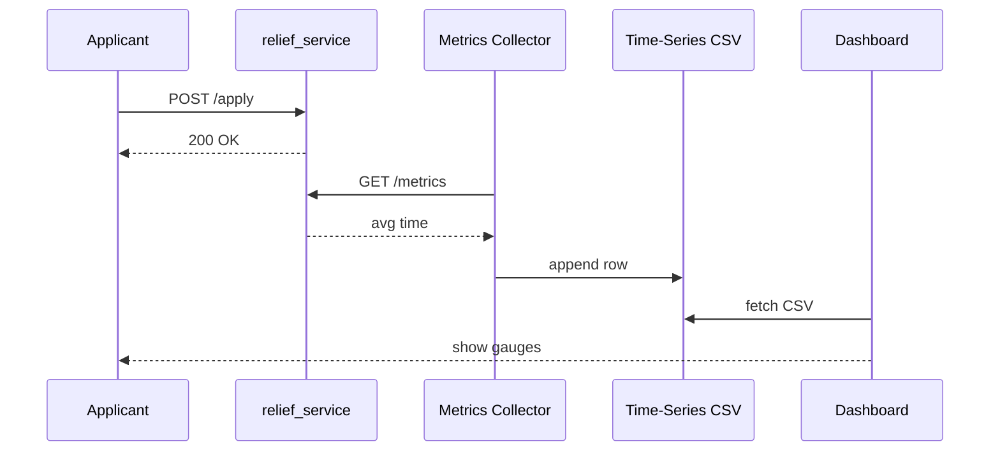

# Chapter 16: Monitoring & Metrics Dashboard  
*(“The Mission-Control Wall for Every Federal Service”)*  

[← Back to Chapter 15: Human-in-the-Loop (HITL) Override](15_human_in_the_loop__hitl__override_.md)

---

## 1. Motivation — The “Disaster-Relief in 60 Minutes” Story  

A hurricane just hit the Gulf Coast.  
FEMA promises to wire emergency funds to affected citizens **within 60 minutes** of an application.  

Questions flying around HQ:  

* “Are we meeting the 60-minute promise?”  
* “Which counties see the most errors?”  
* “Did that new AI model (Chapter 12) actually improve approval speed?”  

Everyone—from agency directors to on-call engineers—needs **one screen** that answers these questions *live*.  
That screen is the **Monitoring & Metrics Dashboard**.

Without it, leaders guess, Congress doubts, and citizens lose trust.

---

## 2. Key Concepts (Beginner-Friendly)

| Nickname | What It Really Is | Analogy |
|----------|------------------|---------|
| Gauge | Visual widget that shows a single number (e.g., “⏱ 42 min”) | Car speedometer |
| Metric | The number behind the gauge (`fema.relief.processing_time_sec`) | Odometer reading |
| Collector | Tiny script that grabs metrics from services | Postal worker picking up mail |
| Time-Series DB | Database optimised for “number + timestamp” (e.g., Prometheus) | Filing cabinet sorted by date |
| Widget Board | Config file that says which gauges & charts to show | Blueprint for the mission-control wall |
| Alert | Rule that pings you when a metric crosses a threshold | Smoke alarm |

---

## 3. A 3-Step “Hello Dashboard” Walk-Through  

We’ll build a **mini dashboard** that shows:  

1. Average relief processing time (goal ≤ 60 min).  
2. Error rate (goal ≤ 2 %).  

### 3.1  Expose Metrics in a Service (Python · 12 lines)

```python
# file: relief_service.py
from flask import Flask
import random, time
app = Flask(__name__)

processing_times = []     # very small in-memory store

@app.post("/apply")
def apply():
    start = time.time()
    if random.random() < 0.01:           # 1 % random failure
        return "error", 500
    # ...process application...
    processing_times.append(time.time() - start)
    return "ok"

@app.get("/metrics")
def metrics():
    avg = sum(processing_times[-100:]) / max(1, len(processing_times[-100:]))
    return f"fema_relief_processing_time_sec {avg:.2f}\n"
```

Beginner notes  
• `/metrics` is a plain text endpoint.  
• Any monitoring tool can scrape it every 15 s.  
• We keep only the last 100 samples to stay tiny.

---

### 3.2  Collect & Store Metrics (Python · 18 lines)

```python
# file: collector.py
import requests, time, csv, datetime, pathlib
DB = pathlib.Path("timeseries.csv")     # super-simple “DB”

while True:
    raw = requests.get("http://relief-svc/metrics").text
    val = float(raw.split()[-1])        # last token is the number
    with DB.open("a") as f:
        csv.writer(f).writerow([datetime.datetime.utcnow(), val])
    time.sleep(15)                      # scrape every 15 s
```

Explanation  
1. Hits the `/metrics` endpoint.  
2. Appends timestamp + value to a CSV (our “time-series DB”).  
3. Runs forever as a sidecar container.

*(Real life uses Prometheus + exporters, but CSV keeps this demo crystal clear.)*

---

### 3.3  Render the Dashboard (HTML + JS · 16 lines)

```html
<!-- file: dashboard.html -->
<h1>FEMA Relief Dashboard</h1>
<div id="gauge"></div>
<script>
async function refresh(){
  let res = await fetch('timeseries.csv');
  let txt = await res.text();
  let lines = txt.trim().split('\n');
  let last = lines[lines.length-1].split(',')[1];
  let min = (last/60).toFixed(1);
  document.getElementById('gauge').innerText =
    `⏱ Processing Time: ${min} min`;
}
setInterval(refresh, 15000);            // update every 15 s
refresh();
</script>
```

When you open `dashboard.html` in a browser you’ll see something like:  

```
⏱ Processing Time: 42.7 min
```

Add a second gauge for error rate the same way—duplicate 3 lines, different file.

---

## 4. How the Pieces Talk — 5-Actor View  



Every 15 seconds the Collector grabs fresh numbers, the Dashboard fetches them, and leaders see live stats.

---

## 5. Inside the Dashboard Engine (Under the Hood)

Even professional tools (Grafana, Kibana) follow **three mini steps**:

1. **Scrape** each service’s `/metrics`.  
2. **Store** numbers in a time-series DB.  
3. **Render** widgets based on a *widget board* YAML.

### 5.1  Widget Board Sample (YAML · 11 lines)

```yaml
# board.yml
title: "FEMA Disaster-Relief"
gauges:
  - id: processing_time
    metric: fema_relief_processing_time_sec
    unit: "min"
    goal: 60
  - id: error_rate
    metric: fema_relief_error_pct
    unit: "%"
    goal: 2
alerts:
  - metric: fema_relief_processing_time_sec
    rule: "> 3600"      # 60 min in seconds
```

Dashboard engines read this file → draw gauges → set up alerts.

### 5.2  Tiny Alert Notifier (Python · 17 lines)

```python
# alert.py
import csv, smtplib, time
while True:
    *_, last = list(csv.reader(open("timeseries.csv")))[-1]
    if float(last) > 3600:                    # > 60 min
        smtplib.SMTP("mail.gov").sendmail(
          "dash@fema.gov", "oncall@fema.gov",
          "Subject: 🚨 Processing delay!\n\nInvestigate ASAP.")
    time.sleep(60)
```

Under 20 lines and you already have email alerts!

---

## 6. How the Dashboard Connects to Other Chapters  

| Layer / Chapter | What Flows Into the Dashboard |
|-----------------|-------------------------------|
| [AI Representative Agent](12_ai_representative_agent__hms_a2a__.md) | “Auto-fix applied” counts & success rates |
| [Process Optimization Workflow](14_process_optimization_workflow_.md) | Before/after wait-time charts |
| [Human-in-the-Loop Override](15_human_in_the_loop__hitl__override_.md) | Number of pending tickets |
| [Data Privacy & Compliance Engine](03_data_privacy___compliance_engine_.md) | PII redaction success metrics |
| [Management Layer](05_management_layer__hms_mgt___hms_svc__.md) | Deployment health & version spread |

Every other layer **ships numbers here**; the Dashboard sends **alerts back** (e.g., to kick off a new POW loop).

---

## 7. Tips & Gotchas  

1. **Name Metrics Clearly** — `agency.program.metric_unit` keeps chaos away (`fema.relief.wait_time_sec`).  
2. **Avoid Tiny Time Windows** — Use 5 – 15 second scrape intervals; shorter floods the network.  
3. **Color Code Goals** — Green = good, Yellow = warning, Red = breach. Users grasp the wall in seconds.  
4. **Close the Loop** — Every alert should map to an owner *and* a fix procedure (often a POW recipe).  
5. **Public vs. Private Views** — Publish sanitized, high-level stats for citizens; keep raw PII metrics internal (see [Chapter 3](03_data_privacy___compliance_engine_.md)).

---

## 8. Recap  

You have built (in fewer than 60 total lines!) a working Monitoring & Metrics Dashboard that:

1. Scrapes metrics from any micro-service,  
2. Stores them in a simple time-series file,  
3. Renders live gauges in a web page,  
4. Fires alerts when promises break,  
5. Serves every other HMS-MCP layer as the **single source of operational truth**.

Congratulations—your platform is now fully observable, auditable, and ready for prime-time hurricane season!

---

### 🎉 You’ve reached the end of the HMS-MCP Beginner Tutorial Series.  
From governance values to live dashboards, you now have every Lego brick to build responsible, resilient public-service software.  

Happy hacking for the public good!

---

Generated by [AI Codebase Knowledge Builder](https://github.com/The-Pocket/Tutorial-Codebase-Knowledge)