# Chapter 18: Marketplace & Discoverability (HMS-MKT)

*(A friendly jump from [Intent-Driven Navigation & AI Journeys](17_intent_driven_navigation___ai_journeys_.md))*  

> “If an agency invents a brilliant data feed and nobody can find it,  
> did it really help the public?” 
> —Federal CIO, budget hearing

---

## 1. Why Do We Need a Marketplace?

### 1.1 60-Second Story — *“Snow-Storm Response in Two Clicks”*

1. A **city snow-plow dispatcher** needs *real-time traffic data* plus an *anonymization agent* so the feed can be shared with local news.  
2. She opens **HMS-MKT**, types “traffic”.  
3. The **New Jersey DOT** listing *“Live Traffic Feed – I-78”* appears, labeled “Gov-Vetted ✅”.  
4. She clicks **Add to Workspace**.  
5. HMS-MKT automatically:  
   • Registers a secure data pipeline in [HMS-DTA](09_data_repository___management__hms_dta__.md).  
   • Installs the *“PHI Anonymizer”* skill (an [HMS-AGX](06_specialized_agent_extensions__hms_agx__.md) package).  
   • Logs the transaction for auditors in [HMS-ESQ](04_compliance___legal_reasoning__hms_esq__.md).  
6. Ten minutes later plow drivers see de-identified congestion maps on their tablets.  

Without HMS-MKT: weeks of email chains, NDAs, and one-off SFTP folders.  
With HMS-MKT: discover, click, go.

---

## 2. Five Beginner-Friendly Building Blocks

| # | Concept | Street-Level Analogy | Emoji |
|---|---------|---------------------|-------|
| 1 | Listing | App-store card | 🗂️ |
| 2 | Tag | Search hashtag (e.g., `traffic`, `anonymizer`) | 🔖 |
| 3 | Vetting Queue | TSA security line for new uploads | 🛂 |
| 4 | Install Token | Proof you “own” the item | 🎟️ |
| 5 | Rating Badge | Five-star style feedback, gov-safe | ⭐ |

Memorize **L-T-V-I-R** — Listing, Tag, Vetting, Install, Rating.

---

## 3. Publishing Your First Listing (≤ 18 Lines)

A transportation agency will publish a *real-time traffic feed*.

### 3.1 `traffic_feed.listing.yaml`

```yaml
id: NJDOT_Live_Traffic_I78
type: dataset               # dataset | agent_skill | ui_brick
owner: NewJerseyDOT
title: "Live Traffic Feed – I-78"
tags: [traffic, realtime, i78]
access: stream://nj.gov/dot/i78
license: OGL-1.0
description: >
  JSON stream updated every 5 s.
  Fields: speed, lane_closure, timestamp, geo.
```

### 3.2 Publish in One Line

```bash
mkt publish traffic_feed.listing.yaml
```

Console output:

```
🗂️  Listing queued for vetting   id=NJDOT_Live_Traffic_I78
```

*Beginner takeaway:* one YAML file = an app-store card.

---

## 4. Vetting – How Listings Go Live

Governance teams (think **OMB** + **CISA**) review every submission.

```mermaid
sequenceDiagram
    participant Pub as Publisher (NJDOT)
    participant Q as 🛂 Vetting Queue
    participant Gov as Governance Reviewers
    participant MKT as HMS-MKT Catalog

    Pub->>Q: submit(listing.yaml)
    Gov->>Q: pull for review
    Gov-->>MKT: approve ✅ / reject ❌
    MKT-->>Pub: status update
```



Only four actors—easy to trace for FOIA.

---

### 4.1 Tiny Vetting Script (≤ 18 Lines)

```python
# mkt/vet.py
import yaml, re

PROHIBITED = re.compile(r"social_security|ssn|phi", re.I)

def vet(path):
    meta = yaml.safe_load(open(path))
    txt  = yaml.dump(meta)
    if PROHIBITED.search(txt):
        return "reject", "Contains PII keywords"
    return "approve", "Looks clean"
```

*Real system calls ESQ; demo fits on half a screen.*

---

## 5. Discovering a Listing (≤ 15 Lines)

```python
import mkt_sdk as mkt

hits = mkt.search(tags=["traffic"], free_text="I-78")
print([h["id"] for h in hits][:3])
# ➜ ['NJDOT_Live_Traffic_I78', 'PA_Turnpike_Traffic', 'NYC_511_Feed']
```

Behind the scenes:

1. **Full-text index** (SQLite demo) runs fuzzy search.  
2. Results include vetting badge and rating.

---

## 6. Installing & Using a Listing

### 6.1 Install in Two Lines

```python
feed = mkt.install("NJDOT_Live_Traffic_I78")   # 🎟️ token issued
print(feed["access"])                          # stream URL
```

### 6.2 Pipe Straight into HMS-DTA

```python
import dta_sdk as dta, websocket

ws = websocket.create_connection(feed["access"])
for _ in range(3):
    dta.save("traffic.i78", ws.recv())         # Chapter 9
```

Within minutes dashboards light up.

---

## 7. Buying an Agent Skill Example

A **health department** needs an *Anonymization Agent*.

```python
skill = mkt.install("PHI_DeIdentifier@1.0.0")    # an AGX package
bot   = agt_sdk.login("agt-45ab2c")
bot.load(skill["path"])                          # Chapter 6 method
```

*Zero zip files, zero procurement paperwork.*

---

## 8. Internal Mechanics – What Happens When You Click “Install”?

```mermaid
sequenceDiagram
    participant UI as Marketplace Web
    participant MKT as HMS-MKT Engine
    participant ESQ as Compliance
    participant DTA as Data Vault
    participant User as Your Workspace

    UI->>MKT: install(listing_id)
    MKT->>ESQ: check_license + security
    ESQ-->>MKT: 👍
    MKT->>DTA: log_receipt
    MKT-->>User: install_token + download_url
```



Five messages—auditors rejoice.

---

## 9. Under-the-Hood Code Snippets

### 9.1 Search Index (≤ 18 Lines)

```python
# mkt/search.py
import sqlite3

DB = sqlite3.connect("market.db")
DB.execute("""CREATE VIRTUAL TABLE IF NOT EXISTS idx
              USING fts5(id, title, tags, description)""")

def add(listing):
    DB.execute("INSERT INTO idx VALUES (?,?,?,?)",
               (listing["id"],
                listing["title"],
                " ".join(listing["tags"]),
                listing["description"]))
    DB.commit()

def query(text="", tags=[]):
    q = f"{text} {' '.join(tags)}"
    rows = DB.execute("SELECT id FROM idx WHERE idx MATCH ?", (q,)).fetchall()
    return [r[0] for r in rows]
```

*Small enough for a beginner to hack.*

---

### 9.2 Install Token Generator

```python
# mkt/install.py
import uuid, time, dta_sdk as dta

def install(listing_id, user):
    token = "tok-" + uuid.uuid4().hex[:8]
    rec   = {"id": token, "listing": listing_id,
             "user": user, "ts": time.time()}
    dta.save("mkt.install", rec)    # Chapter 9 receipt
    return token
```

---

## 10. Rating & Trust Badges

After using a listing, agencies can post 1–5-star ratings:

```python
mkt.rate("NJDOT_Live_Traffic_I78", stars=5, comment="Fast & accurate")
```

Ratings appear as **⭐ 4.8 (12 agencies)**—helps newcomers pick reliable feeds.

---

## 11. Tying HMS-MKT to the Larger Puzzle

```mermaid
graph LR
    Pub[Publisher Agency] --> MKT
    MKT --> AGT[Agents]      %% skills download
    MKT --> DTA[Data Vault]  %% receipts & datasets
    MKT -.policy.- ESQ
    User[Consumer Agency] --> MKT
```

*Marketplace is the **town square** where every other HMS layer swaps wares.*

---

## 12. Quick “Did I Do It Right?” Checklist

☐ Created a `*.listing.yaml` with `id`, `type`, `tags`, `access`  
☐ `mkt publish` shows “queued for vetting” 
☐ Governance reviewer can approve via `mkt vet --approve` in dev  
☐ `mkt.search()` returns your listing when you search by tag  
☐ `mkt.install()` hands back a token and DTA logs the receipt  

Pass all five and **congrats**—you’ve opened your own *.gov app store stall*! 🎉

---

## 13. What You Learned

• HMS-MKT turns scattered data feeds & skills into app-store-style *listings*.  
• Vetting workflows keep security teams happy.  
• One-line install tokens wire listings into **any** HMS workspace.  
• Ratings and tags make discovery painless.  

Marketplace & Discoverability is the final puzzle piece—citizens, agencies, and developers can now **find, trust, and reuse** everything you built across the previous 17 chapters.

---

Thank you for completing the HMS-MCP beginner journey.  
Build, share, and serve the public good!

---

Generated by [AI Codebase Knowledge Builder](https://github.com/The-Pocket/Tutorial-Codebase-Knowledge)