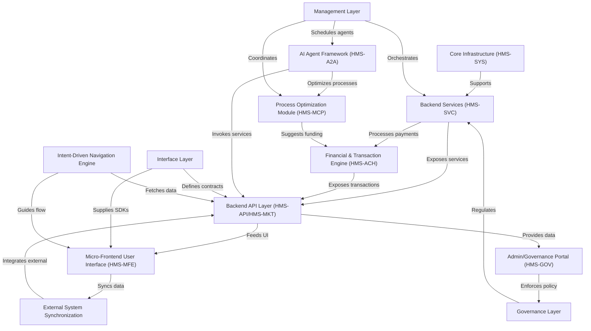

# Tutorial: HMS-MCP

**HMS** is a *comprehensive* AI-driven multi-party workflow automation platform for governments.  
It connects **citizens**, **agencies**, and **policymakers** through modular web interfaces, AI agent assistance,  
and robust back-end services. From *citizen-facing program portals* to *policy governance dashboards*,  
it streamlines financial transactions, legislative drafting, and process optimization to improve public service delivery.

**Source Repository:** [None](None)

## Chapters

1. [Micro-Frontend User Interface (HMS-MFE)
](01_micro_frontend_user_interface__hms_mfe__.md)
2. [Admin/Governance Portal (HMS-GOV)
](02_admin_governance_portal__hms_gov__.md)
3. [Intent-Driven Navigation Engine
](03_intent_driven_navigation_engine_.md)
4. [Process Optimization Module (HMS-MCP)
](04_process_optimization_module__hms_mcp__.md)
5. [AI Agent Framework (HMS-A2A)
](05_ai_agent_framework__hms_a2a__.md)
6. [Backend API Layer (HMS-API/HMS-MKT)
](06_backend_api_layer__hms_api_hms_mkt__.md)
7. [External System Synchronization
](07_external_system_synchronization_.md)
8. [Financial & Transaction Engine (HMS-ACH)
](08_financial___transaction_engine__hms_ach__.md)
9. [Governance Layer
](09_governance_layer_.md)
10. [Management Layer
](10_management_layer_.md)
11. [Interface Layer
](11_interface_layer_.md)
12. [Backend Services (HMS-SVC)
](12_backend_services__hms_svc__.md)
13. [Core Infrastructure (HMS-SYS)
](13_core_infrastructure__hms_sys__.md)

---

Generated by [AI Codebase Knowledge Builder](https://github.com/The-Pocket/Tutorial-Codebase-Knowledge)