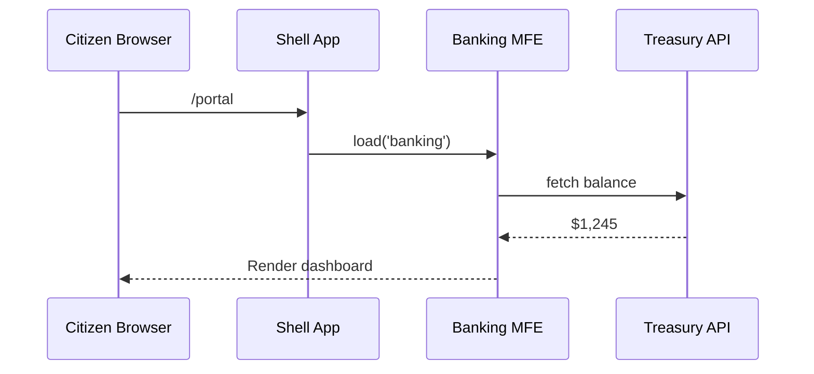

# Chapter 1: Micro-Frontend (HMS-MFE Component)

> “Imagine every online government counter as its own Lego brick.  
> Need a new veteran-benefits screen? Snap in a brick.  
> Want to update only the tax-payment interface? Replace just that brick.”  

That brick-by-brick idea is the heart of the HMS-MFE layer.

---

## 1. Why do we need Micro-Frontends?

### A citizen story

Maria opens `my.gov` to:
1. Pay a parking ticket (City Treasury)  
2. Check her student-loan balance (Dept. of Education)  
3. Order a new passport (State Department)

Without micro-frontends, all three screens would live in one giant codebase. A small update to the passport page could accidentally break parking tickets. Developers would tip-toe around each other, releases would slow, and Maria might see a dreaded “Service Unavailable” banner.

With HMS-MFE:
* Each program owns its **own** UI bundle (an MFE component).  
* Bundles share a common header, fonts, and security—but can be deployed independently.  
* Maria experiences one smooth portal; agencies keep their autonomy.

---

## 2. Key concepts (in bite-size pieces)

| Term | Think of it as… | Simple definition |
|------|-----------------|-------------------|
| Shell App | The building lobby | A tiny host page that loads the bricks. |
| MFE Component | A DMV counter | Self-contained UI served from its agency. |
| Universal UI Kit | The building’s paint | Shared buttons, fonts (see [Universal Interface Library (Shared UI Kit)](02_universal_interface_library__shared_ui_kit__.md)). |
| Runtime Loader | The Lego table | Script that decides which brick to snap where. |
| Cross-MFE Bus | Walkie-talkies | Lightweight channel for MFEs to talk safely. |

---

## 3. Your first MFE in 10 lines

Below is a stripped-down Banking Dashboard (`components/pages/dashboards/banking/BankingDashboard.vue`).  
Pretend we are inside the Treasury Department repo.

```vue
<!-- BankingDashboard.vue -->
<template>
  <div class="banking-dashboard">
    <h1>Banking Dashboard</h1>
  </div>
</template>

<script>
export default { name: 'BankingDashboard' }
</script>
```

Explanation  
1. A template tag renders plain HTML.  
2. We export the component so the shell can import it dynamically.  
3. No CSS yet—those styles will come from the shared UI kit.

### Registering with the shell

```js
// entry-bank.js  (loaded at run-time)
import BankingDashboard from './BankingDashboard.vue'

window.HMS_MFE.register('banking', BankingDashboard)
```

When the page needs the **banking** brick, it calls `window.HMS_MFE.load('banking')`, and the component appears.

---

## 4. How does it work under the hood?

### High-level flow



1. Browser loads the **Shell App**.  
2. Shell asks the Runtime Loader for the `banking` brick.  
3. Brick fetches data from its own backend.  
4. Citizen sees updated balances—without reloading the whole site.

---

## 5. Internal implementation details (gentle version)

### a. The Runtime Loader

```js
// runtime-loader.js  (simplified)
const registry = {}

export function register(name, component) {
  registry[name] = component
}

export async function load(name, mountPoint) {
  const Comp = registry[name]
  new Vue({ render: h => h(Comp) }).$mount(mountPoint)
}

window.HMS_MFE = { register, load }
```

What happens?

1. Each agency calls `register()` during its bundle bootstrap.  
2. The shell later calls `load('banking', '#slot1')`.  
3. Vue mounts the component into the chosen DOM node.

### b. Folder structure snapshot

```
hms-portal/
 ├─ shell/
 │   └─ runtime-loader.js
 ├─ mfe-banking/
 │   ├─ BankingDashboard.vue
 │   └─ entry-bank.js
 └─ mfe-food-delivery/
     ├─ FoodDeliveryApp.vue
     └─ entry-food.js
```

Each `mfe-*` folder can be its own Git repo and deployment pipeline—just copy the final bundle URL into the shell’s config.

---

## 6. A second example: Food Delivery for AmeriCorps Seniors

The **AmeriCorps Seniors** program wants to let volunteers request meal deliveries.

```vue
<!-- FoodDeliveryApp.vue -->
<template>
  <div class="food-delivery-app">
    <h1>Meal Delivery</h1>
    <button @click="order">Order Lunch</button>
  </div>
</template>

<script>
export default {
  name: 'FoodDeliveryApp',
  methods: {
    order() { alert('Lunch on the way!') }
  }
}
</script>
```

Register it:

```js
import FoodDeliveryApp from './FoodDeliveryApp.vue'
window.HMS_MFE.register('food', FoodDeliveryApp)
```

Now the shell can show it on a `/seniors/meals` route without touching the Banking code.

---

## 7. Communication between bricks (the safe way)

Sometimes one brick needs info from another (e.g., a unified “Unread Messages” badge).

```js
// inside BankingDashboard.vue
this.$emit('notify', { type: 'messages', count: 2 })
```

```js
// in shell
window.addEventListener('hms-notify', (e) => {
  // re-broadcast to all MFEs
})
```

Rule of thumb:  
• Keep payloads tiny (strings, numbers).  
• Never share raw DOM elements.  
• Use the governance gateway for sensitive data (see [Governance Gateway (HMS-GOV)](04_governance_gateway__hms_gov__.md)).

---

## 8. Deploying an MFE (one-pager)

1. Build → `npm run build` produces `banking.js`.  
2. Upload to your agency’s CDN: `https://cdn.treasury.gov/mfe/banking.js`.  
3. Add to shell config:

```json
{
  "banking": "https://cdn.treasury.gov/mfe/banking.js"
}
```

4. Release. Only the Treasury CDN cache changes; no portal downtime.

---

## 9. Common pitfalls & tips

| Pitfall | Quick Fix |
|---------|-----------|
| Conflicting CSS | Prefix class names OR rely on the [Universal UI Kit](02_universal_interface_library__shared_ui_kit__.md). |
| Large bundle sizes | Code-split by route. |
| Inconsistent auth | Always call the central auth library shipped by the shell. |
| Breaking message schemas | Version your events like `v1/messages`. |

---

## 10. Recap

You learned:

* The motivation behind micro-frontends in a government portal.  
* How a **Shell App** dynamically loads independent **MFE components**.  
* How to build, register, and deploy lightweight bricks such as BankingDashboard and FoodDeliveryApp.  
* The basic internal runtime that glues everything together.

In short: one portal, many autonomous teams, zero monolithic headaches.

---

Ready to make those bricks look beautiful and consistent?  
Proceed to [Universal Interface Library (Shared UI Kit)](02_universal_interface_library__shared_ui_kit__.md).

---

Generated by [AI Codebase Knowledge Builder](https://github.com/The-Pocket/Tutorial-Codebase-Knowledge)