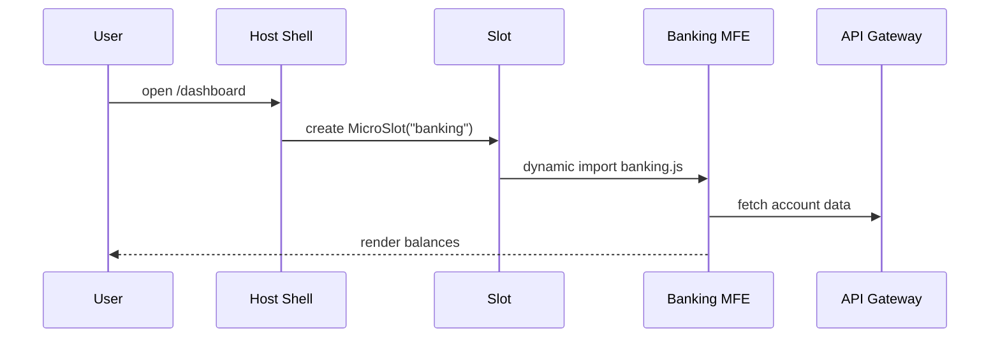

# Chapter 1: Micro-Frontend Interface (HMS-MFE)


> “Think of a giant government service center.  
> Instead of one long counter, each agency—Parks, Veterans Affairs, Economic Analysis—runs its **own kiosk**.  
> Micro-Frontends bring that kiosk model to the web.”

---

## 1. Motivation — Why micro-frontends?

Imagine the national “MyGov” portal.  
On the same site, a citizen might:

* check veterans’ benefits,  
* pay student loans,  
* buy a national-park pass.

If every change to one screen forced **all** teams to redeploy the whole site, development would crawl at bureaucratic speed.  
HMS-MFE fixes this by letting each team ship an independent **Micro-Frontend (MFE)**—a tiny, self-contained web app—that plugs into the shared portal.

---

## 2. Key Concepts (kiosk analogies)

| Concept | Kiosk Analogy | One-line Definition |
| --- | --- | --- |
| Host Shell | The building lobby | A lightweight container that loads MFEs. |
| Micro-Frontend | An agency kiosk | A standalone UI bundle (e.g., `BankingDashboard.vue`). |
| Slot / Mount Point | An empty booth | A DOM location where an MFE appears. |
| Shared Contracts | Agency handbook | Agreed props/events so MFEs talk to the host. |
| Independent Deploy | Separate clocks | Each MFE can update without touching others. |

---

## 3. Quick Start – Put a Banking kiosk on the home page

We’ll create a **Banking Dashboard MFE** and mount it inside a host shell.

### 3.1 Host shell (`App.vue`) – super-simplified

```vue
<!-- App.vue -->
<template>
  <div id="portal">
    <!-- empty booth -->
    <MicroSlot name="banking" />
  </div>
</template>

<script setup>
import MicroSlot from './components/MicroSlot.vue'
</script>
```

Explanation  
1. The shell shows almost nothing—just a `<MicroSlot>`.  
2. A slot is a **dynamic mount point** that will later fetch and display the Banking MFE.

---

### 3.2 Simple slot loader (`MicroSlot.vue`)

```vue
<!-- MicroSlot.vue -->
<template>
  <component :is="remote" v-if="remote" />
</template>

<script setup>
import { ref, onMounted } from 'vue'
const props = defineProps({ name: String })
const remote = ref(null)

onMounted(async () => {
  // ❶ Fetch a remote ES module at runtime
  remote.value = await import(
    /* @vite-ignore */ `https://cdn.my.gov/mfe/${props.name}.js`
  ).then(m => m.default)
})
</script>
```

What happens?  
❶ At runtime, the slot downloads `banking.js`, turns it into a Vue component, and renders it. If the Banking team deploys a new version, the host shell **doesn’t change at all**.

---

### 3.3 A minimal Micro-Frontend (`BankingDashboard.vue`)

We already have a stub in the repo:

```vue
<template>
  <div class="banking-dashboard">
    <h1>Banking Dashboard</h1>
  </div>
</template>
```

Package & deploy this file as `banking.js` (using Vite or Webpack Module Federation—see appendix). Once uploaded, any portal with a `MicroSlot name="banking"` will show it.

---

## 4. Government-flavored Use Case Walkthrough

1. A citizen logs in to MyGov.  
2. The host shell inspects the user’s profile: “veteran + bank-account-holder”.  
3. It decides to load two MFEs: `banking` and `veterans-benefits`.  
4. Each MFE is fetched from its agency’s CDN, rendered, and can update data **independently** through the shared API layer described later in [Backend API Gateway](06_backend_api_gateway__hms_api___hms_mkt__.md).

---

## 5. Under the Hood (step-by-step)



* The shell knows _where_ to place kiosks.  
* Each MFE knows _how_ to fetch its own data.  
* The host never touches the inner code of the kiosk—true separation of concerns.

---

## 6. Tiny Peek at Module Federation Config (optional)

> Skip if the term “webpack” scares you—you can always use plain `<script type="module">`.

```js
// banking/webpack.config.js  (excerpt, 15 lines)
module.exports = {
  plugins: [
    new ModuleFederationPlugin({
      name: 'banking',
      filename: 'banking.js',
      exposes: {
        './Dashboard': './src/BankingDashboard.vue'
      },
      shared: { vue: { singleton: true } }
    })
  ]
}
```

This tells Webpack to output a single file (`banking.js`) exposing our dashboard.

---

## 7. Testing your first MFE

1. Serve the host shell on `localhost:5173`.  
2. Publish `banking.js` on a tiny HTTP server (`npx serve`).  
3. In a browser, open the portal. You should see “Banking Dashboard”.

> Break it? No worries—because each MFE is isolated, a bug in banking won’t crash the parks kiosk.

---

## 8. Common Questions

**Q: Can MFEs talk to each other?**  
Yes, through a shared event bus or the [Event Bus / Service Mesh](10_event_bus___service_mesh_.md) layer.

**Q: How do we route between MFEs?**  
That’s handled in the next chapter, [Intent-Driven Navigation & AI-Guided Journeys](02_intent_driven_navigation___ai_guided_journeys_.md).

**Q: How do we secure them?**  
Identity lives in [Identity & Access Management (IAM)](07_identity___access_management__iam__.md).

---

## 9. Summary

• Micro-Frontends = “kiosks” inside one portal.  
• Each agency builds & deploys its own UI without touching others.  
• A tiny `<MicroSlot>` plus dynamic `import()` is enough to get started.  
• This isolation accelerates delivery while keeping the citizen experience unified.

Ready to guide users from one kiosk to the next? Continue to  
[Intent-Driven Navigation & AI-Guided Journeys](02_intent_driven_navigation___ai_guided_journeys_.md).

---

Generated by [AI Codebase Knowledge Builder](https://github.com/The-Pocket/Tutorial-Codebase-Knowledge)