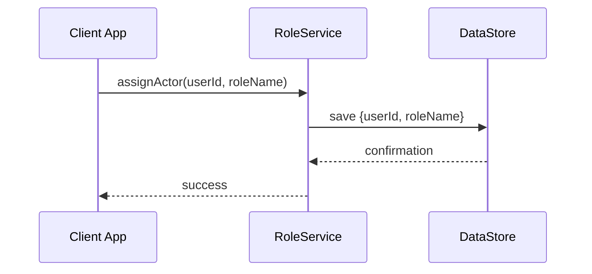

# Chapter 1: User Roles and Actors

Welcome to HMS-MFE! In this chapter, we’ll learn how to model the people (and bots) who use your app: who they are, what they can do, and how to keep everything organized—just like seating residents, experts, board members, and staff at a public hearing.

## 1. Why “User Roles and Actors” Matter

Imagine the Consumer Financial Protection Bureau (CFPB) portal:

- **Residents** file a complaint.
- **Experts** analyze the case.
- **Board members** vote on policy changes.
- **Staff** support the process.

Each group needs a different view and permissions. Without clear roles, anyone could do anything—chaos! Our **User Roles and Actors** layer solves this by:

1. Defining **User Groups** (e.g., Resident, Staff).
2. Identifying **Concerned Stakeholders** (e.g., Experts).
3. Tagging **Human Decision Makers** (e.g., Board Members).
4. Registering **AI Agents** (e.g., automated triage bot).

## 2. Key Concepts

1. **User Groups**  
   Collections of real people (residents, staff).  
2. **Concerned Stakeholders**  
   Specialists who need deeper access (auditors, experts).  
3. **Human Decision Makers**  
   Officials who approve or reject proposals (board members).  
4. **AI Agents**  
   Machines that auto-process routine tasks (triage, notifications).

Analogy: at a city council meeting, everyone sits in a designated section—and only the council votes.

## 3. How to Use This Abstraction

Let’s see how to set up roles in code. We’ll:

1. Define roles with permissions.
2. Attach actors (users or bots) to roles.
3. Query what an actor can do.

```ts
// 1. Create manager
const roleManager = new RoleManager()

// 2. Define roles
roleManager.defineRole('Resident', ['submitForm', 'viewStatus'])
roleManager.defineRole('Staff',    ['reviewForm', 'updateRecord'])

// 3. Add actors
roleManager.assignActor('alice@example.com', 'Resident')
roleManager.assignActor('bob@example.com',   'Staff')

// 4. Check permissions
console.log(roleManager.getPermissions('alice@example.com'))
// ➜ ['submitForm', 'viewStatus']
```

Explanation:
- We set up two roles, `Resident` and `Staff`.
- We assign real emails to those roles.
- Finally, we fetch what “alice” is allowed to do.

## 4. What Happens Behind the Scenes

Here’s a high-level flow when you call `assignActor`:



1. **Client App** calls the service.
2. **RoleService** handles logic and validations.
3. **DataStore** persists the assignment.
4. You get a “success” back in the app.

## 5. Peek Under the Hood (Minimal Code)

File: `src/roles.ts`

```ts
interface Role {
  name: string
  permissions: string[]
}

interface Assignment {
  actorId: string
  roleName: string
}

export class RoleManager {
  private roles: Map<string, Role> = new Map()
  private assignments: Assignment[] = []

  defineRole(name: string, permissions: string[]) {
    this.roles.set(name, { name, permissions })
  }

  assignActor(actorId: string, roleName: string) {
    // skip validation details…
    this.assignments.push({ actorId, roleName })
  }

  getPermissions(actorId: string) {
    // gather all roles for actor
    return this.assignments
      .filter(a => a.actorId === actorId)
      .flatMap(a => this.roles.get(a.roleName)?.permissions || [])
  }
}
```

Explanation:
- A `Map` of roles holds permissions.
- An array of assignments ties actors to roles.
- `defineRole` and `assignActor` manage data.
- `getPermissions` finds what an actor can do.

## 6. Summary & What’s Next

You’ve learned to:
- Model **who** interacts with HMS-MFE.
- Give each actor only the permissions they need.
- See the simple flow and code behind this abstraction.

Next up, we’ll build the screens and endpoints these actors use. Ready? Let’s dive into the [Interface Layer](02_interface_layer_.md)!

---

Generated by [AI Codebase Knowledge Builder](https://github.com/The-Pocket/Tutorial-Codebase-Knowledge)