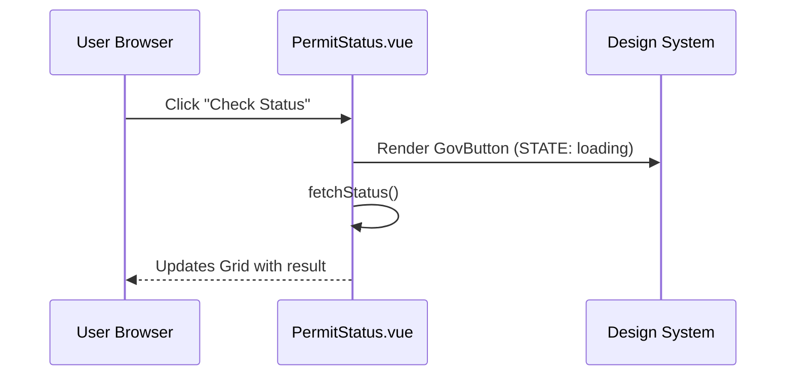

# Chapter 2: Frontend Component Library & Design System


*(continuing from [Chapter&nbsp;1: Micro-Frontend (HMS-MFE)](01_micro_frontend__hms_mfe__.md))*  

---

## 1. Why Do We Need a Design System?

Picture the **Office of Local Defense Community Cooperation** launching a “Base-Closure Grant Form” while the **House Office of Inspector General** ships an “Audit Dashboard.”  
Citizens should feel they never left one `.gov` website—fonts, colors, buttons, keyboard shortcuts, and screen-reader text must be identical.

A shared *Component Library* is our LEGO® box:

* Reusable bricks: Header, Button, FormRow, DataGrid  
* Federal style baked in: colors (#1A4480), seal-ready typography (Public Sans)  
* Section 508 accessibility checked by the **Access Board** playbook  

Result: every team builds faster *and* meets legal accessibility standards.

---

## 2. Key Concepts (Zero-Jargon Edition)

| Term | What It Really Means | One-Line Analogy |
|------|----------------------|------------------|
| Component | Mini UI file that knows how to draw itself | LEGO brick |
| Design Token | Name → value pair (e.g., `primary-color → #1A4480`) | Paint swatch |
| Theme | Collection of tokens that work together | Color palette booklet |
| Accessibility (A11y) | Rules so everyone can use the UI | Wheelchair ramp |
| Storybook | Living demo site to preview components | LEGO instruction book |

---

## 3. 5-Minute “Hello Citizen” Walk-Through

We will build a tiny “Permit Status” screen using three ready-made components.

### 3.1 Install the Library

```bash
npm install @hms-mfe/design-system
```

### 3.2 Compose Components

`PermitStatus.vue`

```vue
<template>
  <GovPage>
    <GovHeader title="Permit Status Inquiry" />
    
    <GovForm @submit="fetchStatus">
      <GovFormRow label="Application ID" required>
        <GovInput v-model="appId" />
      </GovFormRow>
      <GovButton type="submit">Check Status</GovButton>
    </GovForm>
    
    <GovDataGrid v-if="statusRows" :rows="statusRows" />
  </GovPage>
</template>

<script setup>
import { ref } from 'vue'
import { GovPage, GovHeader, GovForm, GovFormRow,
         GovInput, GovButton, GovDataGrid } from '@hms-mfe/design-system'

const appId = ref('')
const statusRows = ref(null)

function fetchStatus() {
  // Placeholder – real call goes through the API Gateway in Chapter 3
  statusRows.value = [{ step: 'Review', officer: 'J. Smith', date: '2024-04-18' }]
}
</script>
```

What just happened?  
1. We **imported** 7 components from the library.  
2. We never touched CSS—branding, spacing, and keyboard navigation come free.  
3. A11y labels, focus order, and contrast are already correct.

---

## 4. Under the Hood (Non-Scary Edition)



Key points:  
1. Components are plain Vue files living under `node_modules/@hms-mfe/design-system`.  
2. Each component imports **design tokens** from `/tokens/*.json` at build time; no global CSS overrides.  
3. Accessibility tests run in CI using `axe-core`.

### 4.1 Peek Inside a Component (Simplified)

`GovButton.vue`

```vue
<template>
  <button
    class="gov-btn"
    :class="{ loading }"
    :disabled="loading || disabled"
  >
    <slot />
  </button>
</template>

<script setup>
defineProps({ loading: Boolean, disabled: Boolean })
</script>

<style scoped>
@import '@/tokens/colors.css';

.gov-btn {
  background: var(--color-primary);
  color: #fff;
  border: 0;
  padding: 0.5rem 1rem;
}

.gov-btn.loading {
  opacity: 0.6;
  cursor: wait;
}
</style>
```

Explanation:  
• **`var(--color-primary)`** comes from the token file—change it once and every button updates.  
• `scoped` style prevents clashes with micro-apps.  

---

## 5. How to Contribute a New Component

1. Fork `hms-mfe/design-system`.  
2. Add `MyAgencyBadge.vue` under `src/components/`.  
3. Document props in `stories/MyAgencyBadge.stories.js`.  
4. Run tests:  

```bash
npm run test       # Jest + vue-test-utils
npm run a11y       # axe-core sweep
npm run storybook  # local preview
```

5. Open a PR. A GitHub Action blocks merge if **any** a11y rule fails.

---

## 6. Frequently Asked Beginner Questions

**Q: Can I override styles?**  
A: Yes, but use *design tokens*—never hard-code `#123456`. Example:

```css
:root { --color-primary: #0A7B83; } /* Local accent */
```

**Q: Does this only work with Vue?**  
A: Internally, components export as Web Components too. A React micro-app can `import '@hms-mfe/design-system/button'`.

**Q: How does it relate to security?**  
A: Components hold *no* sensitive data. Auth tokens stay in the [Identity & Access Management layer](04_identity___access_management__iam__.md).

---

## 7. Recap & Next Steps

You now know how the Design System:

• Gives every `.gov` screen a trustworthy look.  
• Bakes in Section 508 accessibility from day one.  
• Lets teams snap UI bricks together—no CSS wars.

Next, we’ll wire our shiny UI to real back-end data through the API Gateway. 👉 [Chapter 3: Backend API Gateway (HMS-API / HMS-SVC)](03_backend_api_gateway__hms_api___hms_svc__.md)

---

Generated by [AI Codebase Knowledge Builder](https://github.com/The-Pocket/Tutorial-Codebase-Knowledge)