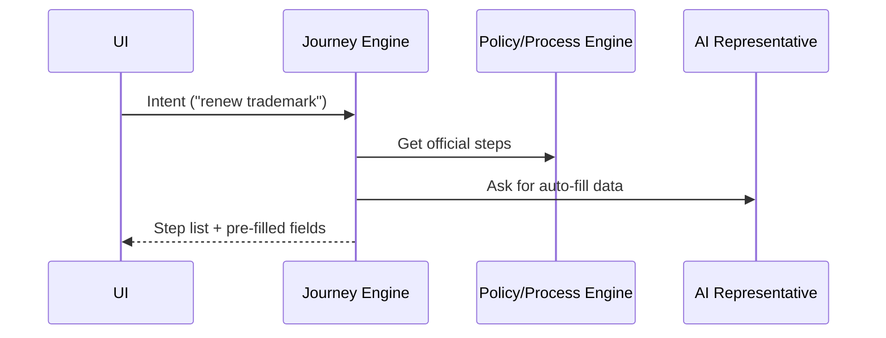

# Chapter 2: Intent-Driven Navigation & AI-Guided Journeys


*From “Which form do I need?” to “Here are your next three clicks.” — a GPS for bureaucracy.*

[← Back to Chapter 1: Micro-Frontend Interface (HMS-MFE)](01_micro_frontend_interface__hms_mfe__.md)

---

## 1. Why do we need a “government GPS”?

Picture Alex, a small-business owner who simply wants to **renew a federal trademark**.  
Today Alex must:

1. Find the right USPTO page.  
2. Decode legal jargon (“Section 9 Renewal?”).  
3. Manually copy business info into half-a-dozen fields.  
4. Hope no attachment is missing.

One wrong turn and Alex ends up in a 50-page PDF labyrinth.

**Intent-Driven Navigation** flips this: Alex types *“renew my trademark”* → the system **generates a guided journey**:

```
Step 1  Verify trademark # & owner info (✓ Auto-filled)
Step 2  Attach proof of continued use (✗ Missing)
Step 3  Pay renewal fee
```

Think of it as **Google Maps, but for forms**.

---

## 2. Key Concepts (mini-glossary)

| Term | Everyday analogy | What it means here |
|------|------------------|--------------------|
| Intent | “I want coffee” | A plain-language goal the user states (“report a fire code violation”). |
| Journey Map | GPS route | Ordered tasks the system plans to reach the intent. |
| Waypoint | Road exit | A single form, upload, or approval step. |
| Auto-Fill Engine | Auto-complete | Pulls known data to pre-populate fields. |
| Document Radar | Packing checklist | Detects which attachments are still missing. |
| Feedback Loop | Re-routing | Learns from user actions & refines future routes. |

---

## 3. A 60-second Hands-On

### 3.1 Ask for a journey

```js
// src/pages/TrademarkRenewal.vue (simplified)
<script setup>
import { useJourney } from '@/journey'

const { currentStep, next, status } = useJourney(
  'renew trademark'      // ① the intent
)
</script>

<template>
  <h1>{{ status.title }}</h1>
  <p>{{ status.description }}</p>

  <button @click="next()">Next</button>
</template>
```

Explanation  
① We hand the **intent string** to `useJourney`. Behind the scenes it:

• sends the intent to the Journey Engine,  
• receives an ordered list of waypoints,  
• exposes helpers (`currentStep`, `next`) for the UI.

### 3.2 What the citizen sees

```
Renew Trademark
---------------
Step 1/3  Confirm trademark number 874231
[Next]
```

On click, the component advances to Step 2. No manual URL juggling, no “Where is form TX-09-B?”.

---

## 4. How does it work under the hood?



1. **UI** collects the intent.  
2. **Journey Engine** queries the central rule book (see [Policy/Process Engine](09_policy_process_engine_.md)).  
3. It also asks the **AI Representative Agent** ([HMS-A2A](03_ai_representative_agent__hms_a2a__.md)) for reusable user data.  
4. The combined plan returns to the UI as an easy, linear flow.

---

## 5. Peeking at the Journey Engine

File: `src/journey/engine.ts` (core logic trimmed to <20 lines)

```ts
export async function planJourney(intent: string) {
  // 1. Classify intent (LLM call skipped)
  const intentCode = await classify(intent)     // e.g. "TRADEMARK_RENEWAL"

  // 2. Fetch canonical steps from policy service
  const steps = await fetch(`/api/policy/${intentCode}`).then(r => r.json())

  // 3. Auto-fill with known user data
  const enriched = await Promise.all(
    steps.map(step => autofill(step))
  )

  return enriched                                // [{id, title, fields, status}]
}
```

What happens?

1. `classify()` turns free text into a standard **intent code**.  
2. We pull the official checklist for that code.  
3. `autofill()` asks HMS-A2A for any data we can pre-populate (name, address, prior filings).

---

## 6. Making forms magically complete

File: `src/journey/autofill.ts`

```ts
async function autofill(step) {
  for (const field of step.fields) {
    if (!field.value) {
      field.value = await getFromProfile(field.key) // e.g., "legalName"
    }
  }
  return step
}
```

If a value exists in the citizen’s profile, the field appears **already filled**. Missing docs are marked “To-Do”, triggering the Document Radar to show reminders.

---

## 7. Wiring it into Micro-Frontends

Because each agency UI is an independent kiosk (see [Chapter 1](01_micro_frontend_interface__hms_mfe__.md)), we expose a **Journey Router** that any MFE can mount.

```vue
<!-- src/components/JourneyRouter.vue -->
<template>
  <component :is="currentStep.component"
             :step="currentStep"
             @complete="next()" />
</template>
```

Any kiosk (e.g., USPTO MFE) drops `<JourneyRouter/>` inside its booth and inherits the guided flow for *its* portion of the journey. No extra wiring.

---

## 8. Common Questions

**Q: Is this just a fancy wizard?**  
Partly, but unlike a static wizard, it adapts in real-time. If the user suddenly adds a co-owner, the Journey Engine may insert an extra tax form as a new waypoint.

**Q: Where is user data stored?**  
In the shared profile managed by [Identity & Access Management (IAM)](07_identity___access_management__iam__.md). The Journey Engine only reads what the user grants.

**Q: Can staff override the path?**  
Yes. Case workers use the [Human-in-the-Loop Review Console](04_human_in_the_loop__hitl__review_console_.md) to add, remove, or approve steps.

---

## 9. Mini-exercise

1. Add a button “Report fire code violation” to any page.  
2. Call `useJourney('report fire code violation')`.  
3. Observe the steps (upload photos, select location, submit).  
4. Remove your internet connection → notice the component gracefully informs the user and retries, thanks to offline caching in the Journey Engine.

---

## 10. Recap & What’s Next

You learned to:

• Capture a plain-language intent.  
• Generate a dynamic, AI-guided journey.  
• Auto-fill forms and flag missing documents.  
• Embed the journey into any Micro-Frontend.

In the next chapter we’ll meet the brains that gather user data and talk to agencies on the citizen’s behalf: [AI Representative Agent (HMS-A2A)](03_ai_representative_agent__hms_a2a__.md).

---

Generated by [AI Codebase Knowledge Builder](https://github.com/The-Pocket/Tutorial-Codebase-Knowledge)