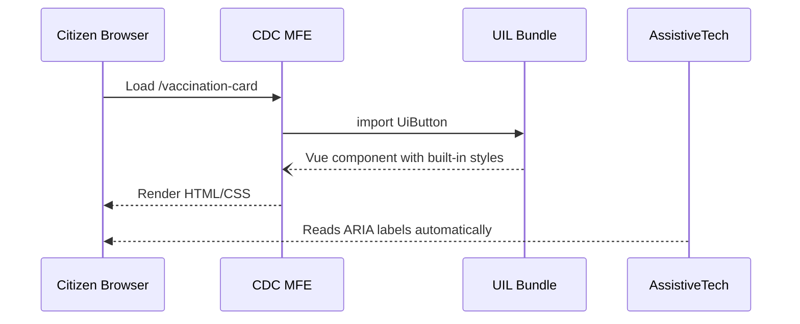

# Chapter 2: Universal Interface Library (Shared UI Kit)  

*(a.k.a. “The paint, tiles, and ramps every government counter already has installed”)*  

---

## 0. From Bricks to Paint  
In [Chapter 1: Micro-Frontend (HMS-MFE Component)](01_micro_frontend__hms_mfe_component__.md) we learned how each agency ships its own Lego-brick UI bundle.  
But what if every brick is a different color, uses different fonts, and forgets accessibility rules? Citizens would feel like they just walked from a modern DMV counter into a 1980s basement office.

**Enter the Universal Interface Library (UIL).**  
One shared kit of buttons, forms, alerts, and layout pieces that:

* already passes Section 508 checks,  
* already supports English, Spanish, and French out of the box,  
* already adapts to each agency’s brand colors,  
* already snaps into any Vue micro-frontend.

Rollout becomes “plug & play”, not “design, debate, re-invent”.

---

## 1. A Citizen-First Motivation  

Imagine Maria (yep, same Maria) now wants to:  

1. Request a COVID-19 vaccination card re-print (CDC).  
2. File a workplace safety complaint (OSHA).  
3. Apply for an AbilityOne job (U.S. AbilityOne Commission).  

All three processes require:

* A “Continue” button.  
* A multi-step wizard.  
* Error messages for invalid input.  

With the UIL each agency just **imports** the same `<UiButton>` and `<UiStepper>` components.  
Maria sees one coherent experience—and assistive technology like screen readers already work.

---

## 2. Key Pieces of the Kit (Plain English)

| Term | Friendly Analogy | Why You Care |
|------|------------------|--------------|
| Design Tokens | Paint swatches | Central list of colors, font sizes, spacing units. |
| Tin Can Components | Pre-built Lego tiles | Buttons, inputs, modals—ready to drop in. |
| Themes | Peel-and-stick wraps | Lets the CDC use teal while OSHA uses red, **without** code changes. |
| Accessibility Guards | Wheelchair ramps | ARIA labels, keyboard focus loops, high-contrast checks already inside. |
| Storybook Playground | Showroom floor | A live gallery where designers & devs test each part before shipping. |

---

## 3. Using the UIL in an MFE (5 Minutes)

### 3.1 Installation

```bash
npm i @hms/uil
```

### 3.2 A Tiny Vue Page

```vue
<!-- VaccinationCard.vue -->
<template>
  <ui-card>
    <h1>Request Vaccination Card</h1>

    <ui-text-field
      v-model="email"
      label="Email address"
      required
    />

    <ui-button @click="submit" color="primary">
      Continue
    </ui-button>
  </ui-card>
</template>

<script setup>
import { UiCard, UiTextField, UiButton } from '@hms/uil'
import { ref } from 'vue'

const email = ref('')
function submit() {
  // real call skipped
  alert(`Sent link to ${email.value}`)
}
</script>
```

What happens?  
1. You imported **zero CSS**—the component ships its own styles.  
2. The button already has ARIA attributes, keyboard focus rings, and a loading spinner slot.  
3. Error states and localized labels can be toggled via props (`error-message-es`, etc.).

### 3.3 Theming for Your Agency

```js
// cdc-theme.js
import { setTheme, federalTeal, usaFonts } from '@hms/uil'

setTheme({
  primary: federalTeal(600),
  fontFamily: usaFonts('Public Sans')
})
```

Place that in your MFE bootstrap (`entry-cdc.js`) **before** the first component renders.  
Now all `<ui-*>` components follow the CDC color palette—no overrides needed.

---

## 4. Behind the Curtain (Gentle Tour)



Key steps:

1. The MFE asks the UIL for a component (plain ES Module import).  
2. The UIL returns a Vue SFC that already references design tokens.  
3. On render, global CSS variables (`--hms-primary`) cascade from the theme file.  
4. Screen readers pick up baked-in ARIA tags without extra developer work.

---

## 5. A Peek at the Code

### 5.1 `UiButton.vue` (simplified – 17 lines)

```vue
<template>
  <button
    :class="['ui-btn', color]"
    :aria-label="ariaLabel"
    @click="$emit('click')"
  >
    <slot />
  </button>
</template>

<script setup>
import { computed } from 'vue'
const props = defineProps({ color: String, ariaLabel: String })
const color = computed(() => props.color || 'primary')
</script>

<style scoped>
.ui-btn {
  font-family: var(--hms-font);
  padding: 0.5rem 1rem;
  border-radius: 4px;
  cursor: pointer;
}
.ui-btn.primary { background: var(--hms-primary); color: #fff; }
.ui-btn:focus-visible { outline: 3px solid var(--hms-focus); }
</style>
```

Why this matters:  
* The button **reads** CSS variables (`--hms-primary`) set by any theme.  
* Focus outlines are enforced—no accidental removal by over-eager designers.  

### 5.2 Global Token File

```js
// tokens/default.js (excerpt)
export default {
  '--hms-primary': '#1a4480',   // USWDS “blue-50”
  '--hms-focus':   '#ffbf47',   // high-contrast yellow
  '--hms-font':    '"Public Sans", Arial, sans-serif'
}
```

A theme file simply overrides any subset; the rest fall back to defaults.

---

## 6. Testing & Playground

Run:

```bash
npx hms-uil storybook
```

A browser window opens showing every component with:

* Color-blindness filters  
* Dark/Light toggle  
* Keyboard-only navigation test  

No special setup—teams can visually verify compliance **before** merging code.

---

## 7. Common Pitfalls & Quick Fixes

| “Uh-oh” Moment | Fix |
|----------------|-----|
| Button text appears in English only | Pass `label-es="Continuar"` or rely on the i18n plugin. |
| Custom CSS breaks focus ring | Never override `.ui-btn:focus-visible`; instead adjust `--hms-focus`. |
| Two themes on the same page clash | Scope themes to a root node: `<div data-theme="cdc">…</div>`. |

---

## 8. Recap

You now know:

* **Why** the Universal Interface Library exists—to give every agency ADA-compliant, brand-aware components instantly.  
* **How** to install, import, and theme components in any micro-frontend.  
* **What** happens under the hood with design tokens and ARIA guards.  

With these shared parts, your MFEs can focus on policy logic, not pixel-pushing.

---

Ready to connect those beautiful screens to real data and services?  
Jump to [Backend Service & API Layer (HMS-SVC)](03_backend_service___api_layer__hms_svc__.md).

---

Generated by [AI Codebase Knowledge Builder](https://github.com/The-Pocket/Tutorial-Codebase-Knowledge)