# Chapter 3: AI Representative Agent (HMS-A2A)

[← Back to Chapter 2: Intent-Driven Navigation & AI-Guided Journeys](02_intent_driven_navigation___ai_guided_journeys_.md)

---

> “Imagine a tireless policy aide who reviews every complaint, crunches usage data, rewrites the rule-book at 3 a.m., and ships the fix before breakfast.” 
> That is the **AI Representative Agent**.

---

## 1. Why do we need an AI aide in government IT?

### Mini-story: The Over-booked Fire Marshal
The U.S. Fire Administration receives 50 000 inspection requests a month.  
Humans triage them by hand, so:

* Low-risk warehouses wait **9 weeks**.  
* High-risk nightclubs sometimes wait **4 weeks**.  
* Staff spend Fridays copying data from one spreadsheet to another.  

Result? Safety risks and overtime bills.

**HMS-A2A** steps in to:

1. Read every request + historical inspection data.  
2. Draft a smarter scheduling policy (e.g., “prioritize buildings with prior code violations”).  
3. Push the new rule to the [Policy/Process Engine](09_policy_process_engine_.md) through an API.  
4. Watch live metrics. If fires drop and overtime falls, keep the change. Otherwise, roll back.

---

## 2. Key Concepts — Meet the cast

| Term | Friendly analogy | What it does |
|------|------------------|--------------|
| Telemetry Inbox | Mailbox | Stream of logs, complaints, form submissions, etc. |
| Policy Corpus | Law library | Current statutes & agency rules, stored digitally. |
| Improvement Proposal | Bill draft | JSON document suggesting a new rule or workflow. |
| Guardrail Metrics | Scoreboard | KPIs the agent must improve (wait time, cost, etc.). |
| Auto-Deploy Hook | “Send to printer” | API call that publishes an accepted proposal. |

---

## 3. How do you USE HMS-A2A?

As a developer you rarely talk to the agent directly; you **register a problem** and let it work.

### 3.1 File a “pain ticket”

```ts
// firesvc/client.ts  (8 lines)
import { reportPainPoint } from 'hms-a2a/sdk'

await reportPainPoint({
  agency: 'USFA',
  issue:  'high-risk sites wait too long',
  sampleDataUrl: 's3://usfa/backlog.csv'
})
```

**What happens?**

1. The ticket lands in the Telemetry Inbox.  
2. HMS-A2A pulls the sample data, studies patterns, and drafts an Improvement Proposal.

### 3.2 Listen for accepted proposals (optional)

```ts
// governance-console.vue  (simplified)
onMounted(() => {
  a2a.on('proposal.accepted', p => {
    console.log('🎉 New scheduling rule live:', p.id)
  })
})
```

Your UI (often a kiosk MFE) can celebrate when the agent’s idea ships.

---

## 4. What’s inside the black box?

### 4.1 Bird’s-eye sequence

```mermaid
sequenceDiagram
  participant Inbox
  participant A2A as AI Agent
  participant GOV as Governance Portal
  participant PPE as Policy Engine
  Inbox->>A2A: Pain ticket + logs
  A2A->>A2A: Analyze & draft proposal
  A2A->>GOV: Ask for approval (optional)
  activate GOV
  GOV-->>A2A: 👍 auto-approve rules < $50k
  deactivate GOV
  A2A->>PPE: Publish new policy
  PPE-->>A2A: Metrics stream
```



Notes  
• If the rule costs money or changes law, humans review it in the [Human-in-the-Loop Review Console](04_human_in_the_loop__hitl__review_console_.md).  
• Otherwise, auto-deployment is instant.

---

### 4.2 Internal code peek (super-simplified)

#### a2a/brain.ts

```ts
export async function draftProposal(ticket) {
  // 1. Load context
  const data = await loadCsv(ticket.sampleDataUrl)
  const rules = await fetch('/policy/scheduling').then(r => r.json())

  // 2. Use an LLM prompt (pseudo)
  const idea = await llm(`
    Given rules ${rules} and data ${data.slice(0,100)},
    propose a scheduling algorithm that
    lowers average wait time for high-risk sites.
  `)

  // 3. Return structured proposal
  return {
    id:       crypto.randomUUID(),
    agency:   ticket.agency,
    summary:  idea.text,
    patch:    idea.codeSnippet,   // JS or YAML that PPE understands
    metrics:  ['avgWaitHighRisk']
  }
}
```

Explanation  
Lines 1-3: fetch context, call an LLM, package the result. Under 20 lines!

#### a2a/deploy.ts

```ts
export async function deployIfSafe(proposal) {
  // Check guardrails
  const canAuto = proposal.metrics.every(m => criticalMetrics.includes(m)) &&
                  estimateCost(proposal) < 50_000
  if (!canAuto) return queueForHuman(proposal)

  // Push to Policy Engine
  await fetch('/api/policy/apply', {
    method: 'POST',
    body:   JSON.stringify(proposal.patch)
  })
}
```

If the change is cheap and monitored, the agent self-deploys; otherwise humans step in.

---

## 5. Plugging A2A into other HMS layers

* **Journey Engine** (see Chapter 2) calls HMS-A2A for auto-fill data about the user.  
* **Governance Portal** (Chapter 5) shows a dashboard of pending proposals.  
* **Metrics & Observability Pipeline** (Chapter 12) streams KPIs back to the agent for evaluation.

All communication uses the secure [Backend API Gateway](06_backend_api_gateway__hms_api___hms_mkt__.md).

---

## 6. Hands-on exercise (5 min)

1. Copy `reportPainPoint()` call above into any Micro-Frontend.  
2. Simulate log data: upload a CSV with 100 fake inspection requests.  
3. Watch the console—you should see `"proposal.accepted"` within a minute.  
4. Open the **Governance Portal** to view the generated rule YAML.  
5. Roll back the change from the HITL Console to verify fail-safe behavior.

---

## 7. Common Questions

**Q: Can the agent change laws?**  
No. It can only suggest changes; anything touching statutory text requires human approval.

**Q: How is abuse prevented?**  
• Role-based API keys via [Identity & Access Management](07_identity___access_management__iam__.md).  
• Guardrail Metrics ensure no proposal ships without clear success criteria.  
• Full audit trail recorded in [Compliance & Audit Trail](13_compliance___audit_trail_.md).

**Q: Is this the same as “RPA bots”?**  
RPA mimics clicks. HMS-A2A drafts **policies** and **processes**—higher-level changes—then lets systems carry them out.

---

## 8. Recap

You learned:

✓ Why agencies need a tireless AI aide.  
✓ Key concepts: Telemetry Inbox, Policy Corpus, Guardrail Metrics.  
✓ How to file a pain ticket and observe automated policy fixes.  
✓ The safety net: Human-in-the-Loop review before big changes.

Ready to see how humans inspect and approve the agent’s work?  
Jump to [Chapter 4: Human-in-the-Loop (HITL) Review Console](04_human_in_the_loop__hitl__review_console_.md).

---

Generated by [AI Codebase Knowledge Builder](https://github.com/The-Pocket/Tutorial-Codebase-Knowledge)