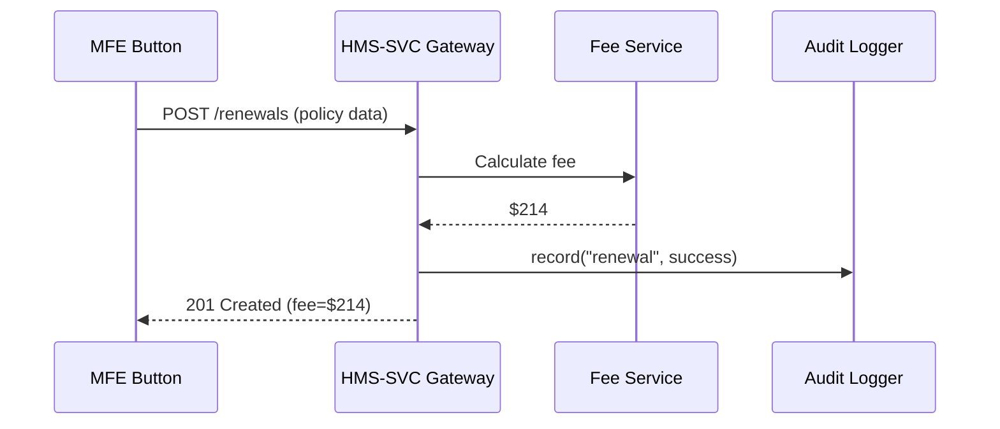
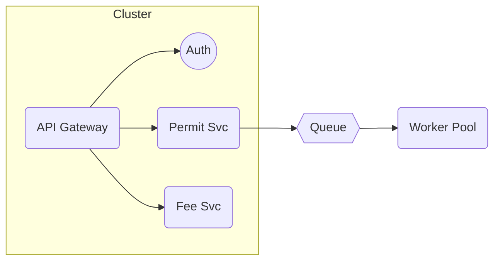

# Chapter 3: Backend Service & API Layer (HMS-SVC)

*(a.k.a. “The invisible clerks that actually stamp the forms.”)*  

Jumped in from [Universal Interface Library (Shared UI Kit)](02_universal_interface_library__shared_ui_kit__.md)?  
Great—your screens look gorgeous. Now let’s connect them to the machinery that gets real government work done.

---

## 0. Why Does HMS-SVC Exist?

### A Quick Citizen Story

1. Kevin logs in to `my.gov` to apply for a **National Flood Insurance Program (NFIP)** policy renewal.  
2. He completes the on-screen form (rendered by an MFE + UIL buttons).  
3. The “Submit” button sends the data to a URL like:
   
   ```
   POST /api/flood-insurance/v2/renewals
   ```
4. An email confirmation arrives, a fee is calculated, and an audit trail is stored.

All of steps 3-4 happen **inside HMS-SVC**—a cluster of tiny, stateless micro-services that:

* validate Kevin’s input,  
* orchestrate workflows (fee calculation, PDF generation, email),  
* record everything for compliance.

Without HMS-SVC, Kevin’s pretty form would go **nowhere**.

---

## 1. Key Concepts (Plain English)

| Term | Real-World Analogy | Quick Definition |
|------|-------------------|------------------|
| Micro-service | A single government clerk | Small program focused on one job (e.g., “Fee Calculator”). |
| Stateless | Clerk with no memory | Service does not store session data; every call must include what it needs. |
| REST Endpoint | A form window | URL that accepts JSON (`/permits/123`). |
| GraphQL Endpoint | A buffet menu | One URL where the caller specifies exactly what fields it wants. |
| Queue / Job Worker | “In-tray” of tasks | Decouples slow work (PDF signing) from instant API response. |
| Audit Log | CCTV camera | Immutable record of who did what and when. |

---

## 2. Anatomy of an HMS-SVC Call



1. The Micro-Frontend hits the **API Gateway**.  
2. Gateway fan-outs to specialized services.  
3. All calls are logged before the response returns.

---

## 3. A “Hello, Service” Walk-Through

We’ll build the tiniest **Permit Submission Service** using Node.js + Express.  
*(You don’t need to be a Node expert—focus on the flow.)*

### 3.1 Service Skeleton (18 lines)

```js
// permit-service/index.js
import express from 'express'
const app = express()
app.use(express.json())          // parse JSON body

// 1️⃣ Endpoint
app.post('/permits', (req, res) => {
  const permit = req.body
  // 2️⃣ Simple validation
  if (!permit.applicant) return res.status(400).send('Missing applicant')
  
  // 3️⃣ Pretend to enqueue a job
  console.log('Queued permit', permit)
  
  // 4️⃣ Log audit entry (stub)
  console.log('AUDIT', {user: permit.applicant, ts: Date.now()})
  
  res.status(201).send({status: 'queued'})
})

app.listen(3000, () => console.log('Permit-svc on :3000'))
```

What happened?

1. `POST /permits` receives citizen data.  
2. We check required fields.  
3. A real system would push a message to a queue (RabbitMQ, SQS).  
4. We write an audit line.

### 3.2 Calling It from an MFE (7 lines)

```js
// inside PermitForm.vue
async function submit() {
  const res = await fetch('/api/permits', {
    method: 'POST',
    headers: {'Content-Type':'application/json'},
    body: JSON.stringify({ applicant: 'Kevin', type: 'Flood' })
  })
  console.log(await res.json())   // ➜ {status:"queued"}
}
```

Press “Submit” and the service queues the job—no page reload.

---

## 4. Internal Plumbing (Slightly Deeper)

A real HMS-SVC deployment adds more layers:



1. **API Gateway**: One hostname (`api.my.gov`) that routes to correct micro-service.  
2. **Auth Middleware**: Verifies JWT from the front-end.  
3. **Queue & Workers**: Long-running tasks handled asynchronously.  

---

## 5. Behind the Curtain: A Peek at Common Files

| File | Purpose | Lines |
|------|---------|------|
| `permit-service/index.js` | Express router | 50 |
| `permit-service/job.js` | Consumes queue, writes to DB | 40 |
| `gateway/routes.yaml` | URL → service map | ~20 |
| `audit/logger.js` | Pushes JSON entries to HMS-DTA | 30 |

We keep each service small so different agencies (e.g., **Pretrial Services Agency** vs **DISA**) can own, deploy, and scale them independently.

---

## 6. Tips & Pitfalls

| Pitfall | Quick Fix |
|---------|-----------|
| Storing session data in memory | Push it to Redis or stateless tokens. |
| Giant multi-purpose service | Split by business domain (“renewals”, “payments”). |
| Ignoring audit requirements | Always call the audit helper *before* sending the HTTP response. |
| Hard-coding URLs in MFEs | Use environment variables (`VITE_HMS_API_BASE`). |

---

## 7. Where Does HMS-SVC Sit in the Whole Stack?

```
Citizen Browser
   ↓  (buttons & forms)
HMS-MFE + UIL
   ↓  (HTTPS)
HMS-SVC  ← you are here
   ↓
HMS-ACH  (money)
HMS-DTA  (data lake)
HMS-OPS  (monitoring)
```

Each downward arrow is another chapter in this guide.

---

## 8. Recap & Next Steps

You now know:

* Why the **Backend Service & API Layer** is the *engine room* of any public-sector portal.  
* How a tiny micro-service validates, queues, and audits a request.  
* The difference between stateless REST calls and background workers.  

Next we’ll secure and govern those APIs so only authorized citizens and agents can call them.  
Head over to [Governance Gateway (HMS-GOV)](04_governance_gateway__hms_gov__.md).

---

Generated by [AI Codebase Knowledge Builder](https://github.com/The-Pocket/Tutorial-Codebase-Knowledge)