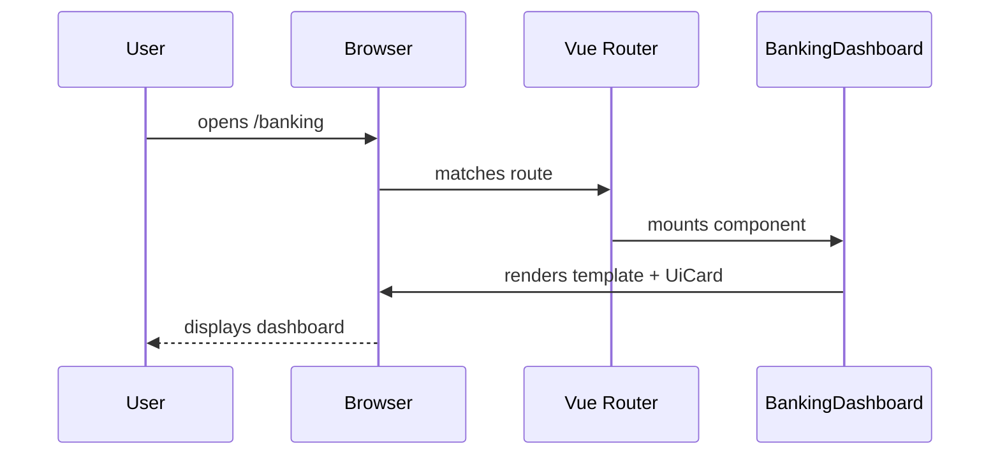

# Chapter 3: Frontend Interface Components

Welcome back! In [Chapter 2: Interface Layer](02_interface_layer_.md) we learned how portals and shared UI libraries hook into routes and APIs. Now, let’s build the actual **pieces** that make up those screens—our reusable **Frontend Interface Components**.

## Why Reusable Components Matter

Imagine a citizen logging into a federal banking portal:  
- The account summary card looks the same on every page.  
- Transaction tables share the same sorting and styling.  
- The top navigation bar never changes.

If each page re-wrote the same HTML/CSS/JS, development would slow to a crawl and consistency would vanish. Vue.js **components** solve this by acting like LEGO bricks—you build once, and snap them together everywhere.

**Concrete use case:**  
- The National Institute of Arthritis portal needs a “My Accounts” dashboard.  
- A different service—food delivery—needs a similar card layout, but for “My Orders.”  
- We’ll see how `BankingDashboard.vue` and `FoodDeliveryApp.vue` share the same building blocks.

---

## Key Concepts

1. **Single-File Components (.vue)**  
   Each component lives in its own folder/file with `<template>`, `<script>`, and `<style>`.

2. **Props & Slots**  
   - *Props* let you pass data into a component (e.g., a list of transactions).  
   - *Slots* let you inject custom markup (e.g., a header or footer) into a wrapper.

3. **Page Templates**  
   High-level components (like `BankingDashboard.vue`) that combine cards, tables, charts, etc.  

4. **Global vs. Local Registration**  
   - *Global*: register once, use everywhere.  
   - *Local*: import into just the pages that need it.

---

## 1. Building a Simple Card Component

Let’s start with a very basic card—a common wrapper for dashboard elements.

```vue
<!-- File: src/components/ui/Card.vue -->
<template>
  <div class="ui-card">
    <slot />
  </div>
</template>

<script>
export default {
  name: 'UiCard'
}
</script>

<style>
.ui-card {
  border: 1px solid #ccc;
  padding: 16px;
  border-radius: 4px;
}
</style>
```

Explanation:  
- `<slot />` is a placeholder for whatever children you pass inside `<UiCard>...</UiCard>`.  
- Styles ensure every card looks the same.

---

## 2. Creating a Banking Dashboard Page

Now let’s assemble a page using our `UiCard`:

```vue
<!-- File: src/components/pages/dashboards/banking/BankingDashboard.vue -->
<template>
  <div>
    <h1>Banking Dashboard</h1>
    <UiCard>
      <h2>Account Balance</h2>
      <p>$12,345.67</p>
    </UiCard>
    <UiCard>
      <h2>Recent Transactions</h2>
      <!-- imagine a list here -->
    </UiCard>
  </div>
</template>

<script>
import UiCard from '../../ui/Card.vue'

export default {
  name: 'BankingDashboard',
  components: { UiCard }
}
</script>
```

Explanation:  
- We import `UiCard` locally and wrap each section in the same styled container.  
- Changing `Card.vue` once updates every dashboard card.

---

## 3. Displaying the Page via Vue Router

To see `BankingDashboard.vue` in action, wire it up in your router:

```js
// File: src/interface/routes.js
import BankingDashboard from '../components/pages/dashboards/banking/BankingDashboard.vue'

export const routes = [
  { path: '/banking', component: BankingDashboard },
  // other routes…
]
```

Explanation:  
- Navigating to `/banking` loads our dashboard component.  
- Behind the scenes, Vue Router handles the mount.

---

## 4. What Happens at Run-Time?



1. The browser requests `/banking`.  
2. Vue Router finds `BankingDashboard`.  
3. Vue mounts it, pulling in `UiCard`.  
4. The user sees a consistent, styled page instantly.

---

## Peek “Under the Hood” File Structure

```
src/
  components/
    ui/
      Card.vue
    pages/
      dashboards/
        banking/
          BankingDashboard.vue
      apps/
        FoodDeliveryApp.vue
  interface/
    routes.js
```

- **ui/** holds generic building blocks (buttons, cards, tables).  
- **pages/** holds full-page templates that combine those blocks.

---

## Reusing in a Food Delivery App

See how the same `UiCard` speeds a Food Delivery interface:

```vue
<!-- File: src/components/pages/apps/FoodDeliveryApp.vue -->
<template>
  <div>
    <h1>Food Delivery App</h1>
    <UiCard>
      <h2>Your Orders</h2>
      <!-- orders table -->
    </UiCard>
  </div>
</template>

<script>
import UiCard from '../../ui/Card.vue'
export default { name: 'FoodDeliveryApp', components: { UiCard } }
</script>
```

Everything looks and behaves the same, even though content differs.

---

## Summary

In this chapter you learned how to:

- Define **single-file Vue components** (`.vue` files).  
- Use **props** and **slots** for flexible content injection.  
- Assemble **page templates** like `BankingDashboard.vue`.  
- Wire components into routes so users can navigate to them.  

With this foundation, your portals stay consistent and maintainable.  

Up next we’ll connect these pages to live data—see [Chapter 4: Backend API](04_backend_api_.md)!

---

Generated by [AI Codebase Knowledge Builder](https://github.com/The-Pocket/Tutorial-Codebase-Knowledge)