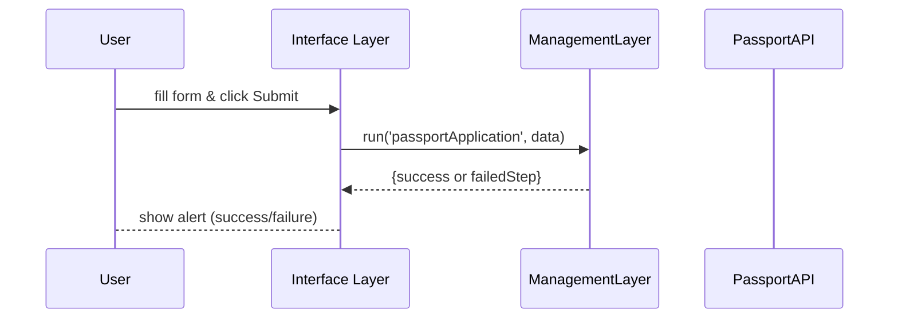

# Chapter 3: Interface Layer

Welcome back! In [Chapter 2: Management Layer](02_management_layer_.md) we learned how we define and run workflows (the “coaching staff”). Now it’s time to build the **Interface Layer**—the “front desk” where citizens, administrators, and managers interact with our system.

## Why Do We Need an Interface Layer?

Imagine you’re applying for a passport online:

1. You land on a clean form.  
2. You fill in your name, date of birth, and upload a photo.  
3. You click **Submit** and instantly see a status update.  

The Interface Layer is responsible for:

- Rendering pages and forms  
- Capturing user input  
- Showing progress and results  

It drives user engagement and sends data into our workflows.

---

## Central Use Case: Passport Application Form

Use case: A citizen wants to apply for a passport through our portal. We need to:

1. Display a form to collect personal data.  
2. Send that data to the [Management Layer](02_management_layer_.md).  
3. Show a success or error message.  

Let’s build that step by step.

---

## Key Concepts

1. **Pages & Routes**  
   Define which URL shows which screen.  
2. **Components & Layout**  
   Reusable building blocks (forms, buttons, nav bars).  
3. **Data Binding**  
   Link form fields to JavaScript variables.  
4. **Workflow Triggers**  
   Call `ManagementLayer.run(...)` when the user submits.

---

## 1. Defining a Page & Route

First, let’s create a **PassportForm** page and tell our router to show it at `/passport`.

File: `interface/src/pages/PassportForm.vue`
```html
<template>
  <div>
    <h2>Passport Application</h2>
    <form @submit.prevent="submit">
      <input v-model="applicant.name" placeholder="Full Name" />
      <input v-model="applicant.dob"   placeholder="Date of Birth" />
      <button type="submit">Submit</button>
    </form>
  </div>
</template>
<script>
import Management from '../../management/ManagementLayer'

export default {
  data() {
    return { applicant: { name: '', dob: '' } }
  },
  methods: {
    async submit() {
      const result = await Management.run('passportApplication', this.applicant)
      if (result.success) {
        alert('Application submitted!')
      } else {
        alert('Failed at step: ' + result.failedStep)
      }
    }
  }
}
</script>
```
Explanation:  
- `v-model` binds inputs to `applicant` fields.  
- On submit, we call our workflow: `passportApplication`.

Now register this page in the router.

File: `interface/src/router.js`
```js
import Vue from 'vue'
import Router from 'vue-router'
import PassportForm from './pages/PassportForm.vue'

Vue.use(Router)

export default new Router({
  routes: [
    { path: '/passport', component: PassportForm },
    // add more pages here...
  ]
})
```
Explanation:  
- Visiting `/passport` shows our form component.

---

## 2. Bootstrapping the App

We need a root component that holds our navigation and outlet for pages.

File: `interface/src/App.vue`
```html
<template>
  <div id="app">
    <nav>
      <router-link to="/passport">Apply for Passport</router-link>
    </nav>
    <router-view/>
  </div>
</template>
```
File: `interface/src/main.js`
```js
import Vue from 'vue'
import App from './App.vue'
import router from './router'

new Vue({
  router,
  render: h => h(App)
}).$mount('#app')
```
Explanation:  
- `<router-view/>` renders whatever page matches the URL.  
- The nav bar links between screens.

---

## 3. What Happens Step-by-Step?

Let’s walk through the flow when a citizen clicks **Submit**:



1. **User** completes the form and clicks Submit.  
2. **Interface Layer** calls `ManagementLayer.run(...)`.  
3. **Management Layer** orchestrates its workflow steps.  
4. Result is returned to the **Interface Layer**.  
5. The page displays a message to the **User**.

---

## 4. Inside the Interface Layer

Under the hood, our Interface Layer is just a thin shell that:

1. Registers pages (`PassportForm.vue`) and layouts (`App.vue`).  
2. Binds user input to JavaScript data objects.  
3. Calls into [Management Layer](02_management_layer_.md) for business logic.  

No heavy lifting—just wiring UI to workflows.

---

## Conclusion

In this chapter you learned to:

- Create pages and routes for user interaction  
- Bind form fields to JavaScript data  
- Trigger workflows in the [Management Layer](02_management_layer_.md)  
- Show success or errors to the user  

Next up is our component toolbox: the **[Frontend Component Library](04_frontend_component_library_.md)** where we standardize buttons, forms, and more for all pages.

---

Generated by [AI Codebase Knowledge Builder](https://github.com/The-Pocket/Tutorial-Codebase-Knowledge)