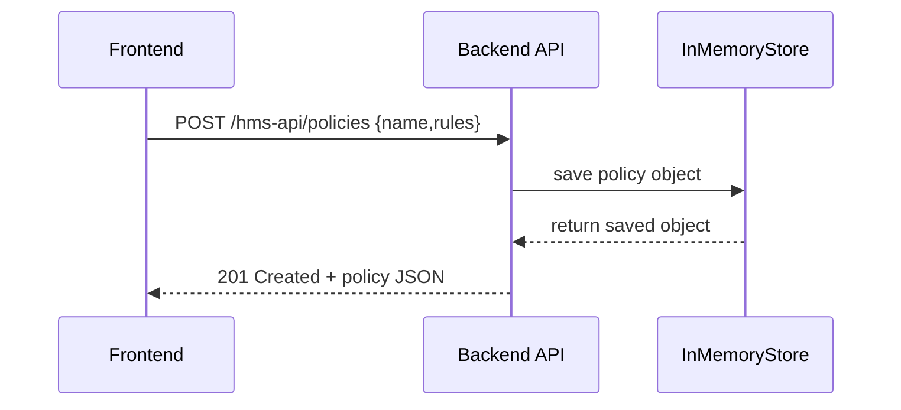

# Chapter 4: Backend API

In [Chapter 3: Frontend Interface Components](03_frontend_interface_components_.md) we built the reusable UI pieces that drive our portals. Now, let’s learn how those UIs talk to the server—the **Backend API**—to read and write policies, processes, and data. In a federal context, this is like the secure channel that connects a DEA case-management system to external labs.

## 1. Why a Backend API Matters

Imagine an official needs to:

1. Retrieve the list of active seizure-chain policies.  
2. Update a policy’s rules.  
3. Fetch lab results and attach them to a case.

The **Backend API** is the “front door” for all these programmatic requests. It ensures:

- Requests follow a standard protocol (HTTP + JSON).  
- Only authorized clients can read or change data.  
- Business rules (e.g., DEA security checks) run before anything hits the database.

Without it, each UI or integration would reinvent the wheel—and security/sanity would crumble!

## 2. Key Concepts

1. **Endpoints**  
   URL paths where you send HTTP requests, e.g. `GET /hms-api/policies` or `POST /hms-api/processes`.

2. **HTTP Methods**  
   - GET: read data  
   - POST: create new data  
   - PUT / PATCH: update existing data  
   - DELETE: remove data

3. **JSON Payloads**  
   We send and receive data as JSON—lightweight, human-readable.

4. **Router & Middleware**  
   Express (or another framework) directs requests to handlers and can run checks (authentication, validation).

5. **Data Store**  
   Could be an in-memory array for testing, or a real database in production.

## 3. A Simple “Policies” API

Let’s build a minimal Express server that manages policies in memory.

```ts
// File: src/api/server.ts
import express from 'express'
const app = express()
app.use(express.json())

// In-memory store
const policies: any[] = []

// Router under /hms-api
const router = express.Router()

// GET /hms-api/policies
router.get('/policies', (req, res) => {
  res.json(policies)
})

// POST /hms-api/policies
router.post('/policies', (req, res) => {
  const newPolicy = { id: policies.length + 1, ...req.body }
  policies.push(newPolicy)
  res.status(201).json(newPolicy)
})

app.use('/hms-api', router)
app.listen(3000, () => console.log('Backend API running on port 3000'))
```

Explanation:
- We create an Express app and enable JSON parsing.
- We keep policies in a simple array.
- Two endpoints:  
  • `GET /hms-api/policies` returns all policies.  
  • `POST /hms-api/policies` creates and returns a new policy.

### Example Interaction

Request:
```
POST http://localhost:3000/hms-api/policies
Content-Type: application/json

{ "name": "Chain-of-Custody", "rules": ["lock-box", "audit-trail"] }
```
Response:
```json
{ "id": 1, "name": "Chain-of-Custody", "rules": ["lock-box","audit-trail"] }
```

## 4. How a Request Flows



1. The UI or agent calls `POST /hms-api/policies`.  
2. The API handler stores the policy.  
3. The store returns the saved policy.  
4. The API sends back a 201 response with JSON.

## 5. Internal Implementation Details

Inside `src/api/server.ts` we used:

- **express.Router()** to group `hms-api/` endpoints.  
- **app.use(express.json())** so `req.body` holds parsed JSON.  
- A simple in-memory array—replaceable with a real database later.

You could split routes into separate files:

```ts
// File: src/api/routes/policies.ts
import { Router } from 'express'
export const policiesRouter = Router()
const store: any[] = []

policiesRouter
  .get('/', (req, res) => res.json(store))
  .post('/', (req, res) => {
    const p = { id: store.length+1, ...req.body }
    store.push(p)
    res.status(201).json(p)
  })
```

And in `server.ts`:

```ts
import express from 'express'
import { policiesRouter } from './routes/policies'

const app = express()
app.use(express.json())
app.use('/hms-api/policies', policiesRouter)
app.listen(3000)
```

## 6. Calling the API from Your Frontend

In your React/Vue code you can do:

```ts
// File: src/interface/apiClient.ts
export async function listPolicies() {
  const res = await fetch('/hms-api/policies')
  return await res.json()
}

export async function createPolicy(data: any) {
  const res = await fetch('/hms-api/policies', {
    method: 'POST',
    headers: { 'Content-Type': 'application/json' },
    body: JSON.stringify(data),
  })
  return await res.json()
}
```

Explanation:
- `listPolicies()` fetches all policies.
- `createPolicy()` sends a new policy and returns the created object.

You can now wire these calls into your components with data fetching and state updates.

## Summary

In this chapter you learned how the **Backend API**:

- Acts as a programmatic gateway under `/hms-api`.  
- Exposes clear HTTP endpoints (`GET`, `POST`, etc.).  
- Uses JSON payloads to exchange data.  
- Straddles the interface between your UI and the data store.  

Next, we’ll break this monolithic API into smaller, independently deployable services—our [Microservices Architecture](05_microservices_architecture_.md).

---

Generated by [AI Codebase Knowledge Builder](https://github.com/The-Pocket/Tutorial-Codebase-Knowledge)