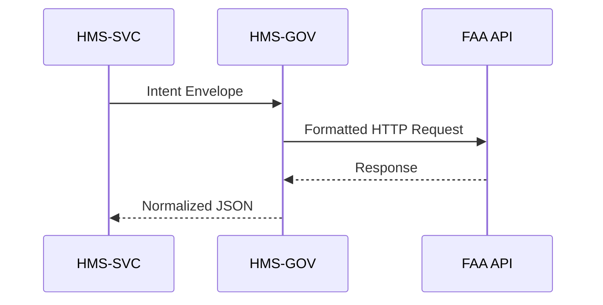

# Chapter 4: Governance Gateway (HMS-GOV)

*(a.k.a. “The protocol office that makes sure our calls to outside agencies wear the right badge.”)*

[← Back to Chapter 3: Backend Service & API Layer (HMS-SVC)](03_backend_service___api_layer__hms_svc__.md)

---

## 0. Why Do We Need a Governance Gateway?

Imagine a tiny service inside HMS-SVC that must pull real-time flight delays from the **Federal Aviation Administration (FAA)** and, ten seconds later, file a bankruptcy fraud alert with the **U.S. Trustee Program**.

Problem:  
* Each agency wants a different URL format, token, header, and rate limit.  
* Mis-format one header and the external API rejects you.  
* Exceed a per-minute quota and you get blocked for 24 hours.

**HMS-GOV** sits between **all internal services** and **any external government API**.  
Think of it as the State Department’s protocol office:

* Translates: turns an internal “intent” into the exact request the partner needs.  
* Decorates: adds JWTs, trace IDs, embargo flags, etc.  
* Enforces: rate limits, redaction rules, and blackout windows.

Result: internal teams speak **one** language; HMS-GOV handles the diplomatic etiquette.

---

## 1. Key Concepts (Plain English)

| Term             | Friendly Analogy              | One-Sentence Meaning                              |
|------------------|--------------------------------|--------------------------------------------------|
| Intent Envelope  | Diplomatic pouch              | JSON packet that says “what we want,” not “how.” |
| Adapter          | Language interpreter          | Converts the envelope into FAA-style, PTO-style, … |
| Policy Guard     | Rule book on the border       | Checks quotas, redacts PII, blocks embargoed calls. |
| Token Vault      | Badge storage room            | Secure service that hands out short-lived OAuth/JWT tokens. |
| Throttle Queue   | The velvet rope               | Lets only *N* calls per agency per minute pass through. |

---

## 2. Using HMS-GOV in Your Service (Step-By-Step)

### 2.1 Install the SDK

```bash
npm i @hms/gov-sdk
```

### 2.2 A 12-Line Example: Fetch Flight Delays

```js
// flightDelay.js (inside your HMS-SVC micro-service)
import { govRequest } from '@hms/gov-sdk'

export async function getDelays(airportCode) {
  const intent = {
    target: 'FAA_FLIGHTS',
    action: 'GET_DELAYS',
    payload: { airport: airportCode }
  }

  // HMS-GOV does all translation & policy checks
  const res = await govRequest(intent)
  return res.data          // standardized JSON
}
```

What you *didn’t* have to do:

* Hunt down the latest FAA token.  
* Remember the header `x-faa-client-id`.  
* Sleep 200 ms between calls to stay within rate limits.

### 2.3 Sample Output

```json
[
  { "flight": "AA123", "minutesLate": 18 },
  { "flight": "DL456", "minutesLate": 5  }
]
```

Clean, uniform, and already logged for auditing.

---

## 3. Internals Without Tears

### 3.1 High-Level Flow



1. Service sends **one** envelope.  
2. HMS-GOV picks the correct **Adapter** (`faaAdapter.js`).  
3. **Policy Guard** validates quotas, adds tokens from **Token Vault**.  
4. Response is normalized and returned.

### 3.2 Peek at an Adapter (14 lines)

```js
// adapters/faaAdapter.js
export async function translate(intent) {
  return {
    url: `https://api.faa.gov/v1/delays/${intent.payload.airport}`,
    method: 'GET',
    headers: {
      'Authorization': `Bearer ${await getToken('FAA')}`,
      'X-Trace-Id': intent.traceId
    }
  }
}
```

Explanation:

* Builds the exact FAA URL.  
* Pulls a fresh token from the vault.  
* Adds tracing so HMS-OPS can follow the call (see next chapters).

### 3.3 Throttle & Policy Guard (16 lines)

```js
// policyGuard.js
import { enqueue, dequeue } from './throttle.js'

export async function enforce(reqMeta) {
  if (await isEmbargoed(reqMeta.target)) throw 'Embargo active'
  await enqueue(reqMeta.target)            // block if over quota
  const res = await send(reqMeta)          // actual HTTP fetch
  dequeue(reqMeta.target)
  return redact(res)                       // strip PII if needed
}
```

*Embargo windows* prevent calls (e.g., IRS blackout during filing freeze).  
`redact()` removes fields the requesting service is not cleared to see.

---

## 4. Configuring a New Partner Agency

1. Add an adapter file (`usptoAdapter.js`).  
2. Register it:

```js
// index.js
registerAdapter('USPTO_PATENTS', usptoAdapter)
```

3. Update the quota table (YAML):

```yaml
USPTO_PATENTS:
  rpm: 30            # requests per minute
  embargo: "22:00-02:00Z"
```

That’s it—every internal service can now talk to the Patent Office by sending an intent with `target: 'USPTO_PATENTS'`.

---

## 5. Common Pitfalls & Fast Fixes

| Pitfall                              | How to Dodge It                          |
|--------------------------------------|------------------------------------------|
| “Token expired” errors               | Never cache tokens; always call `getToken()` in adapter. |
| Service bypasses HMS-GOV via direct URL | Block outbound traffic except through gateway subnet. |
| Unexpected 429 rate-limit responses  | Check throttle queue size; adjust `rpm` in YAML. |
| Sensitive PII leaking in logs        | Ensure `redact()` strips fields **before** audit logging. |

---

## 6. Where HMS-GOV Sits in the Big Picture

```
HMS-MFE  →  HMS-SVC  →  HMS-GOV  →  External Gov APIs
                         ↓
                  HMS-OPS (metrics)
```

Every external call funnels through the Governance Gateway, giving the platform **one choke point** for security, quotas, and traceability.

---

## 7. Recap & Next Steps

You learned:

* The motivation for a **single protocol office** between internal services and hundreds of government APIs.  
* The five key pieces: Intent Envelope, Adapter, Policy Guard, Token Vault, Throttle Queue.  
* How to call HMS-GOV with just **one** function and let it handle tokens, headers, and rules.  
* The internal flow and how to add a new partner agency with minimal code.

Next, we’ll move money securely with the [Financial Transaction Core (HMS-ACH)](05_financial_transaction_core__hms_ach__.md).

---

Generated by [AI Codebase Knowledge Builder](https://github.com/The-Pocket/Tutorial-Codebase-Knowledge)