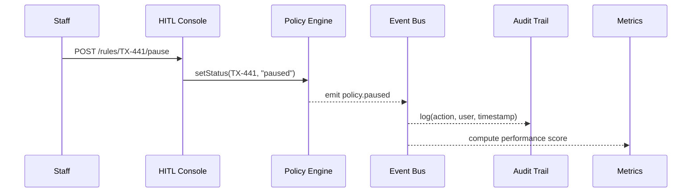

# Chapter 4: Human-in-the-Loop (HITL) Review Console
[← Back to Chapter 3: AI Representative Agent (HMS-A2A)](03_ai_representative_agent__hms_a2a__.md)

---

> “Autopilot gets most flights home,  
> but every cockpit still has a **big red override switch**.”  
>  
> In HMS, that switch lives in the **Human-in-the-Loop Review Console (HITL)**.

---

## 1. Why do we need a cockpit override?

### Mini-story: The 1-Click Tax Refund  
The IRS rolls out an AI rule that **auto-approves low-risk refunds within 24 h**.  
Day 1 looks great—until an edge-case bug starts issuing double payments to self-employed veterans.

A staff auditor opens the **HITL console**, hits **“PAUSE rule TX-441”**, edits the policy, and ships a hot-fix while:

* every faulty payment is frozen,  
* citizens see a friendly status banner (“manual review in progress”),  
* an audit log records who did what and why.

No code deploy, no late-night war room—just a safe, **human override**.

---

## 2. Key Concepts (pilot analogies)

| Concept | Cockpit Analogy | Plain meaning |
|---------|-----------------|---------------|
| Pause Switch | Autopilot off | Stop an AI-driven change instantly. |
| Edit Draft | Flight joystick | Tweak a pending policy or dataset. |
| Veto | “Go-around” | Cancel a change completely. |
| Alert Webhook | Warning siren | Notifies on-call teams & metrics pipeline. |
| Performance Score | Pilot de-brief | Rates each human action: saved errors vs. caused delays. |

---

## 3. First Flight – Pausing a live policy in 10 lines

Below is the entire staff UI you need inside any Micro-Frontend kiosk (the console itself is an MFE):

```vue
<!-- PauseButton.vue -->
<template>
  <button @click="pause()">⏸ Pause Rule</button>
</template>

<script setup>
const props = defineProps({ ruleId: String })

async function pause () {
  await fetch(`/hitl/rules/${props.ruleId}/pause`, { method: 'POST' })
  alert(`Rule ${props.ruleId} paused. Users switched to manual flow.`)
}
</script>
```

What happens?

1. Staff presses the button.  
2. A `POST /pause` call hits the **HITL API**.  
3. The Journey Engine (see [Intent-Driven Navigation](02_intent_driven_navigation___ai_guided_journeys_.md)) instantly routes new requests to the fallback *manual review* path.

---

## 4. Touring the Console

```
┌───────────────────────────────────────────────┐
│  HITL REVIEW CONSOLE                         │
├───────┬─────────┬─────────────┬──────────────┤
│ Rule  │ Status  │ Errors/Day  │ Actions      │
├───────┼─────────┼─────────────┼──────────────┤
│ TX-441│ 🟡 Paused│ 27 (↑)      │ Edit | Veto  │
│ FML-88│ 🟢 Live  │  0          │ Pause        │
└───────┴─────────┴─────────────┴──────────────┘
Selected: TX-441
[Diff View]   [Rollback to v3]   [Approve new patch]
```

Everything is **one screen**: pause, inspect diff, roll back, or approve a fix drafted by HMS-A2A.

---

## 5. What happens under the hood?



* One API call **changes policy state only**; no redeploy.  
* Every action is broadcast on the event bus, captured by both the **Metrics & Observability Pipeline** and the **Compliance & Audit Trail**.

---

## 6. Inside the HITL Service – tiny code peeks

### 6.1 Pause endpoint  
File: `hitl/routes/pause.ts`

```ts
import { publish } from '../bus.js'
import { score } from '../scoring.js'

export async function pauseRule(req, res) {
  const { ruleId } = req.params
  await db.rules.update(ruleId, { status: 'paused' })   // ❶
  publish('policy.paused', { ruleId, by: req.user.id }) // ❷
  score(req.user.id, ruleId, 'pause')                   // ❸
  res.status(202).end()
}
```

Explanation  
❶ Change the row—not the code.  
❷ Notify downstream systems (Journey Engine, Alert Webhooks).  
❸ Update the operator’s performance score.

---

### 6.2 Simple scoring helper  
File: `hitl/scoring.js`

```js
export function score(userId, ruleId, action) {
  const impact = estimateErrorReduction(ruleId) // ← tiny ML model or heuristic
  db.scores.upsert({ userId, delta: impact })
}
```

A **positive impact** (errors prevented) improves the official’s score; negative impact gets flagged for training.

---

## 7. Safety Nets & Abuse Prevention

1. **Two-person rule** on high-value changes: the console can require a second signature (configurable per agency).  
2. **Auto-unpause timer**: any paused rule re-activates after *N* hours unless a patch is approved. Prevents “set and forget”.  
3. **Real-time alerts**: Slack/SMS hooks from `policy.paused` events.  
4. **Full diff viewer**: officials must type a reason before saving edits.  
5. **Performance dashboard** (scores from `scoring.js`) surfaces patterns of negligence or heroics.

---

## 8. Hands-On Exercise (5 min)

1. Open the demo HITL console at `http://localhost:3000/hitl`.  
2. Pause rule **“DPW-MIA-12”** (Defense POW/MIA Accounting Agency).  
3. Watch the terminal running the Journey Engine—notice it logs `policy.paused`.  
4. Create a quick YAML patch in the editor (e.g., tighten data validation).  
5. Hit **“Submit for Approval”** → an alert pops up in the Governance Portal ([Chapter 5](05_governance_layer__hms_gov_portal_.md)).  
6. After approval, verify the rule is live and your performance score updated.

---

## 9. Common Questions

**Q: Is HITL only for emergency stops?**  
No. Officials also use it to stage gradual rollouts (e.g., 5 % → 50 % → 100 %) and to approve HMS-A2A proposals.

**Q: Can every staff member pause rules?**  
Access is gated through roles in [Identity & Access Management (IAM)](07_identity___access_management__iam__.md).

**Q: Does pausing a rule break citizen sessions?**  
The Journey Engine seamlessly reroutes users to the manual workflow, so no session is lost.

---

## 10. Recap & What’s Next

You learned:

✓ Why a **big red override** is essential—even in an AI-first portal.  
✓ Core concepts: pause, edit, veto, alerts, performance scoring.  
✓ How a 10-line button can pause a live policy.  
✓ The event flow that keeps metrics and audits in sync.

Next, we’ll see where oversight teams track these actions, set guardrails, and publish agency-wide decisions:  
[Chapter 5: Governance Layer (HMS-GOV Portal)](05_governance_layer__hms_gov_portal_.md)

---

Generated by [AI Codebase Knowledge Builder](https://github.com/The-Pocket/Tutorial-Codebase-Knowledge)