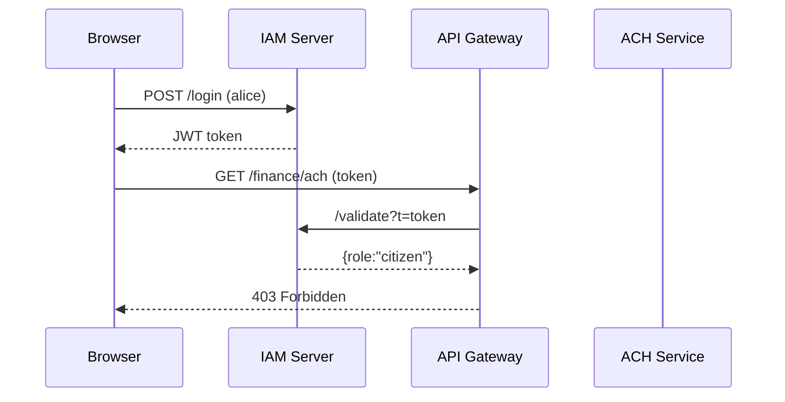

# Chapter 4: Identity & Access Management (IAM)

*(continuing from [Chapter 3: Backend API Gateway (HMS-API / HMS-SVC)](03_backend_api_gateway__hms_api___hms_svc__.md))*  

---

## 1. Why Do We Need IAM?

Imagine three people walking into City Hall:

| Person | Real-World Need | Digital Need |
|--------|-----------------|--------------|
| A citizen paying a parking ticket | See their own ticket, nothing else | Read-only access to `/tickets/*` |
| A treasury analyst | Download ACH settlement reports | Read **and** export `/finance/ach/*` |
| An AI chatbot helping with zoning questions | Pull zoning maps, never personal data | Read `/maps/zoning/*` only |

Without a **badge office** controlling who is who and what they may touch, chaos—or a data breach—would ensue.  
**Identity & Access Management (IAM)** is that badge office for HMS.  
It:

1. Proves *who* you are (authentication).  
2. Decides *what* you can do (authorization).  
3. Logs every door you open (audit).

---

## 2. Key Concepts (Plain-English Cheatsheet)

| Term | 1-Line Analogy | What It Means |
|------|----------------|---------------|
| Identity Provider (IdP) | HR prints a badge | Service that issues digital credentials (e.g., Keycloak, Azure AD). |
| Authentication | Showing your badge | Verifying username + password **or** passkey/MFA. |
| Authorization | Door lock checks badge color | Confirms your role has permission to enter the “room” (API route). |
| Role-Based Access Control (RBAC) | Blue badge = employee, Red = visitor | Each role bundles permissions; users inherit them. |
| Multi-Factor Authentication (MFA) | Badge **plus** PIN on keypad | Requires two proofs (something you know + something you have). |
| Audit Log | Security camera footage | Immutable record of every login and resource access. |

---

## 3. A 5-Minute “Hello Badge” Walk-Through

We will:

1. Stand up a **micro IAM server** (very tiny).  
2. Protect the API Gateway route `/finance/ach` so only `role="treasury_official"` gets through.  

### 3.1 IAM Server (15 lines)

`iam/index.js`

```js
import express from 'express';
import jwt from 'jsonwebtoken';
const app = express(); app.use(express.json());
const USERS = {               // demo database
  alice: { pwd: 'citizen',  role: 'citizen' },
  bob:   { pwd: 'treasury', role: 'treasury_official' }
};
const SECRET = 'hms-demo';

app.post('/login', (req, res) => {
  const { user, pass } = req.body;
  const u = USERS[user];
  if (!u || u.pwd !== pass) return res.status(401).send('Bad creds');
  const token = jwt.sign({ sub: user, role: u.role }, SECRET, { expiresIn: '1h' });
  res.json({ token });
});

app.get('/validate', (req, res) => {
  try { res.json(jwt.verify(req.query.t, SECRET)); }
  catch { res.status(401).send('Invalid'); }
});

app.listen(4000);
```

Explanation:  
• `/login` issues a **JWT** containing the user’s role.  
• `/validate` checks a token’s signature; the Gateway will call this.

### 3.2 Update the Gateway Middleware

`gateway/iam.js`  (← replaces stub from Chapter 3)

```js
import axios from 'axios';
export async function verifyToken(req, res, next) {
  const token = req.headers.authorization?.split(' ')[1];
  if (!token) return res.status(401).send('Missing token');

  try {
    const { data } = await axios.get('http://localhost:4000/validate', { params:{t:token} });
    req.user = data;                 // { sub:'bob', role:'treasury_official' }
    return next();
  } catch { return res.status(401).send('Bad token'); }
}
```

### 3.3 Add an Authorization Check

`gateway/index.js` (snippet)

```js
const needRole = role => (req,res,next) =>
  req.user.role === role ? next() : res.status(403).send('Forbidden');

app.use('/finance/ach', needRole('treasury_official'), (req,res)=>
  res.proxy(`http://localhost:4003${req.originalUrl}`));
```

Now:

```bash
# 1️⃣ Bob logs in
curl -X POST -d '{"user":"bob","pass":"treasury"}' localhost:4000/login
# token = eyJhbGciOi...

# 2️⃣ Access ACH report
curl -H "Authorization: Bearer $token" localhost:3000/finance/ach/report
# 200 OK (Bob is allowed)

# 3️⃣ Alice tries
# Same steps but with alice’s token → 403 Forbidden
```

---

## 4. What Happens Under the Hood?



---

## 5. Inside the JWT (X-Ray View)

```json
{
  "sub": "bob",
  "role": "treasury_official",
  "iat": 1710000000,
  "exp": 1710003600
}
```

• `sub` = who  
• `role` = what they can do  
• `exp` = when it expires  

Because the token is cryptographically signed, the Gateway can trust it—even if it travels through the user’s browser.

---

## 6. Adding Multi-Factor Authentication (MFA) in 10 Lines

```js
// iam/mfa.js  (pseudo)
import speakeasy from 'speakeasy';   // TOTP helper
export function verifyCode(user, code) {
  const secret = USERS[user].totpSecret;          // stored at enrollment
  return speakeasy.totp.verify({ secret, encoding:'base32', token:code });
}
```

Tie it into `/login`: ask for `code` and call `verifyCode`.  
Result: even if a password leaks, the hacker still needs the phone-generated TOTP.

---

## 7. Audit Logging (1-Minute Taster)

Every successful `validate` call can be pushed to a log service:

```js
import { publish } from '../ops/eventBus.js'; // hypothetical
publish('audit', { user:req.user.sub, route:req.originalUrl, ts:Date.now() });
```

These events flow into [Monitoring & Metrics (HMS-OPS)](15_monitoring___metrics__hms_ops__.md) for dashboards and incident forensics.

---

## 8. Frequently Asked Beginner Questions

**Q: Where are passwords stored?**  
A: In production, never in plain text! Use a salted hash (`bcrypt`) or delegate to a federal IdP (e.g., Login.gov).

**Q: Can a user have multiple roles?**  
A: Yes. The token could carry `roles:['citizen','zoning_viewer']`; `needRole` just checks the array.

**Q: What about service-to-service calls (AI agent → API)?**  
A: Treat the AI agent like any other *client credential* and issue a token with a narrowed `role:'ai_agent'`.

---

## 9. Recap & What’s Next

In this chapter you learned how IAM:

• Authenticates users with tokens (and optional MFA).  
• Authorizes requests via roles enforced at the API Gateway.  
• Records audit logs crucial for investigations.

Up next we’ll zoom out to broader **platform protections**—encryption, privacy rules, and legal guardrails that surround IAM.

👉 Continue to [Security, Privacy & Legal Guardrails (HMS-ESQ + Platform Controls)](05_security__privacy___legal_guardrails__hms_esq___platform_controls__.md)

---

Generated by [AI Codebase Knowledge Builder](https://github.com/The-Pocket/Tutorial-Codebase-Knowledge)