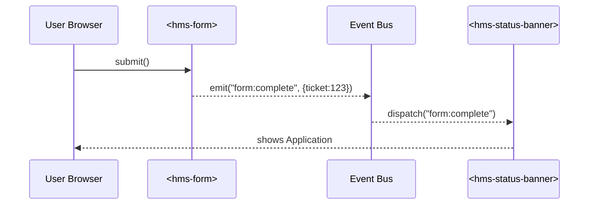

# Chapter 4: Micro-Frontend Interface Layer (HMS-MFE)

*(Coming from [Chapter 3: Legal Reasoning & Compliance Engine (HMS-ESQ)](03_legal_reasoning___compliance_engine__hms_esq__.md))*  

> “I just want to **renew my passport**—why do I have to click through six different agency sites?”

HMS-MFE fixes this problem.  
It is a box of LEGO-style web pieces that any agency can snap together to publish a seamless, beautiful portal without stepping on another agency’s toes.

---

## 1 · Why HMS-MFE Exists

Imagine three simultaneous projects:  

1. The **State Department** launches a “Passport Renewal” wizard.  
2. The **DMV** adds a calendar for road-test appointments.  
3. **FEMA** publishes a disaster-relief claims tracker.

Traditionally, pushing any of these changes meant touching *one giant website*—and risking outages for the others.  
With HMS-MFE each feature ships as an isolated web component. Update the DMV calendar on Friday; the passport flow and FEMA tracker stay untouched.

---

## 2 · Running Example: Passport Renewal in 10 Minutes

Goal: Build a single-page *Passport Renewal* site by composing ready-made bricks.

Bricks we will use  
• `<hms-form>` – renders multi-step forms  
• `<hms-upload>` – handles secure file uploads  
• `<hms-status-banner>` – shows live application status  
• Shared design tokens – keep fonts & colors consistent with the .gov brand

---

## 3 · Key Concepts (Plain English)

| Term | Beginner Analogy | Why It Matters |
|------|------------------|----------------|
| Brick / Component | LEGO piece | Small, self-contained, reusable |
| Design Token | Paint bucket | Global colors, fonts, spacing |
| Isolation Model | Kids build on separate tables | One brick crashes? Others keep working |
| Event Bus | Walkie-talkie between bricks | Components talk without tight coupling |
| A/B Hook | Coin flip at entry | Try two layouts, measure which wins |

---

## 4 · Quick-Start: Assemble the Passport Page

Create `index.html` (only 16 lines!):

```html
<!DOCTYPE html>
<html>
<head>
  <script type="module" src="https://cdn.hms.gov/mfe/loader.js"></script>
  <style>
    :root { --accent: var(--hms-color-primary-teal); }
  </style>
</head>
<body data-hms-agency="state-dept">
  <hms-status-banner id="status"></hms-status-banner>
  <hms-form src="/forms/passport-renewal.json"></hms-form>
  <hms-upload accept="application/pdf,image/*"></hms-upload>
</body>
</html>
```

What just happened?  
1. `loader.js` auto-registers every `<hms-*>` tag.  
2. A **design token** (`--accent`) tweaks the accent color.  
3. When the user submits, `<hms-form>` fires `form:complete`; the banner then shows *“Application #123 received”*.

No build tools, no framework wars—just HTML.

---

## 5 · Listening to Events (Add 8 Lines of JS)

```html
<script type="module">
  import { bus } from "https://cdn.hms.gov/mfe/event-bus.js";

  bus.on("form:complete", data => {
    document.getElementById("status")
            .setAttribute("ticket", data.ticket);
  });
</script>
```

Explanation  
• `bus.on` subscribes to the micro-frontend *walkie-talkie*.  
• When the form finishes, we update the banner—without the two components knowing each other’s internals.

---

## 6 · Under the Hood (Step-By-Step)



Five actors maximum; clear separation keeps failures contained.

---

## 7 · Deeper Dive: Inside a Brick

### 7.1  File Layout (simplified)

```
hms-form/
 ├─ index.ts     (custom-element definition)
 ├─ ui.vue       (optional framework code)
 ├─ schema.ts    (JSON-schema validator)
 └─ manifest.json (version, CDN path, A/B flags)
```

### 7.2  Core Definition (14 lines)

```ts
// hms-form/index.ts
import { bus } from "../event-bus";
class HMSForm extends HTMLElement {
  connectedCallback() {
    const src = this.getAttribute("src")!;
    fetch(src).then(r => r.json()).then(schema => this.render(schema));
  }
  private render(schema:any){
    /* omitted: build inputs from schema */
    const btn = document.createElement("button");
    btn.textContent = "Submit";
    btn.onclick = () => bus.emit("form:complete", {ticket: Date.now()});
    this.append(btn);
  }
}
customElements.define("hms-form", HMSForm);
```

Takeaways  
• Extends `HTMLElement`—no framework lock-in.  
• Emits an event instead of calling the banner directly.  
• Under 15 lines—easy for beginners to read.

---

## 8 · Sandbox & Isolation Tricks

1. **Shadow DOM** – Each component’s styles live in a bubble.  
2. **Versioned CDN** – URL like `mfe/hms-form@2.1.0.js` lets the DMV upgrade while FEMA stays on **1.9.3**.  
3. **Content Security Policy (CSP)** – Components may fetch only whitelisted APIs (`https://api.hms.gov/*`).  
4. **Feature Flags** – `manifest.json` can say `"enableNewDatePicker": true` for 10% of users → simple A/B test.

---

## 9 · Frequently Asked Newbie Questions

**Q: Do I need React or Vue?**  
A: No. Components are native Web Components. Use any framework *inside* if you wish, but consumers only see `<hms-*>` tags.

**Q: How do design tokens work?**  
A: They are plain CSS variables (`--hms-color-*`). Set them once; every brick inherits them.

**Q: Can states/local agencies host their own bricks?**  
A: Yes—point `loader.js` to your own CDN, or register extra components at runtime:  
```js
loader.register("nj-dmv-calendar", "https://cdn.nj.gov/dmv/calendar.js");
```

---

## 10 · Hands-On Exercise

1. Copy the `index.html` sample.  
2. Change `data-hms-agency` to `"fema"`. Notice the default blue switches to FEMA’s orange—powered solely by tokens!  
3. Break the form on purpose (remove the `src` attribute). The banner still loads—proof of isolation.

---

## 11 · How HMS-MFE Talks to the Rest of HMS-NFO

• New bills published in [Codified Democracy Foundation Engine (HMS-CDF)](02_codified_democracy_foundation_engine__hms_cdf__.md) appear instantly via a `<hms-bill-viewer>` brick.  
• Compliance warnings from [HMS-ESQ](03_legal_reasoning___compliance_engine__hms_esq__.md) surface through red badges on forms.  
• User intentions are forwarded to [Intent-Driven Navigation & AI-Guided Journeys](05_intent_driven_navigation___ai_guided_journeys_.md) for personalized help.

---

## 12 · Summary & What’s Next

You learned how HMS-MFE:

1. Breaks a monolithic website into safe, versioned LEGO bricks.  
2. Uses design tokens and the event bus to keep UX consistent yet flexible.  
3. Lets you build a real Passport Renewal page in fewer than 25 lines of code.

Ready to guide citizens through those pages with smart, context-aware routing?  
Jump to the next chapter: [Intent-Driven Navigation & AI-Guided Journeys](05_intent_driven_navigation___ai_guided_journeys_.md).

---

Generated by [AI Codebase Knowledge Builder](https://github.com/The-Pocket/Tutorial-Codebase-Knowledge)