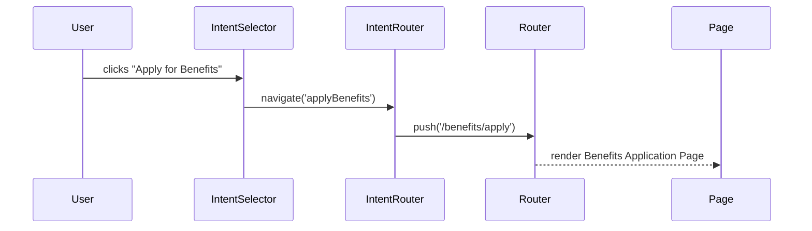

# Chapter 5: Intent-Driven Navigation

Welcome back! In the last chapter we learned how to build and style UI elements using our [Frontend Component Library](04_frontend_component_library_.md). Now let’s put those components to work in a smarter way—by guiding users based on _what they want to achieve_, not by forcing them through static menus. This is **Intent-Driven Navigation**.

## Why Intent-Driven Navigation?

Traditional portals show long menus or dozens of links. Citizens can get lost:

- “Do I click ‘Benefits’ or ‘Apply’ or ‘Claims’?”
- “Where do I report a streetlight outage?”

With Intent-Driven Navigation, we act like a virtual concierge. Instead of listing all options up front, we ask:

> “What can I help you with today?”

Then we route users directly to the right flow: applying for benefits, reporting an issue, or making a payment.

### Central Use Case: Citizen Help Desk

Imagine a government portal welcoming a citizen. They arrive to:

- Apply for unemployment benefits  
- Report a pothole  
- Get information on tax credits  

Our interface will ask “How can we help you today?” and, based on the answer, take them straight to the right form or workflow.

---

## Key Concepts

1. **Intent**  
   A user’s goal, e.g. `applyBenefits` or `reportIssue`.  
2. **Intent Configuration**  
   A simple map of intent IDs to labels and routes.  
3. **Intent Selector UI**  
   A friendly component (`IntentSelector.vue`) that asks “What do you want to do?” using buttons or cards.  
4. **Intent Router**  
   A lightweight module (`IntentRouter.js`) that reads the selected intent and navigates to the right page or workflow.

---

## 1. Defining Intents

First, let’s declare our available intents in a config file.

```js
// src/navigation/intents.js
export default [
  { id: 'applyBenefits', label: 'Apply for Benefits', route: '/benefits/apply' },
  { id: 'reportIssue',  label: 'Report an Issue',   route: '/issues/report'  }
]
```
Explanation:
- `id`: internal key  
- `label`: text shown to the user  
- `route`: the URL or workflow step to launch  

---

## 2. Building the Intent Selector

Next, we create a simple Vue component that lists these intents as buttons.

```html
<!-- src/interface/components/IntentSelector.vue -->
<template>
  <div>
    <h2>How can we help you today?</h2>
    <div v-for="intent in intents" :key="intent.id">
      <HmsButton
        :label="intent.label"
        @click="choose(intent.id)"
      />
    </div>
  </div>
</template>
<script>
import intents from '../../navigation/intents'
import IntentRouter from '../../navigation/IntentRouter'
import { HmsButton } from '@/components'

export default {
  components: { HmsButton },
  data() { return { intents } },
  methods: {
    choose(id) {
      IntentRouter.navigate(id)
    }
  }
}
</script>
```
Explanation:
- We import our intent list and `HmsButton` from the component library.  
- Loop over `intents` and render a button for each.  
- On click, call `IntentRouter.navigate`.

---

## 3. How Navigation Happens

### High-Level Sequence


Explanation:
1. Citizen clicks a labeled button.  
2. UI tells the Intent Router which intent was chosen.  
3. Router pushes the matching route into the app’s router.  
4. The correct page or workflow screen appears.

---

## 4. Inside the Intent Router

Here’s a minimal implementation that ties intents to routes.

```js
// src/navigation/IntentRouter.js
import intents from './intents'
import router from '@/interface/router' // your Vue or React router

export default {
  navigate(intentId) {
    const intent = intents.find(i => i.id === intentId)
    if (intent) {
      router.push(intent.route)
    } else {
      alert('Sorry, we don’t know how to handle that.')
    }
  }
}
```
Explanation:
- Look up the intent by `id`.  
- If found, use your front-end router to go to `intent.route`.  
- Otherwise, show a friendly error.

---

## 5. Wiring It All Together

1. Add a route for the selector itself:

```js
// src/interface/router.js
import Vue from 'vue'
import Router from 'vue-router'
import IntentSelector from './components/IntentSelector.vue'
import BenefitForm from './pages/BenefitForm.vue'
import IssueForm from './pages/IssueForm.vue'

Vue.use(Router)
export default new Router({
  routes: [
    { path: '/', component: IntentSelector },
    { path: '/benefits/apply', component: BenefitForm },
    { path: '/issues/report', component: IssueForm }
  ]
})
```

2. Ensure your root App.vue shows the selector at `/`.  
3. Citizens land on `/`, pick an intent, and zoom into the right form without hunting through menus.

---

## Conclusion

You’ve learned how to:

- Model user goals as **intents**  
- Build an **Intent Selector** UI that asks “What do you want to do?”  
- Implement a lightweight **Intent Router** to map goals to pages  
- Provide a smooth, goal-driven experience for citizens

Next up, we’ll dive into the plumbing behind our workflows—how the front end talks to real services—in [Backend API](06_backend_api_.md).

---

Generated by [AI Codebase Knowledge Builder](https://github.com/The-Pocket/Tutorial-Codebase-Knowledge)