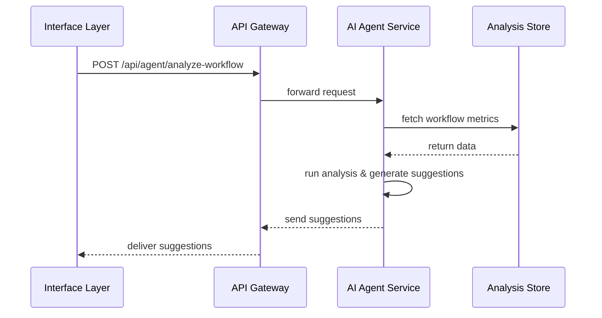

# Chapter 6: AI Representative Agent

Welcome back! In [Chapter 5: Microservices Architecture](05_microservices_architecture_.md) we split our platform into independent services. Now we’ll introduce the **AI Representative Agent**, a smart microservice (HMS-A2A) that watches over workflows, spots optimizations, and even pings humans when things go off track—like an expert consultant on call 24/7.

## Why an AI Agent Matters

Imagine a federal complaints portal:

- Citizens file toxic‐waste reports.
- Experts investigate.
- Board members set policies.
- Staff track performance.

Over time, data piles up: long review times, repeated errors, stalled escalations. What if an automated “Inspector General” could:

1. Scan throughput metrics and spot bottlenecks.  
2. Suggest policy tweaks to speed up processes.  
3. Alert staff when a case has lingered too long.  
4. Keep a log of every suggestion for audit and governance.

That’s exactly the role of our **AI Representative Agent**. It ensures continuous improvement, compliance with rules, and transparent recommendations.

## Key Concepts

1. Data Analysis Pipeline  
   The agent fetches metrics from our services (HMS-SYS, HMS-SVC, etc.) via the API Gateway.

2. Proposal Engine  
   A rules-based or ML-driven core that turns raw data into actionable suggestions.

3. Stakeholder Interaction  
   The agent delivers recommendations through notifications, emails, or dashboard events in the Interface Layer.

4. Governance Logging  
   Every analysis and suggestion is stored for audit, ensuring we meet transparency and policy requirements.

## Using the AI Agent

Let’s see how a staff user might invoke the agent to optimize complaint workflows.

1. The Interface Layer calls the agent’s endpoint.  
2. The agent reviews recent case times.  
3. It returns a list of suggestions (e.g., “Add auto‐reminder at day 3”).

### Example Request & Response

    POST /api/agent/analyze-workflow
    Content-Type: application/json

    {
      "workflowId": "complaint_review",
      "timeWindowHours": 72
    }

Response:

    {
      "workflowId": "complaint_review",
      "suggestions": [
        "Send reminder after 48 hours",
        "Escalate to senior expert if status unchanged"
      ]
    }

Explanation  
- We ask the agent to analyze the “complaint_review” workflow over the last 72 hours.  
- It returns two human‐readable suggestions we can display in the admin console.

## What Happens Behind the Scenes

1. The frontend calls the API Gateway.  
2. The gateway routes to the AI service.  
3. The service gathers metrics from the Data Store.  
4. The agent’s core analyzes and returns recommendations.

## Under the Hood: AI Agent Code

### 1. Defining the Endpoint

File: `hms-a2a/src/index.js`

    const express = require('express')
    const { analyzeWorkflow } = require('./engine')
    const app = express()
    app.use(express.json())

    app.post('/analyze-workflow', async (req, res) => {
      const { workflowId, timeWindowHours } = req.body
      const suggestions = await analyzeWorkflow(workflowId, timeWindowHours)
      res.json({ workflowId, suggestions })
    })

    app.listen(3004, () => console.log('AI Agent running on 3004'))

Explanation  
- We expose `POST /analyze-workflow`.  
- We call a simple `analyzeWorkflow` function in our engine.  
- We reply with JSON suggestions.

### 2. The Analysis Engine

File: `hms-a2a/src/engine.js`

    // Skip DB details…
    async function analyzeWorkflow(workflowId, hours) {
      const data = await fetchMetrics(workflowId, hours)
      // Very simple rule: if avg time > 48h, suggest reminder
      const avgTime = data.averageProcessingTime
      const suggestions = []
      if (avgTime > 48) suggestions.push('Send reminder after 48 hours')
      if (data.stalledCount > 5)
        suggestions.push('Escalate to senior expert if status unchanged')
      return suggestions
    }

Explanation  
- We fetch basic metrics.  
- We apply threshold rules.  
- We return a list of human‐readable suggestions.

## Summary

In this chapter you learned how the **AI Representative Agent**:

- Acts as a specialized microservice (HMS-A2A).  
- Analyzes workflow data and proposes optimizations.  
- Integrates with our API Gateway and Interface Layer.  
- Logs every action for governance and audit.

Up next, we’ll explore how the agent’s suggestions become formal proposals in our **Process Proposal Module**. See you in [Chapter 7: Process Proposal Module](07_process_proposal_module_.md)!

---

Generated by [AI Codebase Knowledge Builder](https://github.com/The-Pocket/Tutorial-Codebase-Knowledge)