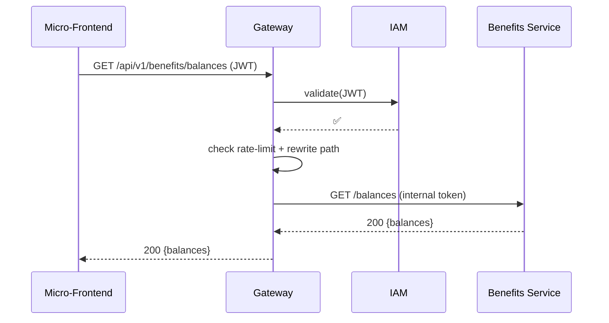

# Chapter 6: Backend API Gateway (HMS-API / HMS-MKT)


[← Back to Chapter 5: Governance Layer (HMS-GOV Portal)](05_governance_layer__hms_gov_portal_.md)

---

> “Every parcel entering the White House passes one secure mailroom.  
> HMS-API is that mailroom for our micro-services.”

---

## 1. Why do we need a Gateway? – A 90-second story

The National Flood Insurance Program (NFIP) team just shipped a new **“quick-claim payout”** rule through the [Governance Portal](05_governance_layer__hms_gov_portal_.md).  

Minutes later:

1. The **AI Representative Agent** ([HMS-A2A](03_ai_representative_agent__hms_a2a__.md)) submits 5 000 claim updates.
2. Thousands of citizens refresh the **Micro-Frontend portal** ([HMS-MFE](01_micro_frontend_interface__hms_mfe__.md)) to see new balances.
3. Internal adjusters upload evidence photos.

Without a single chokepoint you would need to:

* copy auth logic into **every** micro-service,  
* coordinate rate-limits by email,  
* pray that internal URLs never leak to the public.

The **Backend API Gateway** solves all of that. One guard at one door.

---

## 2. Key Concepts (mailroom analogies)

| Gateway Concept | Mailroom Analogy | What it really does |
|-----------------|------------------|---------------------|
| Ingress Point   | Street door      | The only public URL (`https://api.hms.gov`). |
| Auth Check      | Badge scanner    | Verifies JWT or service token with [IAM](07_identity___access_management__iam__.md). |
| Rate-Limit      | Turnstile        | Allows N requests per minute per user/agent. |
| Routing Table   | Sorting bins     | Sends letters to the right micro-service (`/svc/benefits`, `/svc/retirement`). |
| Transform Plug-in | Letter opener | Adds headers, rewrites paths, masks PII. |
| HMS-API vs HMS-MKT | Staff vs Visitor window | Same engine, two entrances: HMS-API for internal traffic, HMS-MKT for public developers/partners. |

---

## 3. First Steps – Calling an endpoint in 10 lines

Below is a tiny **Vue** snippet from the “Banking Dashboard” MFE showing how *simple* life is from the client side.

```vue
<script setup>
import axios from 'axios'

const balances = await axios
  .get('/api/v1/benefits/balances')   // ① single entry-point
  .then(r => r.data)                 // ← JSON: [{name:"Flood",amount:1200}, …]
</script>
```

① No micro-service URLs, no tokens added by hand—**just one path**.  
Everything else (auth, throttling, routing) happens inside the Gateway.

---

## 4. How do I add a new route? – 15-line YAML

Most teams never touch Gateway code.  
They submit a **route manifest** that Ops drops into `gateway/routes/`.

```yaml
# routes/benefits.yaml
uri: /api/v1/benefits/**
upstream: http://hms-svc-benefits:8080
plugins:
  - auth:              # check with IAM
      scopes: ["benefits.read"]
  - rate-limit:        # 60 calls/min per user
      limit: 60
      window: 60
  - transform:         # strip internal prefix
      strip_path: "/api/v1"
```

Deploy the file → the new path is live.  
(Under the hood the Gateway hot-reloads manifests every 30 s.)

---

## 5. What happens on a single request?  



Four passes, one secure doorway.

---

## 6. Quick Peek Inside the Gateway

Most installations use **Express + plug-ins** (easy to grok) or **Kong / Envoy** (prod-grade).  
Below is a *minimal* Express example—only 18 lines per concern!

### 6.1 `middleware/auth.js`

```js
export async function auth(req, res, next) {
  try {
    const token = req.headers.authorization?.split(' ')[1]
    const user  = await fetch('http://iam/verify', {headers:{token}}).then(r=>r.json())
    req.user = user                        // attach user info
    next()
  } catch { res.status(401).end() }
}
```

### 6.2 `middleware/rateLimit.js`

```js
const hits = new Map() // {key -> count}

export function rateLimit(limit = 60){
  return (req,res,next)=>{
    const key = req.user.id + ':' + (Date.now()/60000|0)
    hits.set(key,(hits.get(key)||0)+1)
    hits.get(key) > limit
      ? res.status(429).end()
      : next()
  }
}
```

### 6.3 Route wiring `index.js` (excerpt)

```js
import express from 'express'
import {auth} from './middleware/auth.js'
import {rateLimit} from './middleware/rateLimit.js'
import proxy from 'express-http-proxy'

const app = express()

app.use('/api/v1/benefits', auth, rateLimit(60),
  proxy('http://hms-svc-benefits:8080', {proxyReqPathResolver:p=>p.replace('/api/v1','')})
)

app.listen(9000)
```

Under 20 lines each—yet you have auth, throttling, and routing!

---

## 7. Where does HMS-MKT fit in?

HMS-MKT is simply **another virtual host** on the same Gateway:

* `https://api.hms.gov` → internal / citizen apps (HMS-API)  
* `https://developer.hms.gov` → partner developers (HMS-MKT)

Both share plug-ins, but MKT adds:

* stricter rate-limits,  
* API-key instead of JWT auth,  
* auto-generated OpenAPI docs.

---

## 8. Connecting the Dots – Other HMS Layers

* MFEs, the **Journey Engine**, and staff consoles **call** services only via HMS-API.  
* **AI Representative Agent** bulk operations go through a *service* account rate-limit bucket.  
* Governance rules can **update** gateway manifests (e.g., freeze an endpoint) through a signed patch—reviewed in [HITL Console](04_human_in_the_loop__hitl__review_console_.md).  
* All request logs stream to the **Metrics & Observability Pipeline** (see Chapter 12).

---

## 9. Common Questions

**Q: Do I need to add CORS headers manually?**  
No—add the `cors` plug-in once at the Gateway level.

**Q: How do micro-services know the user ID?**  
The Gateway forwards a signed `x-hms-user` header after validation.

**Q: What about GraphQL?**  
GraphQL endpoints are just another upstream; the Gateway is protocol-agnostic.

---

## 10. Hands-On Exercise (5 min)

1. Run the demo Gateway:

```bash
docker compose up gateway benefits-svc iam
```

2. Hit the API without a token:

```bash
curl -i http://localhost:9000/api/v1/benefits/balances
# → 401 Unauthorized
```

3. Obtain a demo JWT (see next chapter for real flow):

```bash
TOKEN=$(curl -s http://localhost:8000/iam/mock-login | jq -r .jwt)
```

4. Call again:

```bash
curl -H "Authorization: Bearer $TOKEN" \
     http://localhost:9000/api/v1/benefits/balances
# → 200 [{"name":"Flood","amount":1200}]
```

5. Make 70 rapid calls → notice 429 “Too Many Requests”.

---

## 11. Summary & Next Up

You just met your new **secure mailroom**:

✓ Single entry-point for all traffic.  
✓ Built-in auth, rate-limits, and routing.  
✓ Configurable via tiny YAML files—no code in every service.  

Next, we’ll zoom into the **badge scanner** itself: how tokens are issued, roles assigned, and secrets rotated in **Identity & Access Management (IAM)**.  

[Continue to Chapter 7: Identity & Access Management (IAM)](07_identity___access_management__iam__.md)

---

Generated by [AI Codebase Knowledge Builder](https://github.com/The-Pocket/Tutorial-Codebase-Knowledge)